3D Printer Monitor
==========================

When using a 3D printer, we will need to use OctoPrint. It is an open source 3D printer controller application, which provides a web interface for the connected printers. It displays printers' status and key parameters and allows user to schedule prints and remotely control the printer.

Please refer to the detailed installation tutorial for OctoPrint: https://community.octoprint.org/t/setting-up-octoprint-on-a-raspberry-pi-running-raspbian-or-raspberry-pi-os/2337.

This tutorial has written very detailed installation steps, which may take a long time and requires more patience.

.. note::

    * The Raspberry Pi Operating System will need to be installed on the micro-SD card before starting the tutorial. Please refer to :ref:`INSTALL THE OS`.
    * **Webcam Option**: A camera will need to be installed on the RasPad for webcam use. Please refer to the tutorial: :ref:`Assemble the Camera Module`.
    * **Touch UI Option**: A new Raspberry Pi image might not have an auto start function for Touch UI. Please refer to the tutorial: :ref:`Touch UI` to configure the settings for the Touch UI function.

Touch UI
-----------

If the ``autostart`` file is not located in the ``~/.config/lxsession/LXDE-pi`` path, the file will need to be added manually.

Create the ``lxsession`` folder and the ``LXDE-pi`` folder in the ``~/config`` directory.

.. code-block:: shell

    mkdir ~/.config/lxsession
    mkdir ~/.config/lxsession/LXDE-pi

Copy the ``autostart`` file from the path ``/etc/xdg/lxsession/LXDE-pi`` to the ``~/.config/lxsession/LXDE-pi`` folder.

.. code-block:: shell

    cp /etc/xdg/lxsession/LXDE-pi/autostart ~/.config/lxsession/LXDE-pi/autostart

Set the permissions of the ``autostart`` file to be readable and writable.

.. code-block:: shell   

    chmod 644 ~/.config/lxsession/LXDE-pi/autostart
    nano .config/lxsession/LXDE-pi/autostart

Open the autostart file with a text editor such as ``Nano``, and add the following line to the end of the file to make the RasPad execute the ``startTouchUI.sh`` script file on boot.

.. code-block:: shell

    @/home/pi/startTouchUI.sh

After restarting the RasPad, the OctoPrint’s Touch UI will open in full screen mode. Press ``F11`` to exit the full screen mode and enter the desktop.

Make a 3D Model
------------------

Click this link: https://projects.raspberrypi.org/en/projects?hardware%5B%5D=3d-printer, refer to the official Raspberry Pi tutorial, you can get the 3D model file in the format of .stl.

Generally, 3D printers cannot directly process .stl files. You need to use **Ultimaker Cura** software to slice them, and then upload them to the 3D printer through **OctoPrint** to print the 3D model file.

Download `Ultimaker Cura <https://ultimaker.com/software/ultimaker-cura>`_ from . Since Ultimaker Cura is not available on the Raspberry Pi system, you need to perform the slicing operation on your computer.

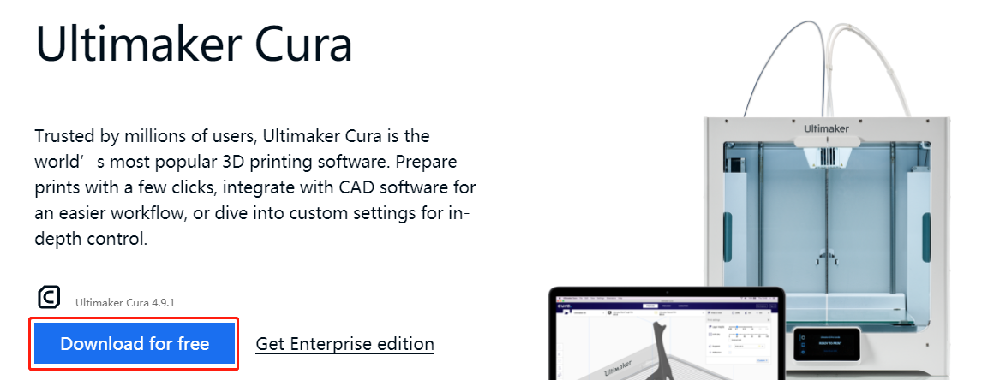

Select the version you need. 

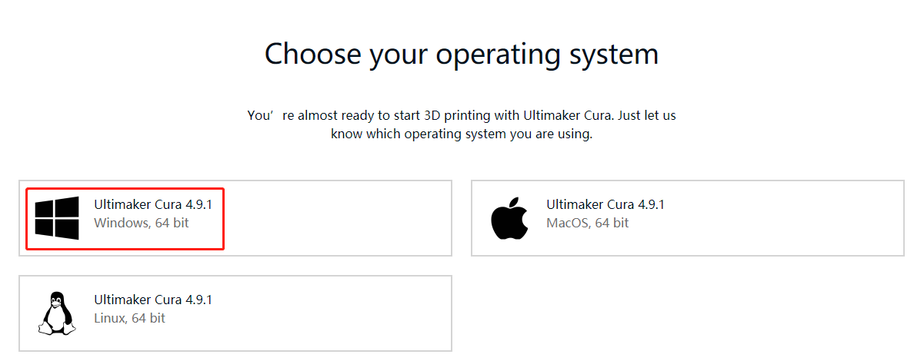

When installing Ultimaker Cura, please note that in the **choose components** step, **Open STL files with Cura** has been checked by default, so that .stl files can be sliced.

If you want to slice other types of model files, check the corresponding option, otherwise you can install it directly.

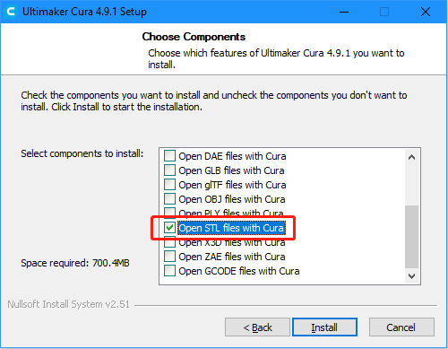

When opening Ultimaker Cura for the first time, there will be a series of configuration prompts. At the **Add a Printer** step, select the model of printer used and click **Next**.

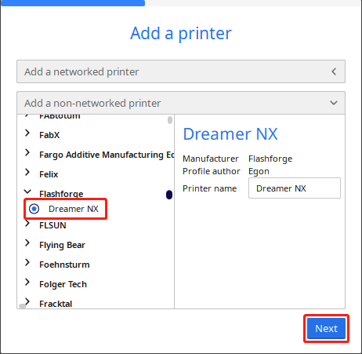

After selecting the correct printer model, verify that the parameters provided by Ultimaker Cura in the Machine Settings page are correct, or change the parameters directly.

Follow the onscreen prompts to complete the configuration of Ultimaker Cura.

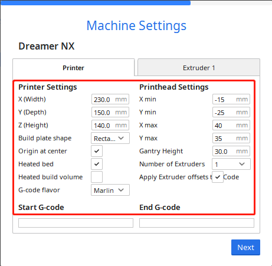

Once Ultimaker Cura has successfully launched, click the **Folder** icon in the upper left-hand corner and browse to the folder with the .stl 3D model file that needs to be sliced, and click **Open** to add the .stl file to Ultimaker Cura's library.

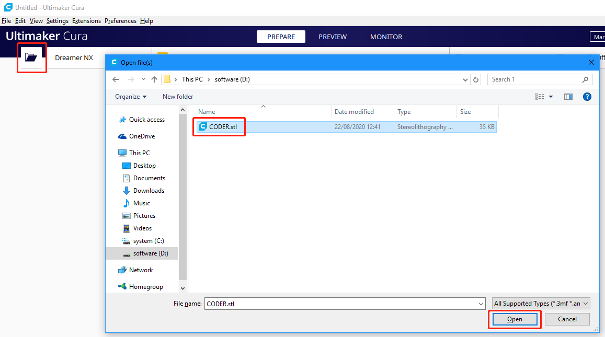

After the file has been added, click the **Slice** option in the lower right-hand corner, and Ultimaker Cura will automatically perform the slicing operation.

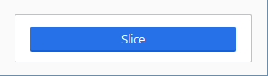

After slicing is complete, click the **Save to Disk** option in the lower right corner to save the sliced ​​file locally.

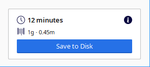

Select the type of file extension recognized by the 3D printer, then click **Save**.

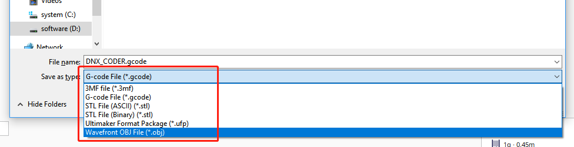

Print 3D Model
--------------------

After the .stl file has been sliced, the 3D model file can be sent to the 3D printer through OctoPrint to be printed.

Open the RasPad's browser, and enter ``http://192.168.18.179/?#temp`` to log in to OctoPrint.

.. note::

  Before logging in to the OctoPrint’s web UI, OctoPrint will first need to have been successfully installed on the RasPad.

  The IP address 192.168.18.179 will need to be replaced with the local IP address of the RasPad. Hover the cursor over the WiFi icon on the RasPad desktop, and the local IP address will be displayed.
  
  .. image:: img/appendix1.png
    :width: 700
    :align: center

Now you have entered OctoPrint.

.. image:: img/oct11.png
  :width: 700
  :align: center

Click the **Upload** option to select the sliced ​​3D model file.

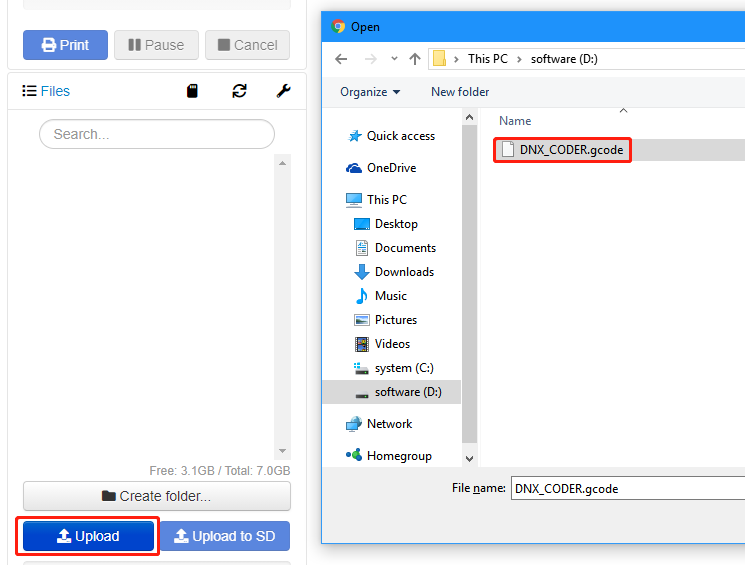

Click the **print** icon. The 3D printer will start to print the 3D model file after the slicing process is complete.

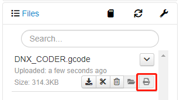

If you have transferred the sliced ​​file to the Raspberry Pi, you can also open the OctoPrint UI in RasPad to print.

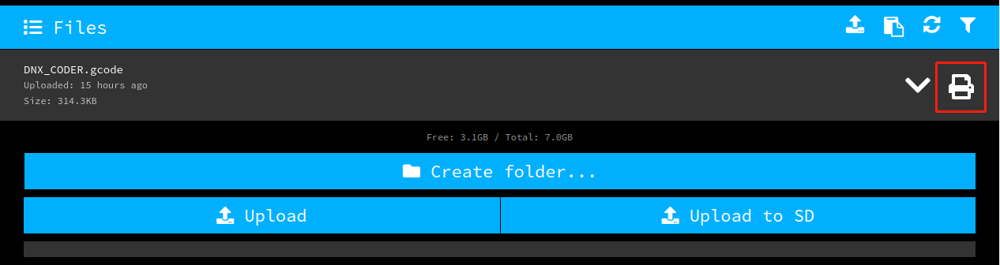

Video
-------

The following video shows that after installing OctoPrint, connect your 3D printer and RasPad 3 through a USB cable，upload the designed 3D file, and then use the camera to monitor the printing process. 

The temperature can also be monitored to prevent the 3D printer from getting too hot or cold, which will affect the printed 3D model.

.. raw:: html

    <iframe width="695" height="576" src="https://www.youtube.com/embed/ml3-Su6Yenc" title="YouTube video player" frameborder="0" allow="accelerometer; autoplay; clipboard-write; encrypted-media; gyroscope; picture-in-picture" allowfullscreen></iframe>

