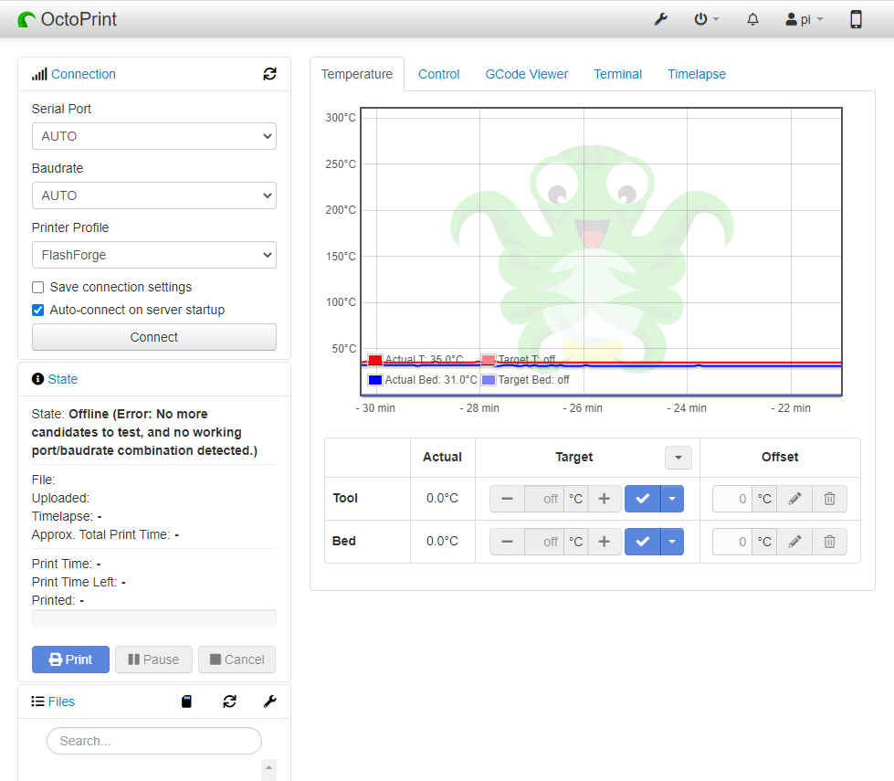

3D 打印机
==========================

使用 3D 打印机时，我们需要使用 OctoPrint。 它是一个开源的 3D 打印机控制器应用程序，可为连接的打印机提供 Web 界面。 它显示打印机的状态和关键参数，并允许用户安排打印和远程控制打印机。

OctoPrint的详细安装教程请参考：https://community.octoprint.org/t/setting-up-octoprint-on-a-raspberry-pi-running-raspbian-or-raspberry-pi-os/2337。

本教程写了很详细的安装步骤，可能需要很长时间，需要比较耐心。

.. note::

    * 在开始本教程之前，需要在 micro-SD 卡上安装树莓派操作系统。 请参考 :ref:`安装树莓派镜像`。
    * **网络摄像头选项**：需要在 RasPad 上安装摄像头才能使用网络摄像头。 请参考教程 :ref:`安装摄像头`。
    * **Touch UI 选项**：新的树莓派图像可能没有 Touch UI 的自动启动功能。 请参考教程 :ref:`Touch UI` 来配置 Touch UI 功能的设置。

Touch UI
-----------

如果 ``autostart`` 文件不在 ``~/.config/lxsession/LXDE-pi`` 路径中，则需要手动添加该文件。

在 ``~/config`` 目录中创建 ``lxsession`` 文件夹和 ``LXDE-pi`` 文件夹。

.. raw:: html

    <run></run>

.. code-block:: shell

    mkdir ~/.config/lxsession
    mkdir ~/.config/lxsession/LXDE-pi

将 ``autostart`` 文件从路径 ``/etc/xdg/lxsession/LXDE-pi`` 复制到 ``~/.config/lxsession/LXDE-pi`` 文件夹。

.. raw:: html

    <run></run>

.. code-block:: shell

    cp /etc/xdg/lxsession/LXDE-pi/autostart ~/.config/lxsession/LXDE-pi/autostart

将 ``autostart`` 文件的权限设置为可读可写。

.. raw:: html

    <run></run>

.. code-block:: shell   

    chmod 644 ~/.config/lxsession/LXDE-pi/autostart
    nano .config/lxsession/LXDE-pi/autostart

使用 **Nano** 等文本编辑器打开自动启动文件，并将以下行添加到文件末尾，以使 RasPad 在启动时执行 **startTouchUI.sh** 脚本文件。

.. raw:: html

    <run></run>

.. code-block:: shell

    @/home/pi/startTouchUI.sh

重启 RasPad 后，OctoPrint 的 Touch UI 将以全屏模式打开。 按 **F11** 退出全屏模式，进入桌面。

制作 3D 模型
------------------

点击这个链接：https://projects.raspberrypi.org/en/projects?hardware%5B%5D=3d-printer，参考树莓派官方教程，可以得到.stl格式的3D模型文件。

通常，3D 打印机无法直接处理 .stl 文件。 需要使用 **Ultimaker Cura** 软件进行切片，然后通过 **OctoPrint** 上传到3D打印机再进行打印。

下载 `Ultimaker Cura <https://ultimaker.com/software/ultimaker-cura>`_。 由于 Ultimaker Cura 在树莓派系统上不可用，您需要在您的计算机上执行切片操作。

.. image:: img/oct2.png
  :width: 600
  :align: center

选择您需要的版本。

.. image:: img/oct3.png
  :align: center

安装Ultimaker Cura时，请注意在 **Select components** 步骤中， **Open the STL file with Cura** 已经默认勾选，这样.stl文件就可以切片了。

如果你想切换其他类型的模型文件，勾选对应选项，否则直接安装即可。

首次打开 Ultimaker Cura 时，会出现一系列配置提示。 在 **Add a printer** 步骤中，选择使用的打印机型号，然后单击 **Next step**。

选择正确的打印机型号后，验证Ultimaker Cura在机器设置页面中提供的参数是否正确，或者直接更改参数。

按照屏幕提示完成 Ultimaker Cura 的配置。

Ultimaker Cura 成功启动后，单击左上角的 **Folder** 图标并浏览到包含需要切片的 .stl 3D 模型文件的文件夹，然后单击 **Open** 添加 .stl 文件到 Ultimaker Cura 的库。

.. image:: img/oct7.png
  :width: 600
  :align: center

添加文件后，单击右下角的 **Slice** 选项，Ultimaker Cura 将自动执行切片操作。

.. image:: img/oct8.png
  :width: 400
  :align: center

切片完成后，点击右下角的 **Save to Disk** 选项，将切片后的文件保存到本地。

选择 3D 打印机识别的文件扩展名类型，然后单击 **Save**。

.. image:: img/oct10.png
  :width: 600
  :align: center

打印 3D 模型
--------------------

.stl文件切片后，3D模型文件可以通过 OctoPrint 发送到3D打印机进行打印。

打开 RasPad 浏览器，输入 ``http://192.168.18.179/?#temp`` 登录 OctoPrint。

.. note::

  在登录 OctoPrint 的 Web UI 之前，OctoPrint 首先需要已成功安装在 RasPad 上。

  IP 地址 192.168.18.179 将需要替换为 RasPad 的本地 IP 地址。 将光标悬停在 RasPad 桌面上的 WiFi 图标上，将显示本地 IP 地址。  
  
  .. image:: img/appendix1.png
    :width: 700
    :align: center

现在您已进入 OctoPrint。

点击 **Upload** 选项，选择切片后的3D模型文件。

.. image:: img/oct12.png
  :width: 600
  :align: center

单击 **print** 图标。 切片过程完成后，3D 打印机将开始打印 3D 模型文件。

.. image:: img/oct13.png
  :width: 500
  :align: center

如果你已经将切片文件传输到树莓派上，你也可以在 RasPad 中打开 OctoPrint UI 进行打印。

.. image:: img/oct14.png
  :width: 700
  :align: center

视频
-------

以下视频显示安装 OctoPrint 后，通过USB线连接3D打印机和 RasPad 3，上传设计好的3D文件，然后使用摄像头监控打印过程。

还可以监控温度，以防止3D打印机过热或过冷，从而影响打印的3D模型。

.. raw:: html

    <iframe width="695" height="576" src="https://www.youtube.com/embed/ml3-Su6Yenc" title="YouTube video player" frameborder="0" allow="accelerometer; autoplay; clipboard-write; encrypted-media; gyroscope; picture-in-picture" allowfullscreen></iframe>

