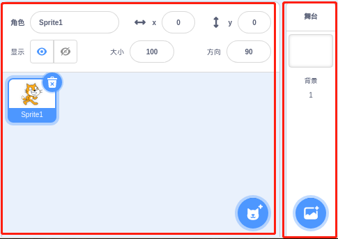
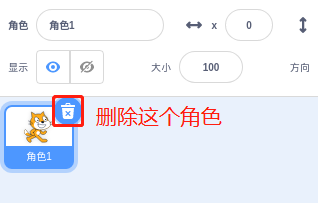
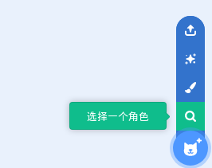
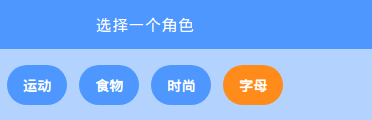
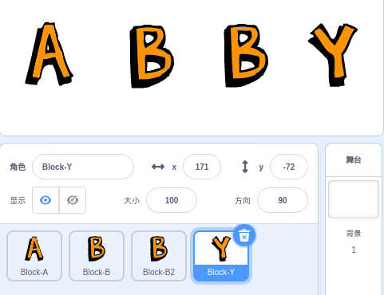
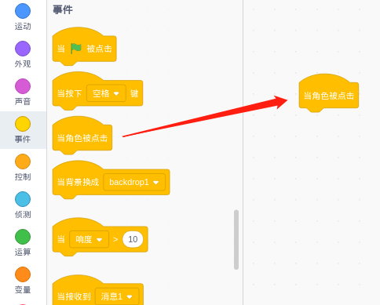
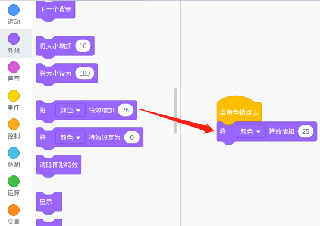
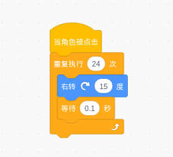
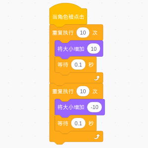

会动的名字
================

描述
-------------

今天我们将学习在 Scratch 上写我们的名字。 当我们点击名称中的字母时，它们将会动起来。

点击绿旗开始。

.. raw:: html

    <iframe src="https://scratch.mit.edu/projects/526925224/embed" allowtransparency="true" width="695" height="576" frameborder="0" scrolling="no" allowfullscreen></iframe>

或者点击 `Animate A Name <https://scratch.mit.edu/projects/526925224/editor>`_, 然后在Scratch官网学习在线教程。

所需组件
-------------------------------

- A RasPad 3
- Scratch 3 (either online or offline)

你将学会
---------------------

- 选择你想要的角色。
- 分别编程不同的角色。
- 使角色变色。
- 让角色旋转。
- 让角色缩放。
- 让角色闪烁。

课程指南
---------------

**我的名字是Abby**

在 Scratch 的右下角，有两个区域。 我们可以在这里添加我们想要的角色和背景。

首先删除原来的角色，我们不需要它。

然后选择新的角色。

找到字母角色。

重复几次拼出你的名字，就像我的名字“Abby”一样。

**字母A可以改变自己的颜色**

单击 Block-A 角色，让我们为它编写一些代码。

当点击 **A** 时，它会改变它的颜色。

点击角色，在事件中找到「**当角色被点击**」，拖到右边的编码区。

在 **外观** 里找到 「**将颜色特效增加…**」 把它拖到 「**当角色被点击**」 的底部.

这时，我们点击舞台上的字母 **A**，它就会改变颜色。

**字母B能够旋转360度**

单击 Block-B 角色，让我们为 Block-B 编写代码。 当舞台上的字母 **B** 被点击时，它会旋转一圈。

你知道为什么要设置让 B 每次旋转 15 度，共旋转 24 次吗？ 因为24*15=360，所以转了360度！

**第二个字母B可以放大和缩小**

单击 Block-B2 角色，让我们为 Block-B2 编写代码。

当舞台上的第二个 **B** 被点击时，它会先放大再缩小。

**点击字母Y让它闪烁**

单击 Block-Y 角色，让我们为 Block-Y 编写一段代码。 当舞台上的 **Y** 被点击时，它会反复消失和出现。

.. image:: img/animate_a_name10.png
  :width: 300
  :align: center

挑战
-----------

我相信你很快就能掌握和实现这个游戏。 接下来，我们将添加一些内容使你的游戏更丰富。

- 添加两个新角色，其中一个会在点击时闪烁并改变颜色； 点击另一个将缩放和旋转。

