APPENDIX
===========

For new RasPad users, the following sections are essential operations that will need to be used for doing certain projects. Please read these sections carefully.

Assemble the Camera Module
--------------------------------------

Open the back cover of the RasPad. Connect the FFC cable to the CSI interface of the Camera Module. Carefully pass the CSI interface cable through the slot on the back cover of the RasPad. Connect the CSI interface of the Raspberry Pi. Then carefully close the back cover of the RasPad.

.. warning::
  
  The SD card slot is a snap-in style attached to the back cover. Before removing or replacing the back cover, remove the micro-SD card to avoid damaging the micro-SD card and the RasPad's internal button board.

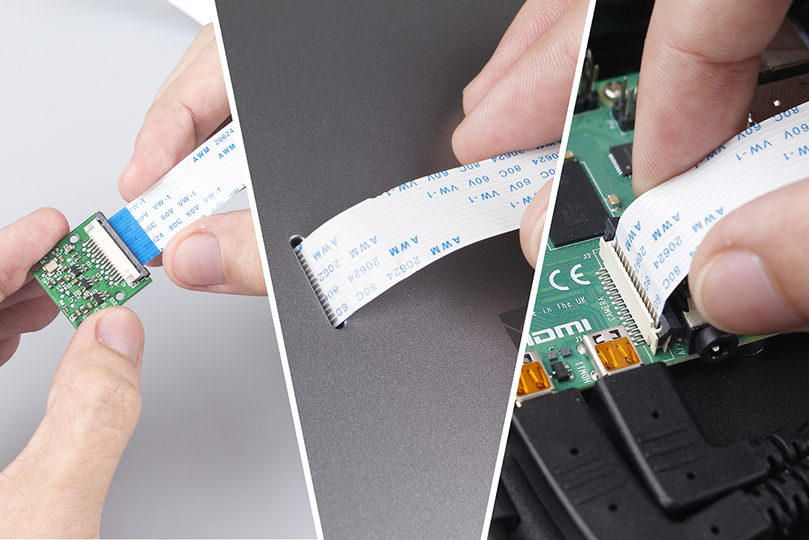

Insert the micro-SD card with the Raspberry Pi OS image into the slot, and long-press the power button to boot the RasPad.

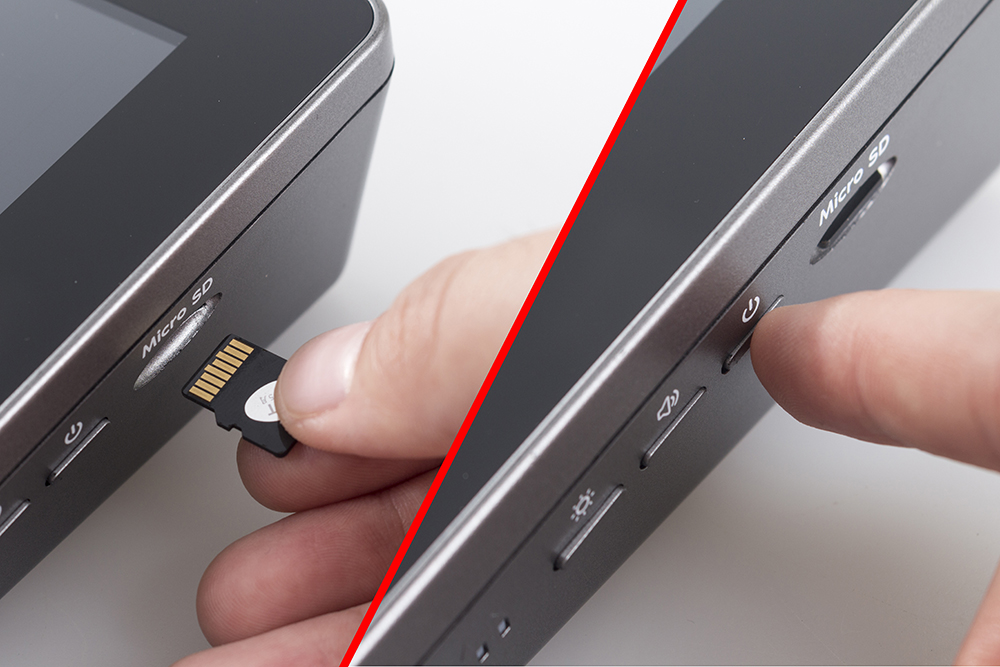

Open **Raspberry Pi Configuration**.

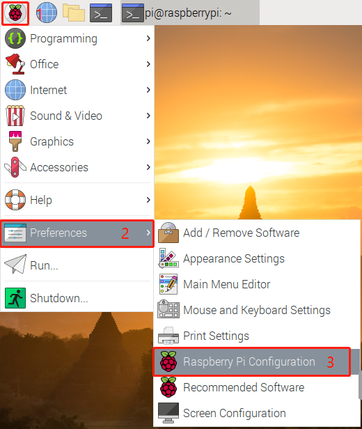

In the **Interfaces** option, **Enable** the Camera, and then click **OK**.

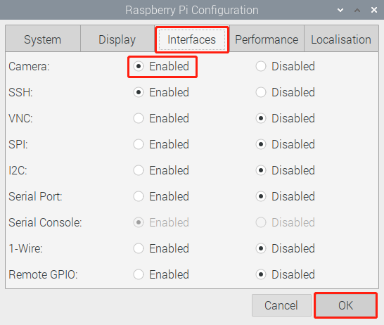

In the pop-up prompt box, choose to restart now.

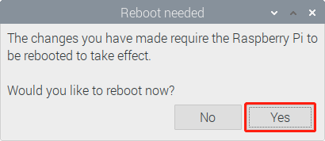

After the restart is complete, use the following command line to check whether the camera is available.

If the camera screen appears it means that the camera is installed successfully. Otherwise the FFC cable needs to be unplugged and plugged in again.

.. code-block:: python

    raspivid -o vid.h264

GPIO Extension Board
------------------------

Before starting the project, you first need to know more about the pins of the Raspberry Pi, which is key to the build circuit.

The pins of Raspberry Pi have three ways to name them. They are wiringPi, BCM and Board. Among these naming conventions, the 40-pin GPIO Extension board uses the naming convention BCM.

The following table shows the naming convention for WiringPi, Board and the intrinsic Name of each pin on GPIO Extension board.

For example, for the GPIO17, the Board naming method of it is 11, the wiringPi naming method is 0, and the intrinsic naming method of it is GPIO0. 

.. image:: img/board1.png
  :width: 700
  :align: center

Open the back cover of the RasPad and insert the 40 pin ribbon cable into the Raspberry Pi. Pass the ribbon cable through the available slot on the base of the RasPad, and connect the other end of the 40 pin ribbon cable to the GPIO extension board. Then replace the back cover of the RasPad.

.. warning::
  
  The SD card slot is a snap-in style attached to the back cover. Before removing or replacing the back cover, remove the micro-SD card to avoid damaging the micro-SD card and the RasPad's internal button board.

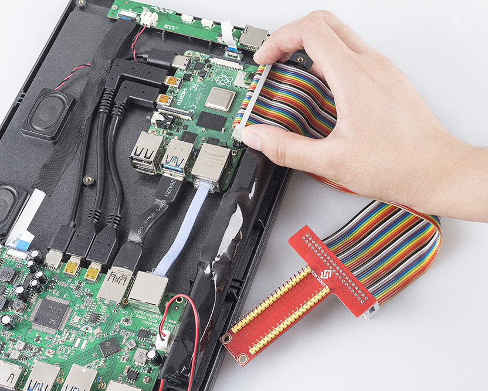

Obtain the IP Address of the Raspberry Pi
--------------------------------------------------

With a Screen
^^^^^^^^^^^^^^^^^^^^^^^

If you have a screen, it will be easy for you to get the IP address of Raspberry Pi.

+-------------------+--------------------------+ 
| Required Components                          | 
+===================+==========================+ 
| Any Raspberry Pi  | 1 * Power Adapter        | 
+-------------------+--------------------------+ 
| 1 * Micro SD card | 1 * Screen Power Adapter | 
+-------------------+--------------------------+ 
| 1 * HDMI cable    | 1 * Screen               | 
+-------------------+--------------------------+ 
| 1 * Mouse         | 1 * Keyboard             | 
+-------------------+--------------------------+

1. Insert the micro-SD card with the Raspberry Pi OS image into the micro SD card slot on the underside of the Raspberry Pi.
2. Plug in the Mouse and Keyboard.
3. Connect the screen to the Raspberry Pi’s HDMI port. Make sure the screen is plugged into a wall socket and turned on.

  .. note::

    For the Raspberry Pi 4 models, connect the screen to the HDMI0 port, nearest to the power-in socket.

4. Use the power adapter to power the Raspberry Pi. After a few seconds, the Raspberry Pi OS desktop will be displayed.
5. Hover the cursor over the WiFi icon, and the IP address of the Raspberry Pi will be displayed.

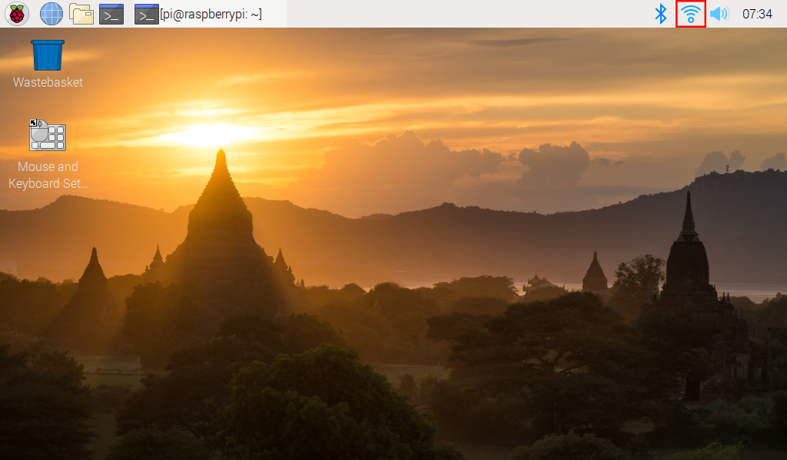

Without a Screen
^^^^^^^^^^^^^^^^^^^^^^^

After the Raspberry Pi is connected to WIFI, we need to get the IP address of it. There are many ways to know the IP address, and two of them are listed as follows.

**1. Checking via the router**

Check the addresses assigned to Raspberry Pi on the administration interface of the router.

The default hostname of the Raspberry Pi OS is raspberrypi. If you are using an ArchLinuxARM system, please find alarmpi.

**2. Network Segment Scanning**
   
Network scanning applications can be used to look up the IP address of Raspberry Pi, such as Advanced IP Scanner.

Scan the IP range set, and the names of all connected devices will be displayed. The default hostname of the Raspberry Pi OS is raspberrypi.

Use the SSH Remote Control
------------------------------

Bash is the standard default shell of Linux, and can be opened on the Raspberry Pi by using SSH. The Shell itself is a program written in C programming language that acts as a bridge linking the customers and Unix/Linux systems.

**For Linux or/Mac OS X Users**

Go to **Applications** -> **Utilities**, find the **Terminal**, and open it. 

.. image:: img/appendix3.png
  :width: 600
  :align: center

Type in ``ssh pi@ip_address`` where ``pi`` is the username and ``ip_address`` is the IP address of the Raspberry Pi. For example:

.. code-block:: python

    ssh pi@192.168.18.197 

At the prompt, type ``yes`` in lowercase.

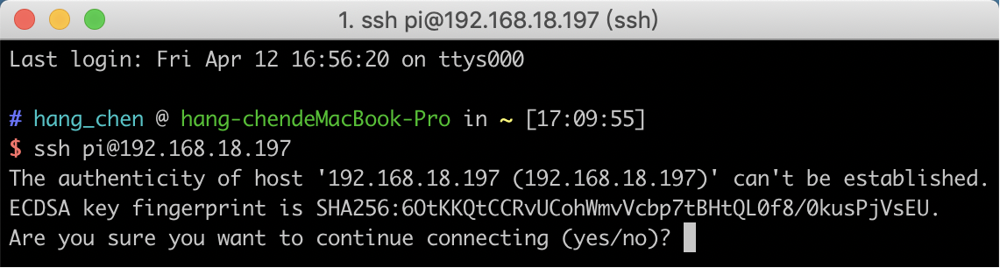

The default password is raspberry.

.. note::
  
  The characters do not display when typing in the password. Make sure to input the correct password.

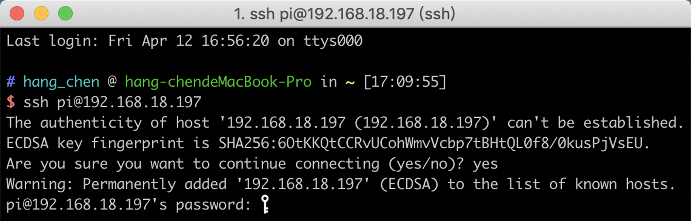

We now get the Raspberry Pi connected and are ready to go to the next step.

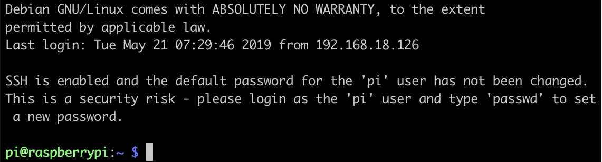

**For Windows Users**

Windows users can use SSH with the PuTTY application.

Download PuTTY, open the application, and click Session on the left of the tree-like structure. Enter the IP address of the Raspberry Pi in the text box under Host Name, and enter 22 under Port.

.. image:: img/appendix7.png
  :width: 600
  :align: center

Click Open.

.. note::
  
  When first logging in to the Raspberry Pi with the IP address, there will be a security prompt. Click Yes to continue.

When the PuTTY window prompts **login as:**, type in ``pi`` for the user name of the Raspberry Pi. The default password is ``raspberry``.

.. note:: 

  The characters do not display when typing in the password. Make sure to input the correct password.

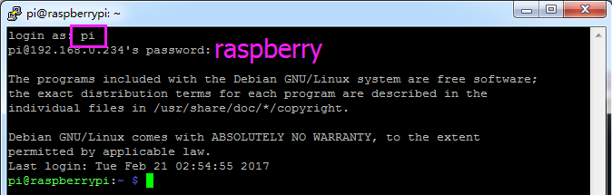

Here, we get the Raspberry Pi connected and it is time to conduct the next steps.

