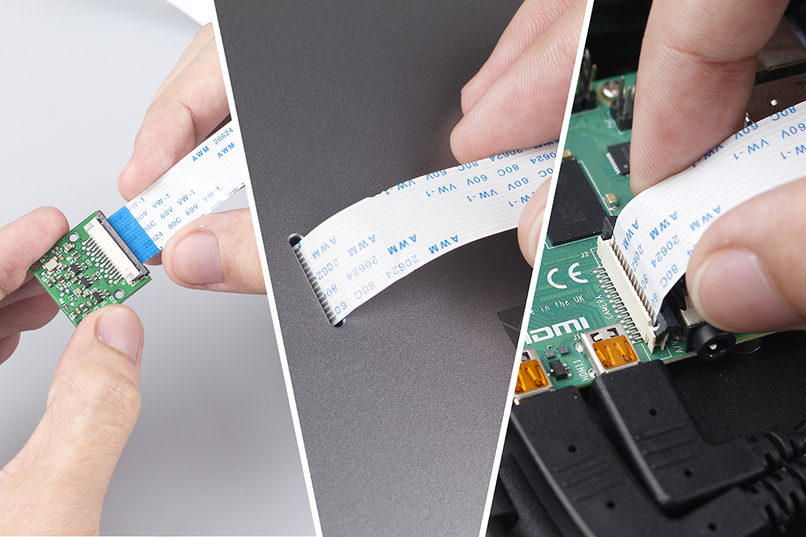
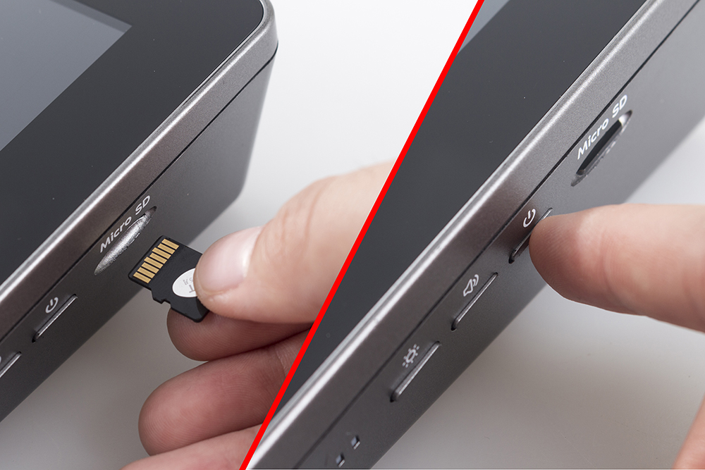
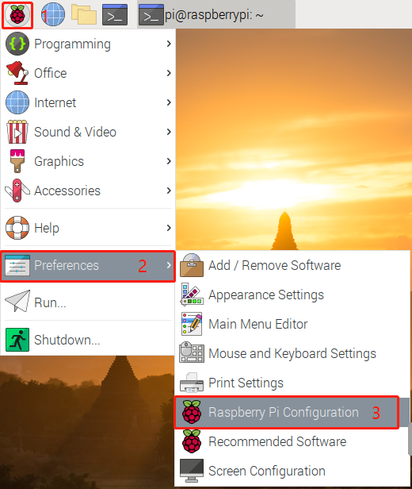
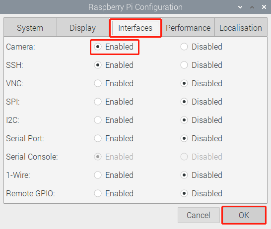
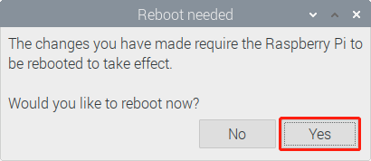

.. note::

    Hello, welcome to the SunFounder Raspberry Pi & Arduino & ESP32 Enthusiasts Community on Facebook! Dive deeper into Raspberry Pi, Arduino, and ESP32 with fellow enthusiasts.

    **Why Join?**

    - **Expert Support**: Solve post-sale issues and technical challenges with help from our community and team.
    - **Learn & Share**: Exchange tips and tutorials to enhance your skills.
    - **Exclusive Previews**: Get early access to new product announcements and sneak peeks.
    - **Special Discounts**: Enjoy exclusive discounts on our newest products.
    - **Festive Promotions and Giveaways**: Take part in giveaways and holiday promotions.

    👉 Ready to explore and create with us? Click [|link_sf_facebook|] and join today!

Assemble the Camera Module
==================================

Open the back cover of the RasPad. Connect the FFC cable to the CSI interface of the Camera Module. Carefully pass the CSI interface cable through the slot on the back cover of the RasPad. Connect the CSI interface of the Raspberry Pi. Then carefully close the back cover of the RasPad.

.. warning::
  
  The SD card slot is a snap-in style attached to the back cover. Before removing or replacing the back cover, remove the micro-SD card to avoid damaging the micro-SD card and the RasPad's internal button board.

Insert the micro-SD card with the Raspberry Pi OS image into the slot, and long-press the power button to boot the RasPad.

Open **Raspberry Pi Configuration**.

In the **Interfaces** option, **Enable** the Camera, and then click **OK**.

In the pop-up prompt box, choose to restart now.

After the restart is complete, use the following command line to check whether the camera is available.

If the camera screen appears it means that the camera is installed successfully. Otherwise the FFC cable needs to be unplugged and plugged in again.

.. raw:: html

    <run></run>

.. code-block:: shell

    raspivid -o vid.h264

