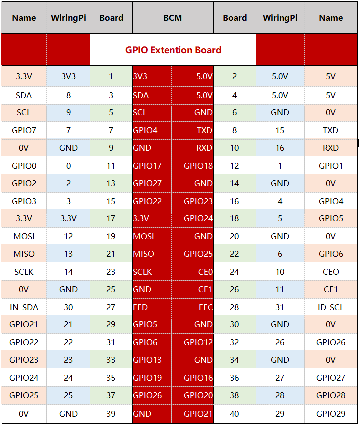
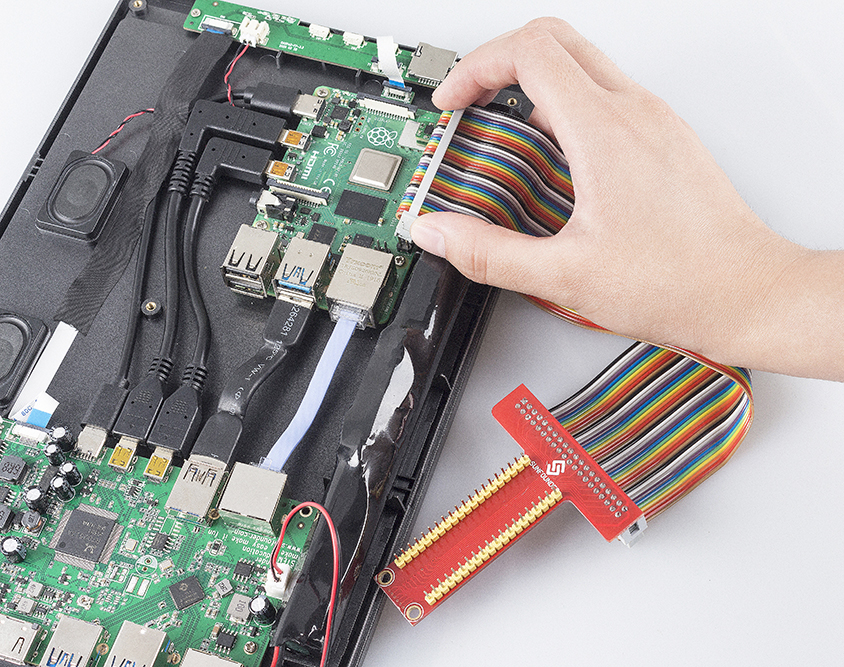

GPIO Extension Board
=========================

Before starting the project, you first need to know more about the pins of the Raspberry Pi, which is key to the build circuit.

The pins of Raspberry Pi have three ways to name them. They are wiringPi, BCM and Board. Among these naming conventions, the 40-pin GPIO Extension board uses the naming convention BCM.

The following table shows the naming convention for WiringPi, Board and the intrinsic Name of each pin on GPIO Extension board.

For example, for the GPIO17, the Board naming method of it is 11, the wiringPi naming method is 0, and the intrinsic naming method of it is GPIO0. 

Open the back cover of the RasPad and insert the 40 pin ribbon cable into the Raspberry Pi. Pass the ribbon cable through the available slot on the base of the RasPad, and connect the other end of the 40 pin ribbon cable to the GPIO extension board. Then replace the back cover of the RasPad.

.. warning::
  
  The SD card slot is a snap-in style attached to the back cover. Before removing or replacing the back cover, remove the micro-SD card to avoid damaging the micro-SD card and the RasPad's internal button board.

