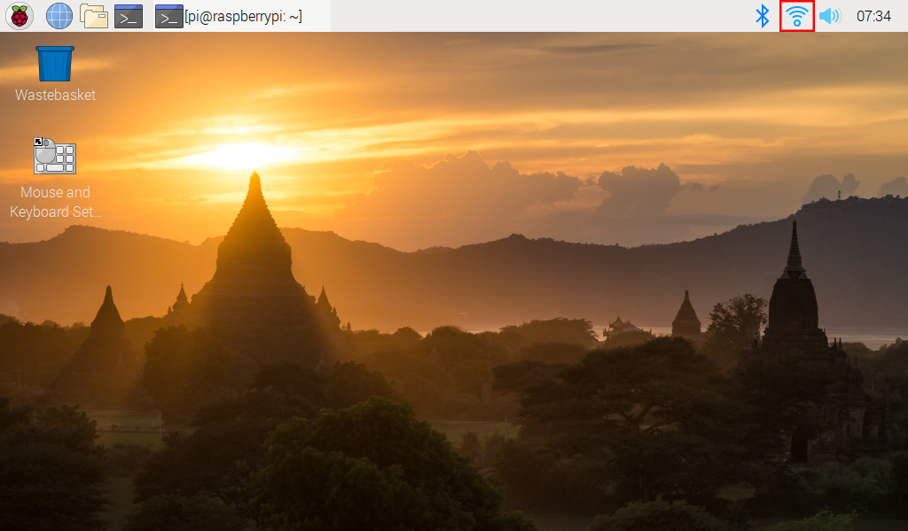

获取树莓派的IP地址
================================================

有屏幕
--------------

如果你有一个屏幕，就可以很容易得到树莓派的 IP 地址。

**所需组件**

* 任何树莓派
* 1 * 电源适配器
* 1 * 微型 SD 卡
* 1 * 屏幕电源适配器
* 1 * HDMI 线
* 1 * 屏幕
* 1 * 鼠标
* 1 * 键盘

1. 将带有树莓派OS 镜像的微型 SD 卡插入树莓派底部的微型 SD 卡插槽。
2. 插入鼠标和键盘。
3. 将屏幕连接到树莓派的 HDMI 端口。确保屏幕已插入壁式插座并已打开。

  .. note::

    对于树莓派4，将屏幕连接到最靠近电源插座的 HDMI0 端口。

4. 使用电源适配器为树莓派供电。几秒钟后，将显示树莓派OS 桌面。
5. 将光标悬停在 WiFi 图标上，将显示树莓派的 IP 地址。

无屏幕
---------------

树莓派连接WIFI后，我们需要获取它的IP地址。知道IP地址的方法有很多种，下面列出了其中的两种。

**1. 通过路由器检查**

在路由器的管理界面上检查分配给树莓派的地址。

树莓派操作系统的默认主机名是 raspberrypi。如果您使用的是 ArchLinuxARM 系统，请查找 alarmpi。

**2. 网段扫描**
   
有一些网络扫描的应用程序可用于查找树莓派的 IP 地址，例如 Advanced IP Scanner。

扫描设置的 IP 范围，将显示所有已连接设备的名称。树莓派操作系统的默认主机名是 raspberrypi。