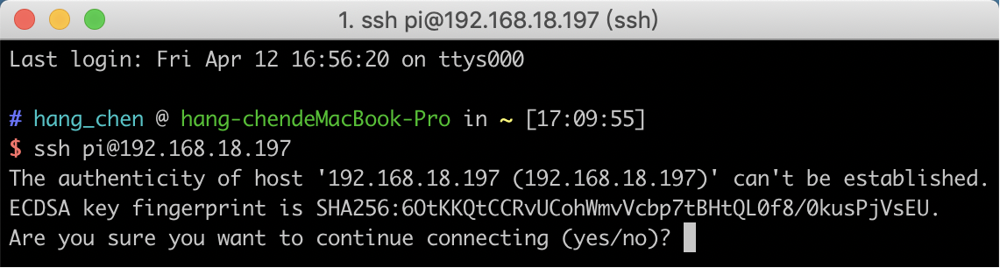
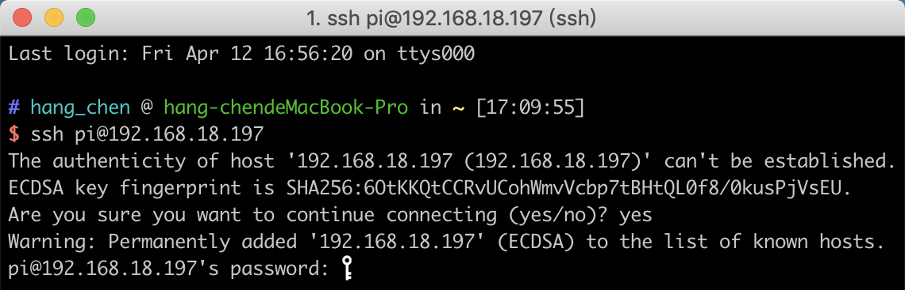
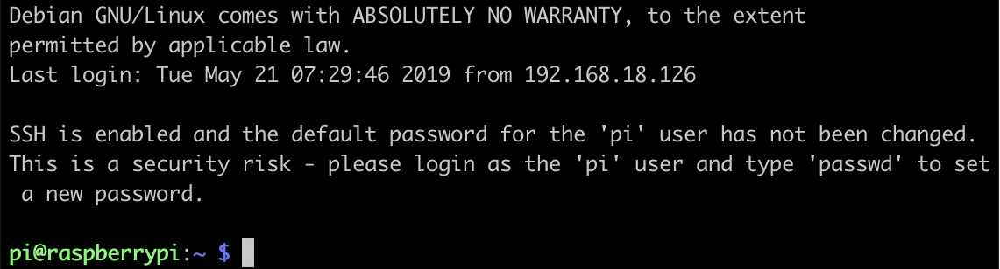
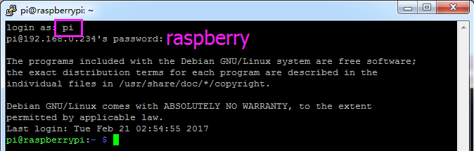

Use the SSH Remote Control
===============================

Bash is the standard default shell of Linux, and can be opened on the Raspberry Pi by using SSH. The Shell itself is a program written in C programming language that acts as a bridge linking the customers and Unix/Linux systems.

**For Linux or/Mac OS X Users**

Go to **Applications** -> **Utilities**, find the **Terminal**, and open it. 

.. image:: img/appendix3.png
  :width: 600
  :align: center

Type in ``ssh pi@ip_address`` where ``pi`` is the username and ``ip_address`` is the IP address of the Raspberry Pi. For example:

.. code-block:: python

    ssh pi@192.168.18.197 

At the prompt, type ``yes`` in lowercase.

The default password is raspberry.

.. note::
  
  The characters do not display when typing in the password. Make sure to input the correct password.

We now get the Raspberry Pi connected and are ready to go to the next step.

**For Windows Users**

Windows users can use SSH with the PuTTY application.

Download PuTTY, open the application, and click Session on the left of the tree-like structure. Enter the IP address of the Raspberry Pi in the text box under Host Name, and enter 22 under Port.

.. image:: img/appendix7.png
  :width: 600
  :align: center

Click Open.

.. note::
  
  When first logging in to the Raspberry Pi with the IP address, there will be a security prompt. Click Yes to continue.

When the PuTTY window prompts **login as:**, type in ``pi`` for the user name of the Raspberry Pi. The default password is ``raspberry``.

.. note:: 

  The characters do not display when typing in the password. Make sure to input the correct password.

Here, we get the Raspberry Pi connected and it is time to conduct the next steps.

