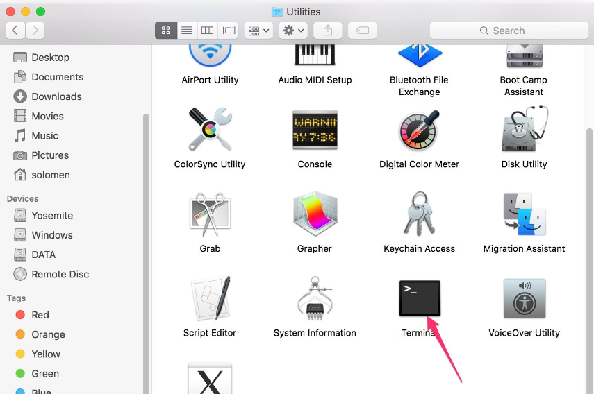

用 SSH 远程控制
===============================

Bash 是 Linux 的标准默认 shell，可以在树莓派上使用 SSH 打开。Shell 本身是一个用 C 编程语言编写的程序，充当连接客户和 Unix/Linux 系统的桥梁。

**对于 Linux 或/Mac OS X 用户**

依次点击 **Applications** -> **Utilities**, 找到 **Terminal**, 然后打开它。 

在 ``ssh pi@ip_address`` 这里可以输入命令， ``pi`` 表示用户名 and ``ip_address`` 表示树莓派的ip地址。例如:

.. code-block:: python

    ssh pi@192.168.18.197 

根据提示，输入小写的 ``yes`` 。

.. image:: img/appendix4.png
  :width: 600
  :align: center

默认密码时 raspberry。

.. note::
  
  输入密码时不会显示字符。确保你输入的是正确的密码。

.. image:: img/appendix5.png
  :width: 600
  :align: center

到这里，我们就已经连接上了树莓派。

**对于 Windows 用户**

Windows 用户可以通过 PuTTY 应用程序使用 SSH。

下载PuTTY，打开应用，点击树状结构左侧的Session。在Host Name下的文本框中输入树莓派的IP地址，在Port下输入22。

.. image:: img/appendix7.png
  :width: 600
  :align: center

单击打开。

.. note::
  
  第一次用IP地址登录树莓派时，会有安全提示。单击继续。

当 PuTTY 窗口提示 **login as:** 的时候，输入用户名 ``pi`` 以及默认的初始密码 ``raspberry``.

.. note:: 

  输入密码时不会显示字符。请确保输入的是正确的密码。

.. image:: img/appendix8.png
  :width: 600
  :align: center

到这里，我们就已经连接上了树莓派。

