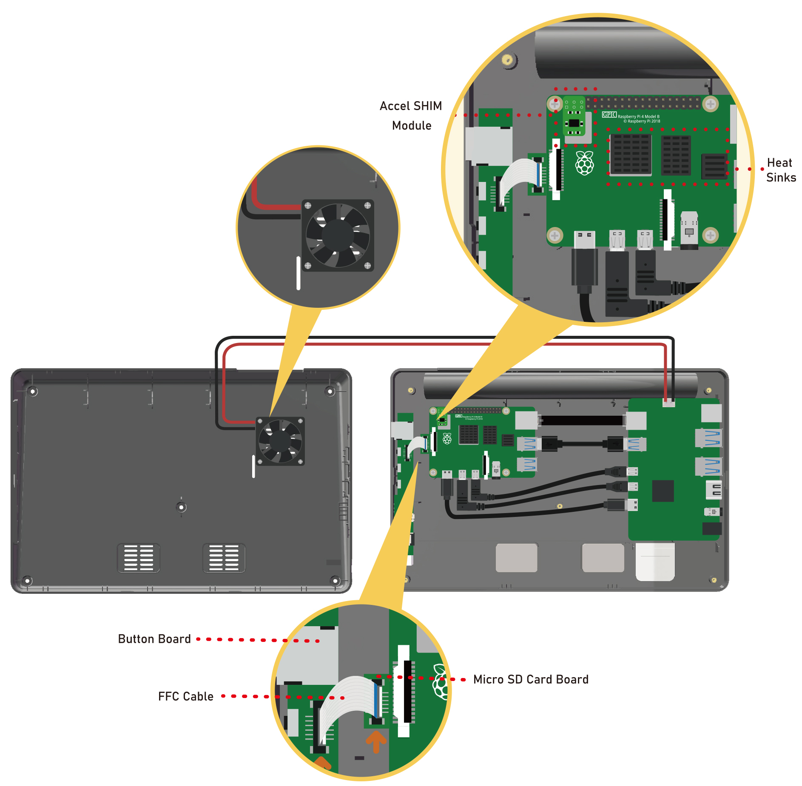

.. note::

    Hello, welcome to the SunFounder Raspberry Pi & Arduino & ESP32 Enthusiasts Community on Facebook! Dive deeper into Raspberry Pi, Arduino, and ESP32 with fellow enthusiasts.

    **Why Join?**

    - **Expert Support**: Solve post-sale issues and technical challenges with help from our community and team.
    - **Learn & Share**: Exchange tips and tutorials to enhance your skills.
    - **Exclusive Previews**: Get early access to new product announcements and sneak peeks.
    - **Special Discounts**: Enjoy exclusive discounts on our newest products.
    - **Festive Promotions and Giveaways**: Take part in giveaways and holiday promotions.

    👉 Ready to explore and create with us? Click [|link_sf_facebook|] and join today!

ASSEMBLY INSTRUCTIONS
==========================

1. Before inserting the Micro SD card, connect the button-board to the Raspberry Pi using the included FFC cable.
2. Connect all the cables, and then attach the Raspberry Pi with four of the M2.5x4 screws.
3. Orient the fan so the logo is facing the exterior vent, then attach the fan with the four PWA1.7X9 screws.
4. Finally, attach the back cover with five M2.5x4 screws.

You can also follow the video to assemble RasPad 3 step by step.

.. raw:: html

    <iframe width="700" height="400" src="https://www.youtube.com/embed/b_hm0I4QhAI" title="YouTube video player" frameborder="0" allow="accelerometer; autoplay; clipboard-write; encrypted-media; gyroscope; picture-in-picture" allowfullscreen></iframe>

**Detailed Assembly Steps**

#. Take out the RasPad and turn it over, unscrew the screws and remove the back cover.

    .. image:: img/assembling/assembling15.png
        :width: 600
        :align: center

    Below is an image of the internal structure of the RasPad. 

    .. note:: 

        Avoid pressing on the two speakers during assembly.

    .. image:: img/assembling/assembling2.png
        :width: 800
        :align: center

#. Insert the Micro SD card board into the Raspberry Pi's Micro SD card slot.

    .. image:: img/assembling/assembling8.png
        :width: 600
        :align: center

#. Insert the other end of the FFC cable into the RasPad button board.

    .. note::
        This step can be skipped if the Micro SD card board has already been connected to the button board in the RasPad that you received.

    * Use two fingers to gently pull up the tab on the top of the CSI connector.
    * Insert the FFC cable, being sure that it is fully inserted and not crooked.
    * Use your fingers to press it firmly from both sides.
    * Pull up the tab gently again if it is not attached properly and can't pull out the FFC forcefully.

    .. image:: img/assembling/ezgif.com-gif-maker.webp

#. Attach the Raspberry Pi with 4 M2.5x4 screws.

    .. image:: img/assembling/assemble_2.png
        :width: 600
        :align: center

#. Connect the Ethernet, USB to USB, 2 Mrico HDMI and Type-C cables in order.

    .. note::
        It doesn't matter if you find the direction of two Mrico HDMI cables slightly off, you can just rotate them manually.

    .. image:: img/assembling/assemble_1.png
        :width: 600
        :align: center

#. Attach the three heat-sinks to the Raspberry Pi, and insert the Accel SHIM module for the RasPad's auto-rotate function.

    .. note::
        Accel SHIM module has no soldered pins so you need to observe whether the 6 holes are in contact with the Raspberry Pi pins. If not, gently break the Raspberry Pi pins.

    .. image:: img/assembling/assembling11.png
        :width: 600
        :align: center

#. To use the GPIO pins of the Raspberry Pi, connect a 40-pin GPIO ribbon cable to the Raspberry Pi, and route the ribbon cable out the top of the case.

    .. note::
        If you don't need to build the circuit with RasPad, you can skip this step.

    .. image:: img/assembling/assembling12.png
        :width: 600
        :align: center

#. Attach the fan onto the back cover with four PWA1.7x9 screws.

    .. note::

        The logo faces out towards the exterior vent.

    .. image:: img/assembling/assembling13.png
        :width: 600
        :align: center

#. Connect the fan to the Main Board.

    .. image:: img/assembling/assembling14.png
        :align: center

#. Attach the back cover with five M2.5x4 screws.

    .. note::

        Do not force the back cover in place. If the enclosure is hard to connect, or the screw-holes do not line up correctly, please check that there are no internal components interfering with the fit before trying to reattach the back cover.

    .. image:: img/assembling/assembling15.png
        :width: 600
        :align: center

