组装说明
==========================

1. 在插入microSD卡板之前，使用随附的FFC排线将按键板连接到树莓派。
2. 连接所有电缆，然后用四颗 M2.5x4 螺丝固定树莓派。
3. 调整风扇的方向，使有贴纸的一侧朝向外部通风口，然后用四颗 PWA1.7x9 螺丝连接风扇。
4. 最后，用五颗 M2.5x4 螺丝固定后盖。

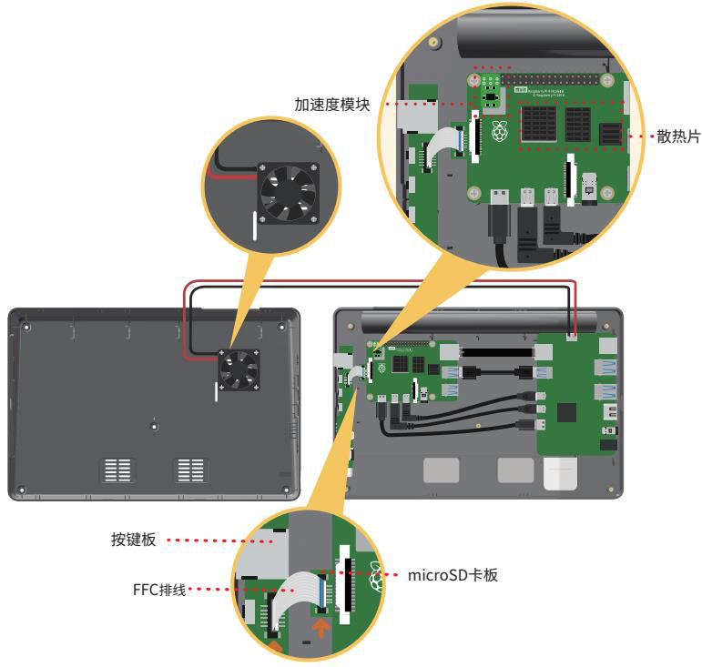

**详细组装步骤**

取出 RasPad，然后将其翻转以取下后盖。

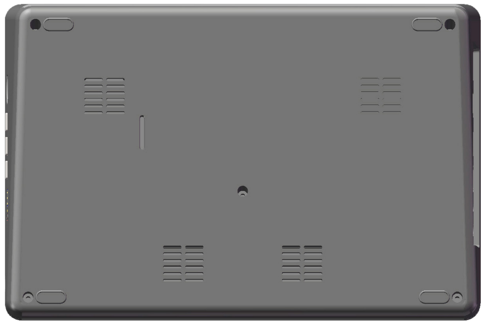

下图是 RasPad 的内部结构图。

.. note:: 

  组装时避免按压两个扬声器。

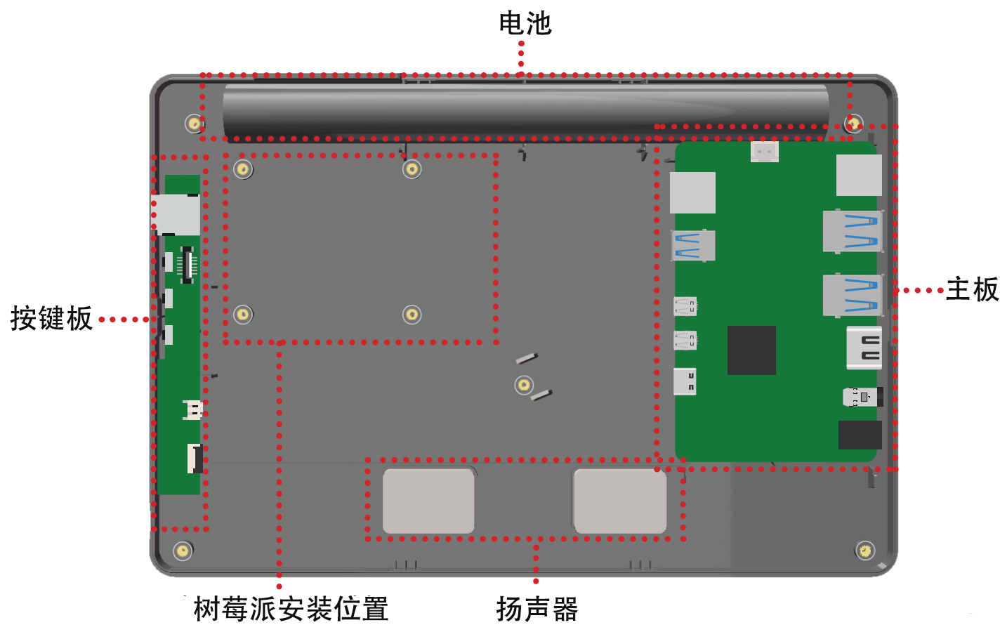

连接树莓派的以太网口和主板。

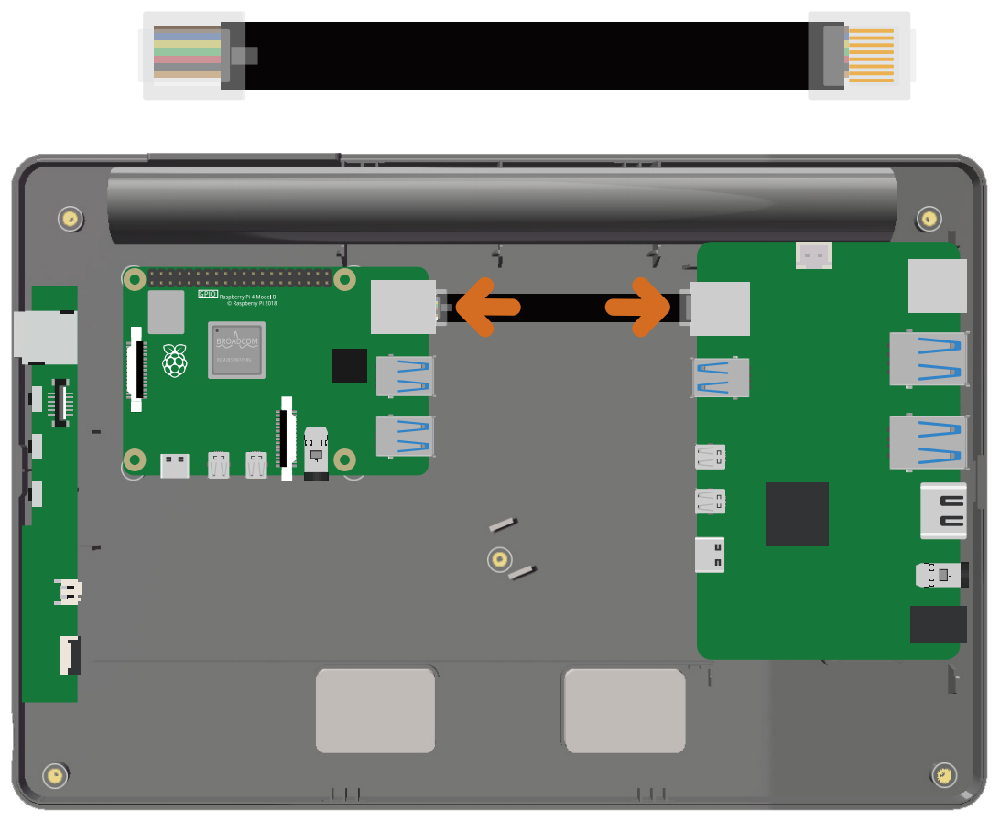

使用随附的USB电缆将树莓派的USB 3.0端口连接到RasPad主板。

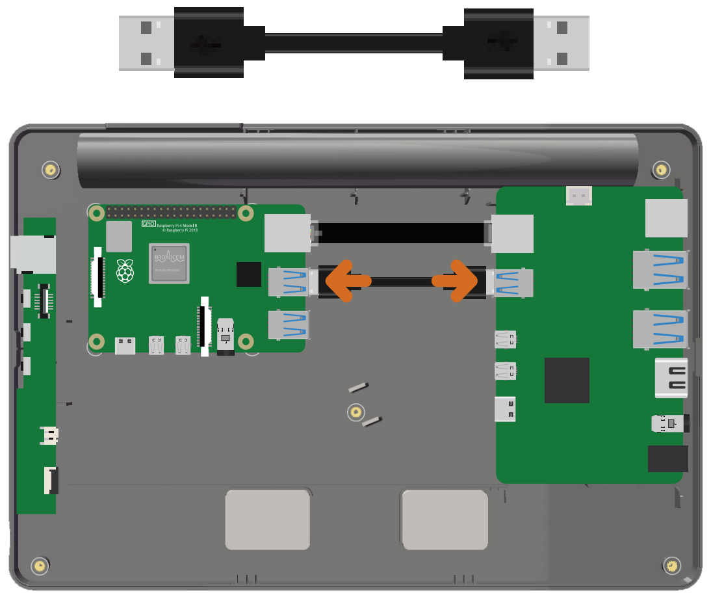

连接两条Micro-HDMI线。

.. note:: 

  A 比 B 稍长。
  

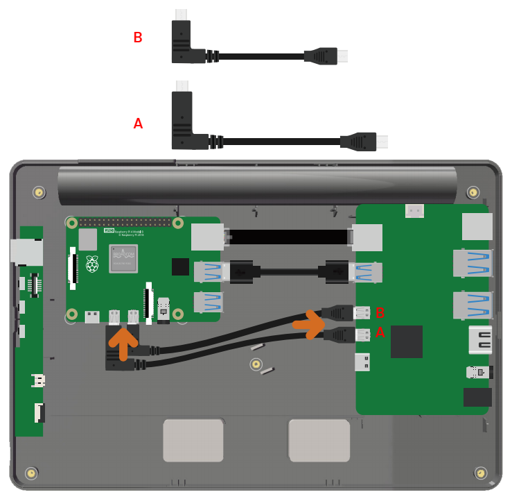

连接 USB-C线。

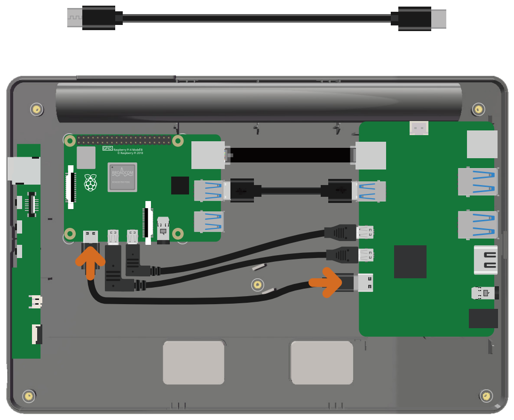

将 FFC插入 microSD卡板。

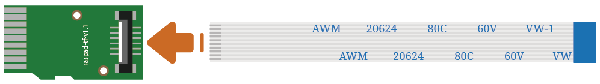

将microSD卡板插入树莓派的 Micro SD卡槽。

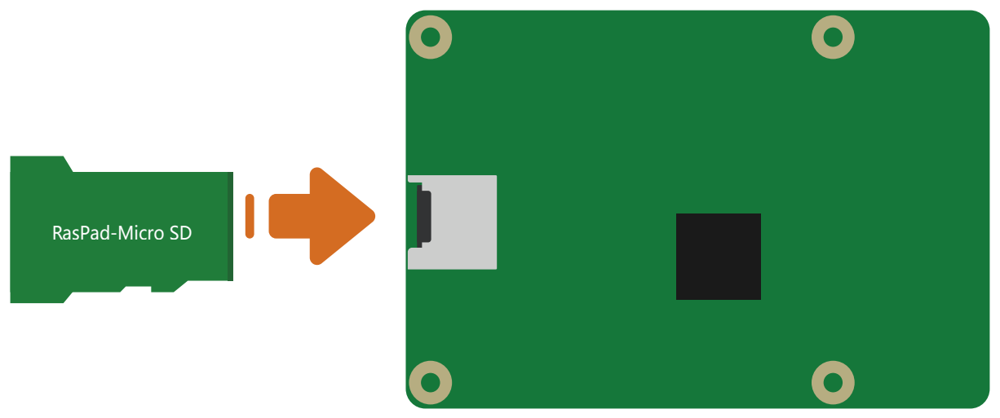

将 FFC的另一端插入 RasPad按键板。

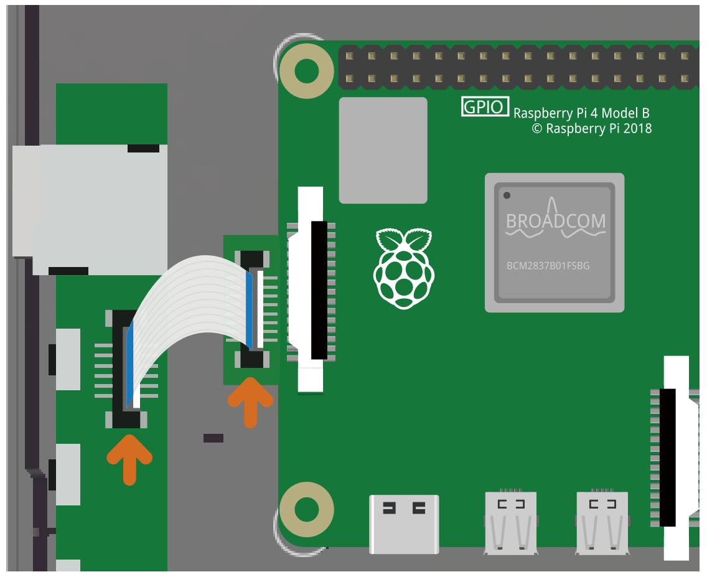

用 4 个 M2.5x4 螺丝固定树莓派。

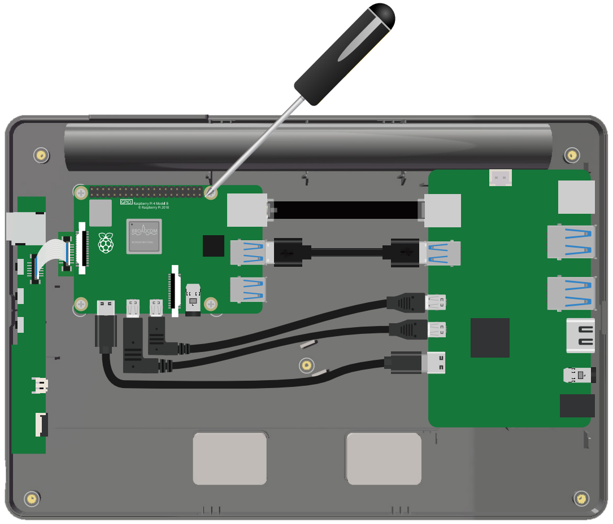

将三个散热片贴到到树莓派的各个芯片上，并插入加速度模块以实现 RasPad 的自动旋转功能。

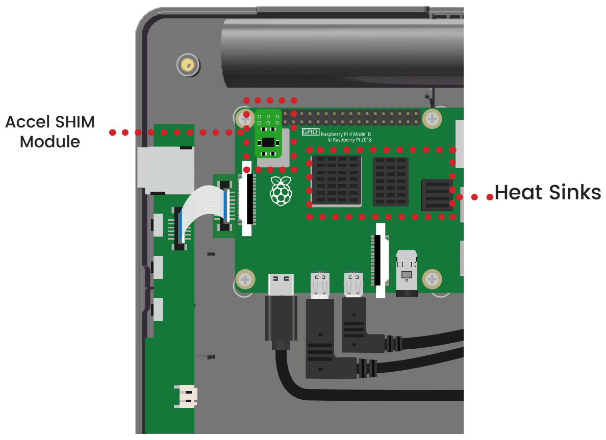

要使用树莓派的 GPIO 引脚，请将 40 针 GPIO排线连接到树莓派，并将带状电缆从外壳顶部引出。

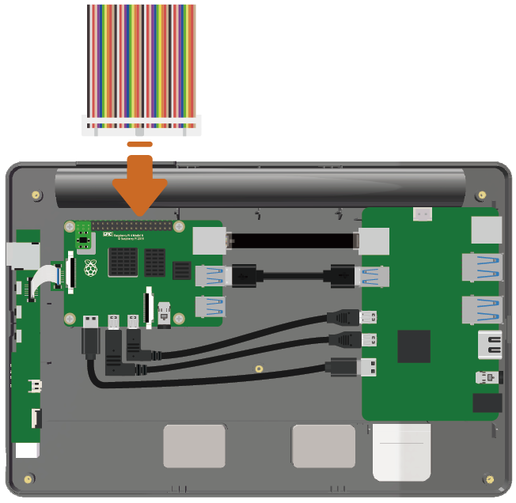

用四颗 M2.5x9 螺丝将风扇固定到后盖上。

.. note::

  有贴纸的一侧面向外部通风口。

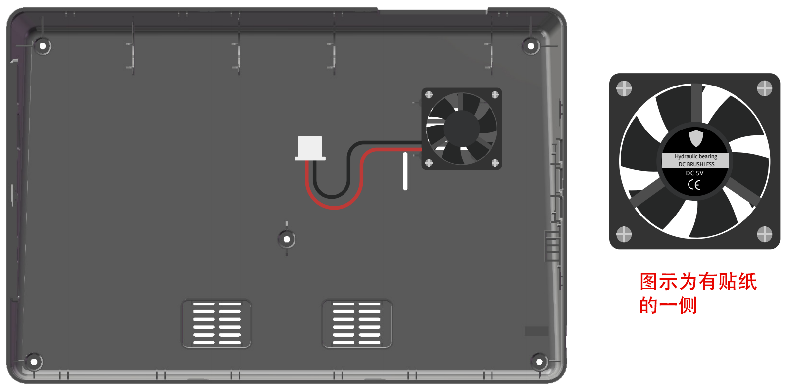

将风扇连接到主板。

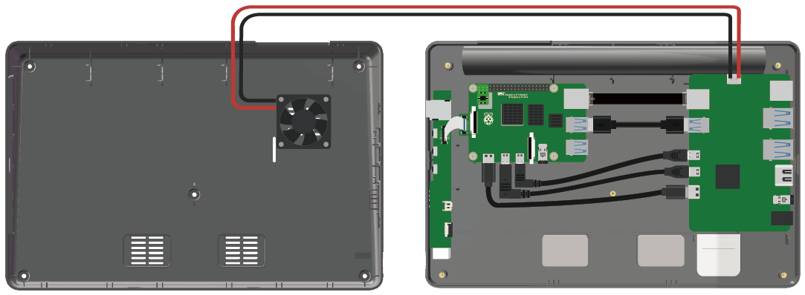

用五颗 M2.5x4 螺丝固定后盖。

.. note::

  请勿强行将后盖固定到位。 如果外壳难以合紧，或螺孔未正确对齐，请检查是否线露出或板子没固定好。

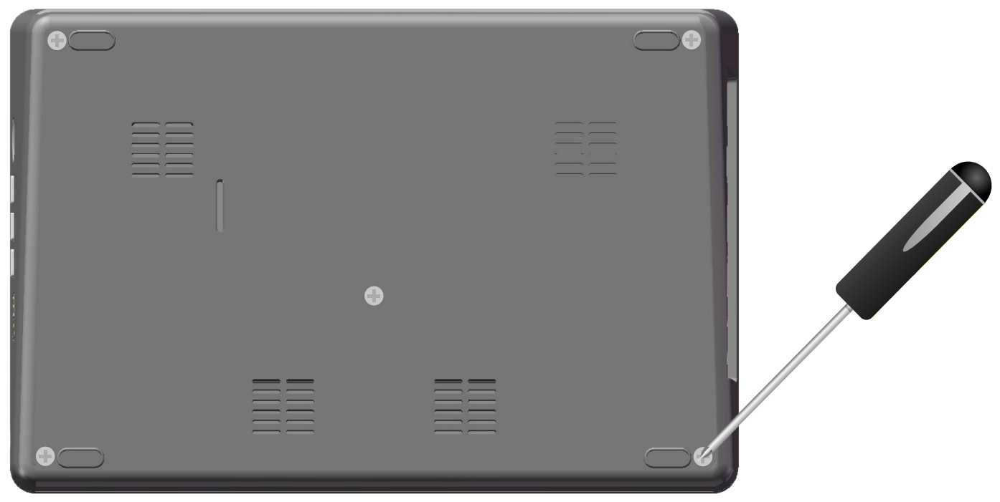

