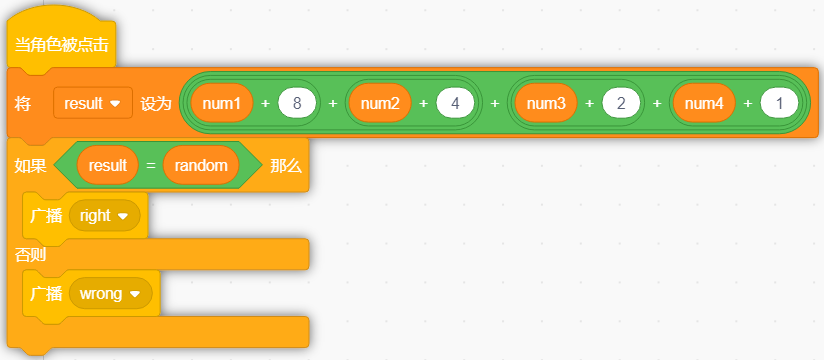

.. note::

    Hello, welcome to the SunFounder Raspberry Pi & Arduino & ESP32 Enthusiasts Community on Facebook! Dive deeper into Raspberry Pi, Arduino, and ESP32 with fellow enthusiasts.

    **Why Join?**

    - **Expert Support**: Solve post-sale issues and technical challenges with help from our community and team.
    - **Learn & Share**: Exchange tips and tutorials to enhance your skills.
    - **Exclusive Previews**: Get early access to new product announcements and sneak peeks.
    - **Special Discounts**: Enjoy exclusive discounts on our newest products.
    - **Festive Promotions and Giveaways**: Take part in giveaways and holiday promotions.

    👉 Ready to explore and create with us? Click [|link_sf_facebook|] and join today!

Binary Game
===============

Description
-------------

Do you understand binary numbers? binary is a number system widely used in computing technology, so understanding binary numbers is an important step for understanding the computer world.

Click on the green flag to start. A random number will appear in the middle of the screen, and you need to know the corresponding binary number. For example, 5, the corresponding Binary number should be 0101, press the bear's paw on the right to confirm. If it is correct, the score will be increased by 1.

.. raw:: html

    <iframe src="https://scratch.mit.edu/projects/526928990/embed" allowtransparency="true" width="695" height="576" frameborder="0" scrolling="no" allowfullscreen></iframe>

Or click `Binary Game <https://scratch.mit.edu/projects/526928990/editor/>`_, and then learn online tutorial on the Scratch official website.

Required Components
-------------------------------

- A RasPad 3
- Scratch 3 (either online or offline)

You Will Learn
---------------------

- Understand binary numbers.
- Convert binary numbers to decimal numbers.

Lesson Guide
--------------

Arrange a small binary abacus at the bottom of the screen.
^^^^^^^^^^^^^^^^^^^^^^^^^^^^^^^^^^^^^^^^^^^^^^^^^^^^^^^^^^^^^^^^

First, we delete the previous sprite. Upload the **Zero.png** file and **Enter.png** file in the sprite list, you have downloaded them from `raspad3.git <https://github.com/sunfounder/raspad3.git>`_ before.

Then we upload the **One.png** file in the **Costumes** option of the **Zero** sprite, so that the **Zero** sprite has **Zero** costume and **One** costume.

Then we copy the **Zero** sprite with the right mouse button, and there will be 3 new **Zero** sprites in the stage area.

.. image:: img/binary2.png
  :width: 600
  :align: center

Set the default costume of the four sprites to Zero, record with the variables "num1", "num2", "num3", and "num4" respectively, and initialize the positions of the four sprites.

The program in the figure below is the program of the Zero sprite. The other three Zero sprites modify the variable names and increase the X coordinate by 80 to make the effect arranged in order from left to right.

.. image:: img/binary3.png
  :width: 400
  :align: center

When we click the √ sign in front of the variable, the variable will disappear from the stage.

Change the shape by clicking and record the binary value.
^^^^^^^^^^^^^^^^^^^^^^^^^^^^^^^^^^^^^^^^^^^^^^^^^^^^^^^^^^^^^^

If you click the **Zero** sprite, it will switch its costume to the next costume, and switch the value of the variable num1, if num1 = 0, change num1 to 1.

In this way, the num1 variable can record the value on the blackboard in real time every time the Zero sprite switches costume.

Copy the program for the remaining three **Zero** sprites and modify the variable names.

Conversion of binary numbers and decimal numbers.
^^^^^^^^^^^^^^^^^^^^^^^^^^^^^^^^^^^^^^^^^^^^^^^^^^^^^^^^

Before programming the Enter sprite, let's first understand the `Binary number <https://en.wikipedia.org/wiki/Binary_number>`_.

A binary number is a number expressed in the base-2 numeral system or binary numeral system, which uses only two symbols: typically "0" (zero) and "1" (one).

How to convert binary to decimal?

For binary number with n digits:
  
.. code-block::

  dn-1 ... d3 d2 d1 d0

The decimal number is equal to the sum of binary digits (dn) times their power of 2 (2^n):

.. code-block::

  decimal = d0×2^0 + d1×2^1 + d2×2^2 + ...

If binary is 1000, the corresponding decimal should be 1x2^3+0x2^2+0x2^1+0x2^0=8

So, what is the decimal number of 1010? 1*2^3+0*2^2+1*2^1+0*2^0=10.

Programming the Backdrop
^^^^^^^^^^^^^^^^^^^^^^^^^^^^

When the game starts, a random integer between 1-16 appears in the middle of our screen as a decimal number that needs to be converted by binary, and it is stored in the variable random.

.. image:: img/binary8.png
  :width: 600
  :align: center

Whether we receive a "right" result or a "wrong" result, we have to regenerate the random number and proceed to the next round of the game.

Programming the Enter Sprite
^^^^^^^^^^^^^^^^^^^^^^^^^^^^^^^

After you understand the conversion of binary numbers and decimal numbers, let's program the Enter sprite.

First, we create a result variable, when the Enter sprite is clicked, We convert the binary number composed of the num1 variable, num2 variable, num3 variable and num4 variable into a decimal number, and save the result in the result variable.

.. image:: img/binary10.png
  :width: 750
  :align: center

Then use the result variable to compare the value of the random variable. If they are equal, we broadcast a "right" message, otherwise we broadcast a "wrong" message.

.. image:: img/binary11.png
  :width: 750
  :align: center

Now, click on the green flag above the stage area to start the game and explore the magical binary!

Challenge
-----------

I believe that you will be smart enough to program and implement this game soon. Next, we will add some challenges to enrich our game content.

- Add a Zero sprite to convert random integers between 1-32.
- When you click on the Zero sprite, a "Pop" sound effect will be emitted.
- 1 point will be deducted for incorrect answers!

