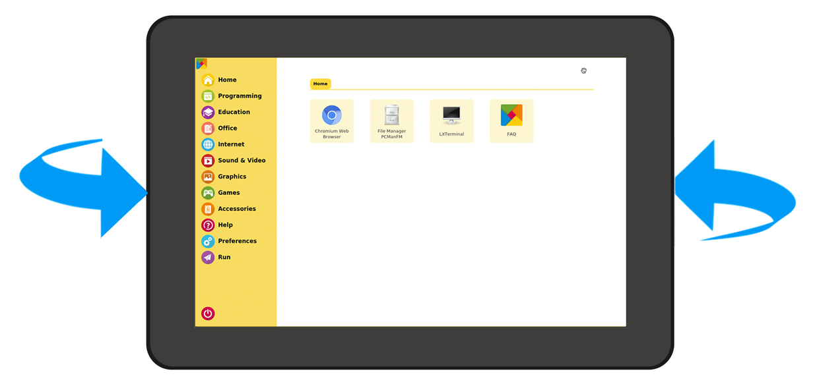
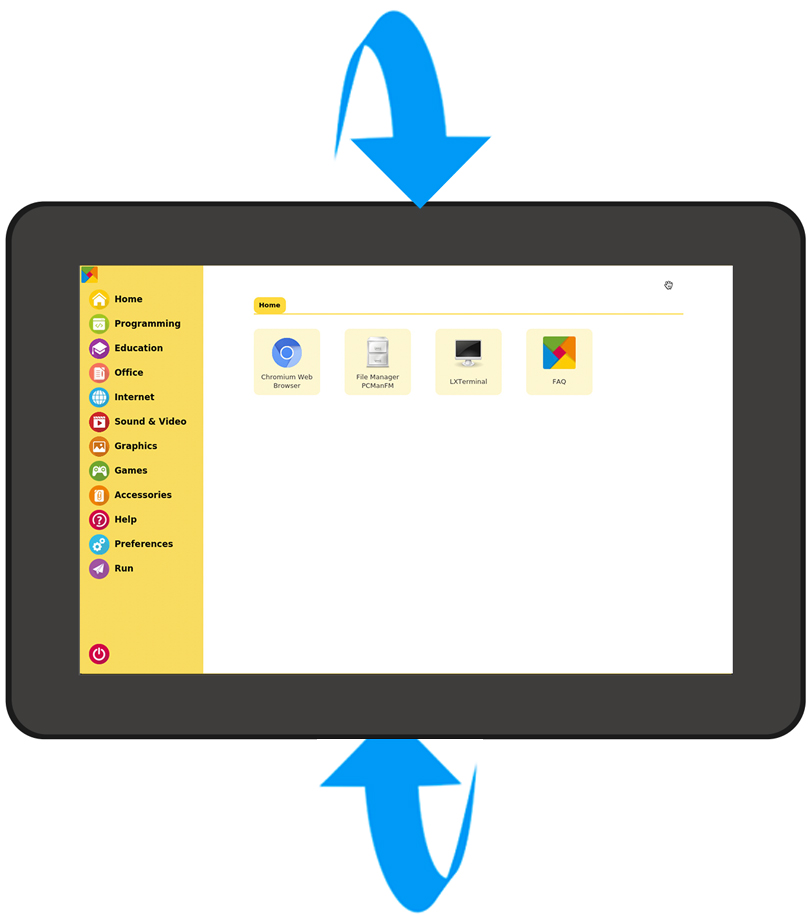
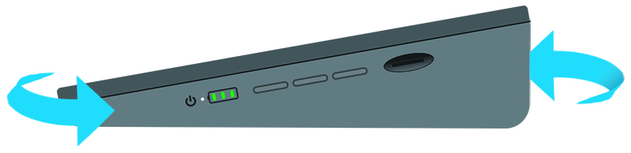

Calibrate the Rotating Screen Function
================================================

Every time after you install the Raspberry Pi OS, you need to recalibrate the built-in Accel SHIM module so that the rotating screen function can work properly.

The calibration steps are as follows：

First run the calibration script.

.. code-block:: shell

  sudo auto-rotator calibrate

Now start to rotate the RasPad 3 according to the picture below. Rotate 360° from left to right, and finally return to the front.

Then rotate 360° from top to bottom, and finally return to the front.

Place the RasPad flat on the desktop and rotate it 360 degrees.

After the calibration is complete, press ``Ctrl + C`` to exit the calibration script and restart RasPad 3.

.. code-block:: shell

  sudo reboot