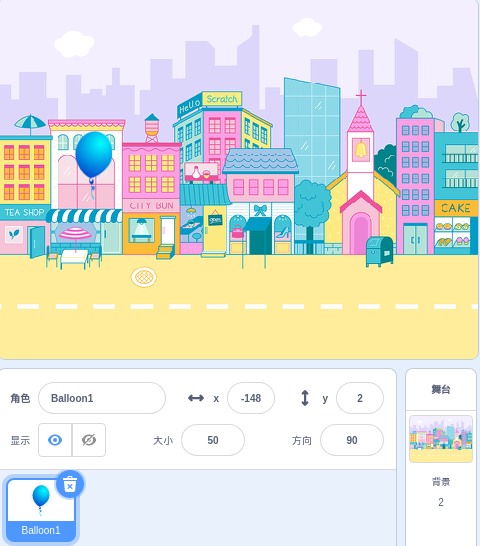
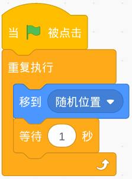
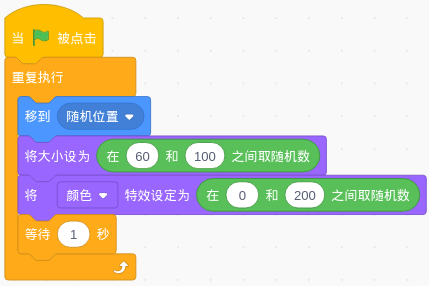
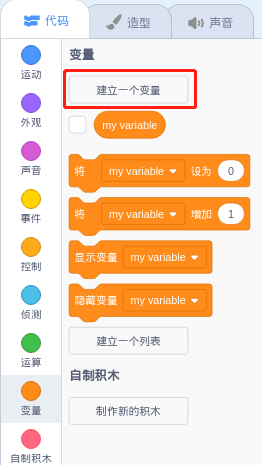
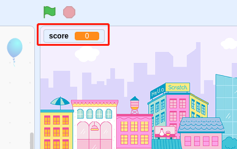
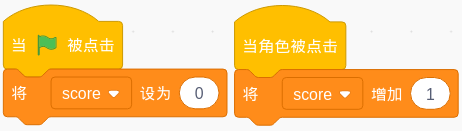

Clicker Game
==============

Description
-------------

Hello, kids! Today we will play a game of poking balloons.

Click the green flag to start.

.. raw:: html

    <iframe src="https://scratch.mit.edu/projects/526927491/embed" allowtransparency="true" width="695" height="576" frameborder="0" scrolling="no" allowfullscreen></iframe>

Or click `Clicker Game <https://scratch.mit.edu/projects/526927491/editor/>`_, and then learn online tutorial on the Scratch official website.

Required Components
-------------------------------

- A RasPad 3
- Scratch 3 (either online or offline)

You Will Learn
---------------------

- Pick random number.
- Change the position, size and color of the sprite.
- Make a variable.

Lesson Guide
--------------

Let the balloons appear randomly.
^^^^^^^^^^^^^^^^^^^^^^^^^^^^^^^^^^^^^^^^

First, add Balloon1 sprite and Colorful City backdrop.

Set the balloon to a random position.

Let it change the color and size randomly.

Now, run the green flag and you can see the balloons randomly change in the stage area.

Click on the balloon to add score.
^^^^^^^^^^^^^^^^^^^^^^^^^^^^^^^^^^^^^^

Now, we need to establish a scoring mechanism. Whenever the balloon is clicked, the score will increase by one.

Create a variable (it can help us keep track of and store the score). In Variables, select 「**Make a Variable**」 and named **score**.

We will see it in the upper left corner of the stage.

When the balloon is clicked, the score is increased by one. When you click the green flag (the game starts), the score will be reset to zero.

Now, click the green flag above the stage area to start the game, and click the balloon to increase your score!

Challenge
-----------

I believe that you will be smart enough to program and implement this game soon. Next, we will add some challenges to enrich our game content.

- When the balloon is clicked, the sound effect of "POP" is emitted.
- Let the Pufferfish sprite appear randomly on the stage as well, if you click on it, you will lose score!

