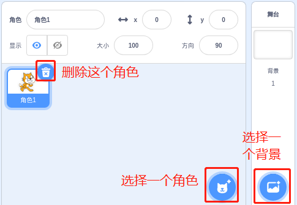
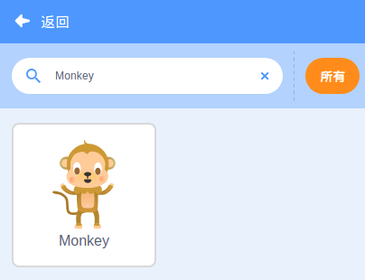
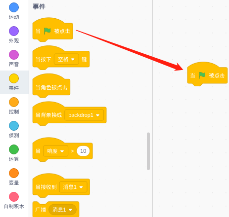
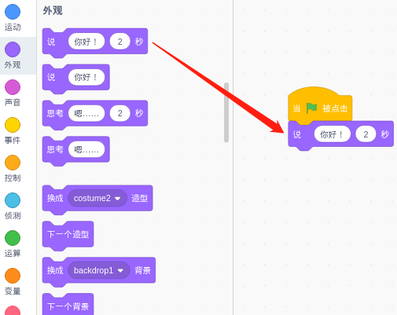
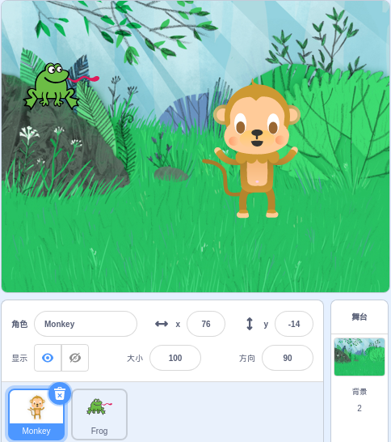
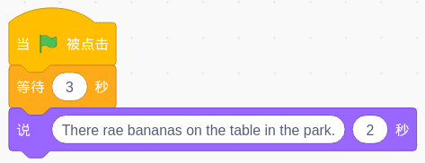
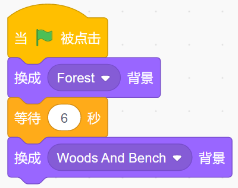
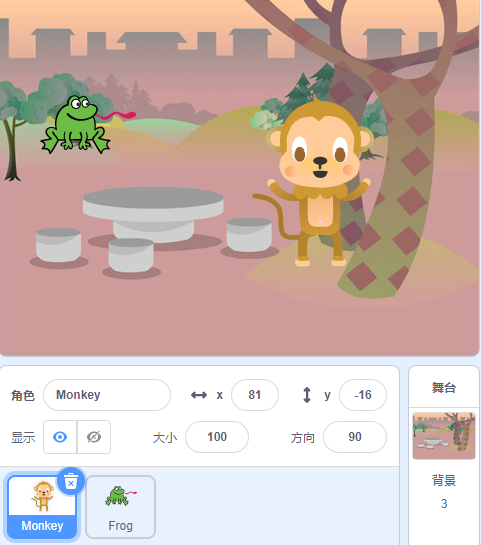
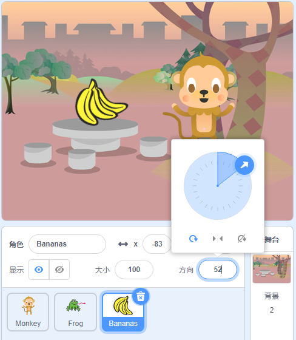
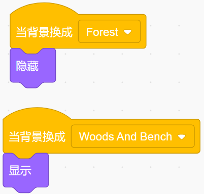

创作故事
================

描述
-------------

你喜欢听故事吗？ 比如，睡前听父母讲的小故事，晚上可以做一个甜蜜的梦。 今天我们要“讲述”一只小猴子在 Scratch 上寻找香蕉的故事。

点击绿旗开始。

.. raw:: html

    <iframe src="https://scratch.mit.edu/projects/526926134/embed" allowtransparency="true" width="695" height="576" frameborder="0" scrolling="no" allowfullscreen></iframe>

或者点击 `Create a Story <https://scratch.mit.edu/projects/526926134/editor/>`_, 然后在Scratch官网学习在线教程。

所需组件
-------------------------------

- A RasPad 3
- Scratch 3 (either online or offline)

你会学到
---------------------

- 选择你想要的角色。
- 让角色四处走动。
- 让角色互相交谈。
- 切换场景。

课程指南
--------------

这是一只快乐的猴子，名叫 **Harley**。
^^^^^^^^^^^^^^^^^^^^^^^^^^^^^^^^^^^^^^^^^^^^

在Scratch的右下角，有两个区域——角色区和舞台区，在这里我们可以添加我们想要的角色和舞台背景。

首先是当前角色，然后点击 **选择一个角色** 按钮来添加角色。

我们需要找到Monkey，点击它！ 你可以用上面的搜索框进行查找。然后给它起一个名字 **Harley**。

Harley饿了。 他问他的朋友Perry香蕉在哪里？
^^^^^^^^^^^^^^^^^^^^^^^^^^^^^^^^^^^^^^^^^^^^

单击您的 Harley 角色，然后单击事件类别。 将 **当 ⚑ 被点击** 拖到右边的编码区。

点击外观类别并拖动 **说 "你好!" 2秒** 到 **当 ⚑ 被点击** 的底部。

在输入框中更改它说话的内容以及它说话的时长。

Perry在公园里看到了香蕉，所以他告诉了Harley.
^^^^^^^^^^^^^^^^^^^^^^^^^^^^^^^^^^^^^^^^^^^^^^^^^^^^^^^^^

Perry是一只青蛙，添加青蛙角色和森林背景。

点击青蛙精灵，添加一个[等待（）秒]块（来等Harley把话说完），然后青蛙开始说话。

现在，点击绿旗，我们就可以看到Harley和Perry的聊天。

Harley去了公园，在桌子上发现了香蕉。
^^^^^^^^^^^^^^^^^^^^^^^^^^^^^^^^^^^^^^^^^^^^^^^^^^^^^^^^

现在，单击背景并让它在 6 秒后（对话结束后）切换。

现在，通过点击绿旗，我们可以看到Perry和Harley在对话后一起来到公园。

但是Harley应该一个人来公园，桌子上应该有香蕉。 所以，我们必须让Perry消失。

点击青蛙角色，添加一个事件， **当背景换成...** 时，在外观中找到“显示”和“隐藏”。 让Perry适时出现！

.. image:: img/create_a_story11.png
  :width: 450
  :align: center

添加香蕉角色并调整角度。

也让它在正确的时间出现。

现在，点击绿旗，你可以看到一个完整的故事。

挑战
-----------

相信聪明的你很快就能编程实现这个游戏，接下来我们会增加一些挑战来丰富我们的故事内容。

- 让Harley将香蕉带回森林，与Perry分享。

