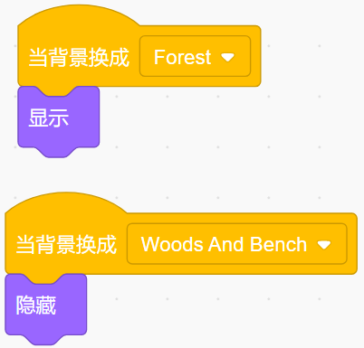

.. note::

    Hello, welcome to the SunFounder Raspberry Pi & Arduino & ESP32 Enthusiasts Community on Facebook! Dive deeper into Raspberry Pi, Arduino, and ESP32 with fellow enthusiasts.

    **Why Join?**

    - **Expert Support**: Solve post-sale issues and technical challenges with help from our community and team.
    - **Learn & Share**: Exchange tips and tutorials to enhance your skills.
    - **Exclusive Previews**: Get early access to new product announcements and sneak peeks.
    - **Special Discounts**: Enjoy exclusive discounts on our newest products.
    - **Festive Promotions and Giveaways**: Take part in giveaways and holiday promotions.

    👉 Ready to explore and create with us? Click [|link_sf_facebook|] and join today!

Create a Story
================

Description
-------------

Do you like to hear stories? For example, before going to bed, you can have a sweet dream at night by listening to a little story from your parents. Today we are going to "tell" the story of a little monkey looking for a banana on Scratch.

Click the green flag to start.

.. raw:: html

    <iframe src="https://scratch.mit.edu/projects/526926134/embed" allowtransparency="true" width="695" height="576" frameborder="0" scrolling="no" allowfullscreen></iframe>

Or click `Create a Story <https://scratch.mit.edu/projects/526926134/editor/>`_, and then learn online tutorial on the Scratch official website.

Required Components
-------------------------------

- A RasPad 3
- Scratch 3 (either online or offline)

You Will Learn
---------------------

- Choose the sprite you want.
- Let the sprites move around.
- Let the sprites talk to each other.
- Switch scenes.

Lesson Guide
--------------

This is a happy Monkey named **Harley**.
^^^^^^^^^^^^^^^^^^^^^^^^^^^^^^^^^^^^^^^^^^^^

In the lower right corner of the Scratch, there are two areas-the character area and the stage area, where we can add the sprites and stage we want.

.. image:: img/create_a_story1.png
  :width: 600
  :align: center

First the current sprite, and then click the **Choose a Sprite** button to add the sprite.

Here we need to find Monkey, click on it! You can use the search box above to find it. Here we give it a name **Harley**.

.. image:: img/create_a_story2.png
  :width: 450
  :align: center

Harley is hungry. He asked his friend Perry where is the banana?
^^^^^^^^^^^^^^^^^^^^^^^^^^^^^^^^^^^^^^^^^^^^^^^^^^^^^^^^^^^^^^^^^^^^^^^^

Click on your Harley sprite, and then click on the Event category. Drag 「**when ⚑ clicked**」 to the coding area on the right.

.. image:: img/create_a_story3.png
  :width: 750
  :align: center

Click on the Looks category and drag 「**say "Hello!" for 2 second**」 to the bottom of "when ⚑ clicked".

.. image:: img/create_a_story4.png
  :width: 750
  :align: center

Change what it says and how long it says in the input box.

.. image:: img/create_a_story5.png
  :width: 700
  :align: center

Perry had seen bananas in the park, so he told Harley.
^^^^^^^^^^^^^^^^^^^^^^^^^^^^^^^^^^^^^^^^^^^^^^^^^^^^^^^^^

Perry is a Frog, add Frog sprite and Forest backdrop.

.. image:: img/create_a_story7.png
  :width: 600
  :align: center

Click on the Frog sprite, add a 3 second 「**delay**」 block (wait for Harley to finish speaking), and then it speaks.

.. image:: img/create_a_story8.png
  :width: 600
  :align: center

Now, click on the green flag, we can see Harley and Perry chat.

Harley went to the park and found bananas on the table.
^^^^^^^^^^^^^^^^^^^^^^^^^^^^^^^^^^^^^^^^^^^^^^^^^^^^^^^^

Now, click on the Backdrop and let it switch after 6 seconds (after the conversation ends).

.. image:: img/create_a_story9.png
  :width: 500
  :align: center

Now, by clicking on the green flag, we can see that the Perry and Harley "come" to the park together after the conversation.

But Harley should come to the park alone, and there should be bananas on the table. So, we have to make Perry "disappear".

Click on the Frog sprite, add an event, 「**when backdrop switches to...**」, and find "hide" and "show" in Looks. Let the Perry appear at the right time!

Add the Banana sprite and adjust the angle.

.. image:: img/create_a_story12.png
  :width: 600
  :align: center

Also let it appear at the right time.

.. image:: img/create_a_story13.png
  :width: 600
  :align: center

Now, click on the green flag and you can see a complete story.

Challenge
-----------

Believe that you who are smart will be able to program and implement this game soon, then we will add some challenges to enrich our story content.

- Harley will take the bananas back to the Forest, share it with Perry.

