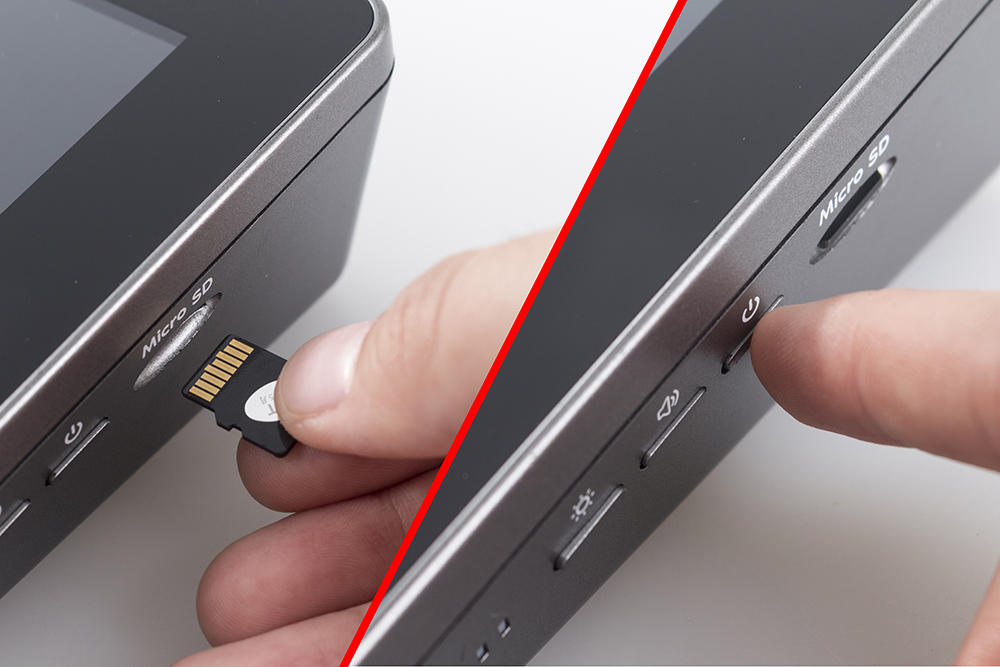

.. note::

    Hello, welcome to the SunFounder Raspberry Pi & Arduino & ESP32 Enthusiasts Community on Facebook! Dive deeper into Raspberry Pi, Arduino, and ESP32 with fellow enthusiasts.

    **Why Join?**

    - **Expert Support**: Solve post-sale issues and technical challenges with help from our community and team.
    - **Learn & Share**: Exchange tips and tutorials to enhance your skills.
    - **Exclusive Previews**: Get early access to new product announcements and sneak peeks.
    - **Special Discounts**: Enjoy exclusive discounts on our newest products.
    - **Festive Promotions and Giveaways**: Take part in giveaways and holiday promotions.

    👉 Ready to explore and create with us? Click [|link_sf_facebook|] and join today!

Create Musical Instrument
===================================

Description
-------------

You can turn RasPad 3 into a game screen playing with your friends, a smart alarm showing the weather and time, a display monitoring your robot’s action and many other things.

This article will show you how to DIY a Musical Instrument with your RasPad 3. Let’s take a look!

Required Components
-------------------------------

- A RasPad 3
- 8G+ SD Card
- Scratch 3 (either online or offline)
- Micro SD Card Reader
- 40 Pin Ribbon Cable
- T-Type GPIO Extension Board
- Breadboard
- Button
- 10k Ohm Resistor
- Several Jumper Wires

You Will Learn
---------------------

- Use note functions on Scratch.
- Input the button value from the GPIO pins.

Lesson Guide
--------------

Build the Circuit
^^^^^^^^^^^^^^^^^^^^^^

First connect the GPIO Extension Board, please read :ref:`GPIO Extension Board` for specific steps.

.. image:: img/pir2.jpg
  :width: 600
  :align: center

Insert the T-type GPIO extension board into the breadboard and build the circuit as shown below.

.. image:: img/paino3.png
  :width: 600
  :align: center

Programming with Scratch 3
^^^^^^^^^^^^^^^^^^^^^^^^^^^^^^^^

Insert the SD card into the slot of RasPad 3，and then long press the power button to boot the RasPad 3. 

.. warning::
  
  The card slot is set on the back cover and it’s in snap style. Therefore before opening or closing the back cover, you need to take out the microSD card to avoid damaging your microSD card and the internal button board.

On the left of Scratch 3 main page are some neatly arranged blocks with which you can drag to program. In this project, we need to add in other two functions: Music and Raspberry Pi GPIO. The Music function to play instruments and drums, and the Raspberry Pi GPIO function can be used to control the whole pins of Raspberry Pi.

.. image:: img/paino5.jpg
  :width: 600
  :align: center

Tap Add icon at lower left corner and choose Music and Raspberry Pi GPIO to add two functions on the left of the main page of the Scratch 3.

.. image:: img/paino6.jpg
  :width: 700
  :align: center

Finished the program.

Press these three buttons on the breadboard and there emits the tones “Do, Re, Mi”.

.. image:: img/paino8.jpg
  :width: 600
  :align: center

If you hate reading, see this video.

.. raw:: html

  <iframe width="695" height="576" src="https://www.youtube.com/embed/Ku4vRZz-x2I" title="YouTube video player" frameborder="0" allow="accelerometer; autoplay; clipboard-write; encrypted-media; gyroscope; picture-in-picture" allowfullscreen></iframe>

In this article, we introduce how to use RasPad 3 to create musical instrument. Surely, you can exert all your imagination and inspiration to upgrade your musical instrument, for example you can add more buttons, notes and an LED to make a cool music box.
