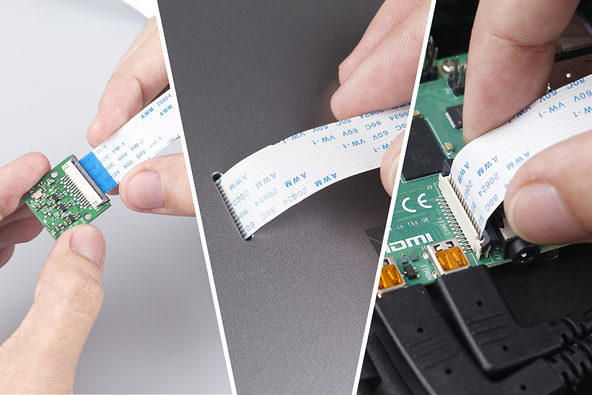
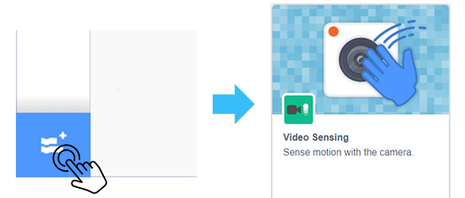
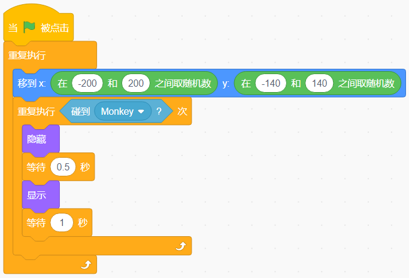
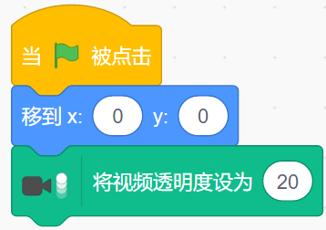
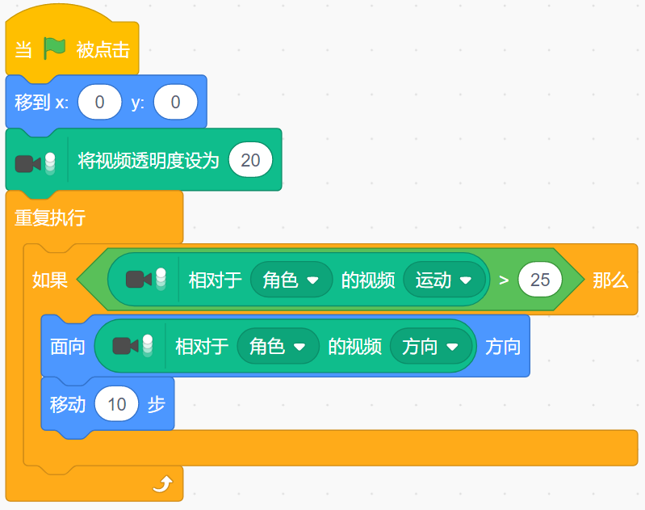

吃香蕉游戏
======================

描述
-------------

Scratch有一个 **Video Sensing** 扩展模块，可以在Scratch中开启摄像头，检测摄像头屏幕上物体的移动。

今天，我们将使用相机制作一个吃香蕉的游戏。 在规定的时间内，帮助猴子多吃香蕉。

要在白色背景下玩游戏，请单击绿旗开始。 移动相机前的彩色物体来控制猴子精灵。

.. raw:: html

    <iframe src="https://scratch.mit.edu/projects/526931685/embed" allowtransparency="true" width="695" height="576" frameborder="0" scrolling="no" allowfullscreen></iframe>

或者点击 `Eating Banana Game <https://scratch.mit.edu/projects/526931685/editor/>`_, 在Scratch官网学习在线教程。

所需组件
-------------------------------

- A Raspad
- Scratch 3 (离线或者在线)

你会学到
---------------------

- 在 RasPad 上安装摄像头。
- 增加Video Sensing扩展模块，使用摄像头功能
- 让相机检测我们的动作

课程指南
--------------

**安装和使用摄像头**

摄像头安装教程请参考 :ref:`安装摄像头`。

单击scratch 左下角的 **Add Extension** 图标，然后选择 **Video Sensing** 扩展。

此时，您可以看到在 Scratch 舞台上拍摄的相机。

**安排猴子和香蕉**

首先，我们删除原始角色，然后添加猴子和香蕉角色，并将它们的大小更改为 50。

让香蕉随机出现。

香蕉在遇到猴子后消失，这意味着它被猴子吃掉并随机重新出现。

让猴子出现在舞台中央并初始化摄像头数据（透明度设置为20）。

如果摄像头检测到物体在移动，让猴子朝着物体移动。

现在，点击舞台区域顶部的绿旗开始游戏。

让猴子吃香蕉，它很饿！ 尽量在白色背景上玩这个游戏，以防止其他物体的干扰。

挑战
------------

我相信你很快就能掌握并实现这个游戏。 接下来可以添加一些额外的内容来使你的游戏更丰富。

- 当猴子吃香蕉时，我们给分数加 1。 30秒内，看谁得分最高！
- 当猴子吃香蕉时，它会发出合适的声音效果。

