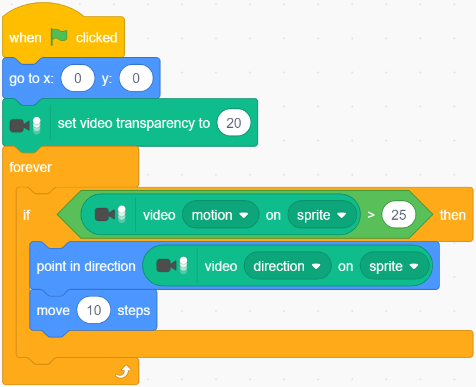

.. note::

    Hello, welcome to the SunFounder Raspberry Pi & Arduino & ESP32 Enthusiasts Community on Facebook! Dive deeper into Raspberry Pi, Arduino, and ESP32 with fellow enthusiasts.

    **Why Join?**

    - **Expert Support**: Solve post-sale issues and technical challenges with help from our community and team.
    - **Learn & Share**: Exchange tips and tutorials to enhance your skills.
    - **Exclusive Previews**: Get early access to new product announcements and sneak peeks.
    - **Special Discounts**: Enjoy exclusive discounts on our newest products.
    - **Festive Promotions and Giveaways**: Take part in giveaways and holiday promotions.

    👉 Ready to explore and create with us? Click [|link_sf_facebook|] and join today!

Eating Banana Game
======================

Description
-------------

Scratch has a Video Sensing expansion module, which can turn on the camera in Scratch and detect the movement of objects on the camera screen.

Today, we will use the camera to make a eating banana game. In the stipulated time, help the Monkey eat more bananas.

To play the game against a white background, click on the green flag to start. Move colored objects in front of the camera to control the Monkey sprite.

.. raw:: html

    <iframe src="https://scratch.mit.edu/projects/526931685/embed" allowtransparency="true" width="695" height="576" frameborder="0" scrolling="no" allowfullscreen></iframe>

Or click `Eating Banana Game <https://scratch.mit.edu/projects/526931685/editor/>`_, and then learn online tutorial on the Scratch official website.

Required Components
-------------------------------

- A Raspad
- Scratch 3 (either online or offline)

You Will Learn
---------------------

- Install camera on RasPad.
- Add Video Sensing expansion module and use camera function
- Let the camera detect our movements

Lesson Guide
--------------

Install and use the camera.
^^^^^^^^^^^^^^^^^^^^^^^^^^^^^^^

For the camera installation tutorial, please refer to :ref:`Assemble the Camera Module`.

.. image:: img/banana1.jpg
  :width: 600
  :align: center

Click the "Add Extension" icon at the bottom left of scratch and select the **Video Sensing** extension.

.. image:: img/banana3.jpg
  :width: 700
  :align: center

At this point, you can see the camera shot on the Scratch stage.

Arrange monkeys and bananas
^^^^^^^^^^^^^^^^^^^^^^^^^^^^^^^^^^

First, we delete the original sprite, then add Monkey sprite and Bananas sprite, and change their sizes to 50.

Let Bananas appear randomly.

.. image:: img/banana4.png
  :width: 700
  :align: center

Bananas disappears after encountering the Monkey, which means it was eaten by the Monkey and reappears randomly.

.. image:: img/banana5.png
  :width: 700
  :align: center

Let the Monkey appear in the center of the stage and initialize the camera data (transparency is set to 20).

.. image:: img/banana6.png
  :width: 400
  :align: center

If the camera detects an object moving, let the Monkey move towards the object.

Now, click on the green flag at the top of the stage area to start the game.

Let the Monkey eat bananas, it is very hungry! Try to play this game on a white background to prevent interference from other objects.

Challenge
------------

I believe that you will be smart enough to program and implement this game soon. Next, we will add some challenges to enrich our game content.

- When Monkey eats banana, we add 1 to the score. Within 30s, see who has the highest score!
- When Monkey eats a banana, it emits a suitable sound effect.

