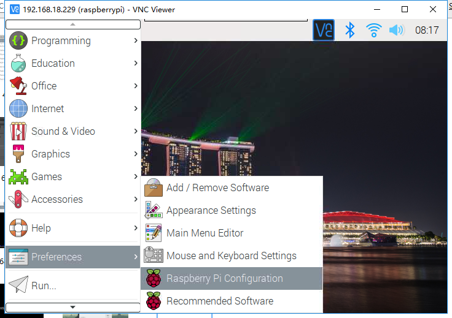
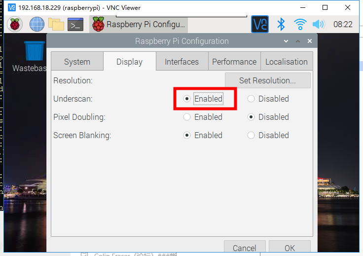

.. note::

    Hello, welcome to the SunFounder Raspberry Pi & Arduino & ESP32 Enthusiasts Community on Facebook! Dive deeper into Raspberry Pi, Arduino, and ESP32 with fellow enthusiasts.

    **Why Join?**

    - **Expert Support**: Solve post-sale issues and technical challenges with help from our community and team.
    - **Learn & Share**: Exchange tips and tutorials to enhance your skills.
    - **Exclusive Previews**: Get early access to new product announcements and sneak peeks.
    - **Special Discounts**: Enjoy exclusive discounts on our newest products.
    - **Festive Promotions and Giveaways**: Take part in giveaways and holiday promotions.

    👉 Ready to explore and create with us? Click [|link_sf_facebook|] and join today!

FAQ
===============

Fix Raspberry Pi boot problems
---------------------------------------

1. Check whether the power indicator is on, if it does not, you need to charge the RasPad or try a different power source. It is best to use the power supply provided by SunFounder.
2. You might be booting but not getting video output. First, check that your cables are connected properly. Take them all out and reconnect them. Try a different HDMI cable if you have one.
3. Take out the microSD card and use Raspberry Pi Imager to flash a new installation of Raspberry Pi OS to it (see :ref:`Install the Raspberry Pi OS`). 
4. Try a different microSD card.

Can't detect Micro SD card?
-----------------------------

1. Whether the FFC on the Micro SD card board is connected correctly, refer to :ref:`ASSEMBLY INSTRUCTIONS`.
2. Check whether the golden finger (transmission signal) on the SD card or the Micro SD card board turn black. If it is, it means that the gold finger has been oxidized and you need to erase the oxide layer with an eraser.
3. Check whether the SD card is damaged. If the plug of the SD card is unplugged while reading the SD card, causing the power supply to the card to be interrupted, the card may be damaged.

Screen can not be rotated?
---------------------------------

The reason is that the built-in Accel SHIM module has not been calibrated.

Please refer to: :ref:`Install Rotating Screen Service`.

About sleep problem
-----------------------------

* If your RasPad screen is on but black, this is the Raspberry Pi going into sleep mode. You can wake up by tapping the touch screen, or by pressing the external keyboard or mouse.

* If the RasPad's screen is not lit or you short press the power button, this is the RasPad entering sleep mode. You can wake up by pressing the power button shortly.

About the shutdown problem
----------------------------------

* When you click shutdown button on the Raspberry Pi desktop or shutdown the Raspberry Pi at the command line, the Raspberry Pi will shut down, but the RasPad is not shut down, it will automatically go to sleep after a period of time because it does not detect the HDMI signal. You need to long press the RasPad's power button to shut down.

* If you directly press and hold the power button of RasPad, both Raspberry Pi and RasPad will be turned off at the same time. But it should be noted that this is to turn off the power of the Raspberry Pi directly, which may damage the Micro SD card. It is recommended to turn off the Raspberry Pi first, and then turn off RasPad.

Desktop is not full screen
---------------------------------------
If the desktop does not display in full screen after the Raspberry Pi boots, you need to leave **Underscan** enabled.

Click on the menu icon in the top left corner and select **Preferences** -> **Raspberry Pi Configuration**.

In the **Display** page, make Underscan enabled and then restart the Raspberry Pi.

About the touch problem
-----------------------------------

**A. Touch does not work**

First of all, please check whether the internal cables connection are stable.

For the old version of RasPad 3, because the touch will become very strange after an external display, so turn off the touch function.

**B. Touch inaccurate**

Because the Raspberry Pi system is based on the PC mouse control, the human hand can not be as accurate as the mouse, if the touch accuracy problems cause inconvenience, we recommend that you increase the size of the icon, or use the :ref:`RasPad LAUNCHER` to install RasPad theme.

About the Audio problem
-------------------------

**A. There is no sound.**

If the volume of either RasPad and Raspberry Pi is set to 0, it will result in no sound.

**B. headphone jack does not work properly**

Since the 3.5mm headphone jack is inside the RasPad 3 case, please check if the headphone is fully inserted.

Fan is too noisy?
-------------------------

This is because the fan speed is too high, which was originally done to enhance the cooling capacity of RasPad 3. You can reduce the noise by setting the fan switch on the upper left corner of the mainboard to \'s\', but this will reduce the fan speed as well as the cooling capacity.

Power consumption is too fast?
--------------------------------

RasPad's battery capacity is 3x3.7Vx3Ah = 33Wh, which is a bit larger than iPad pro 2020's 28.65Wh. But because the Raspberry Pi itself is relatively large power consumption, standby about 3W, and the Raspberry Pi system is not similar to the power-saving mechanism of the tablet or even iOS. Compared to the previous generation, we have reduced the original 7w screen drive power consumption to 3W or less, and the use of time has been improved.

We will continue to optimize this use of time.

Touch function sometimes fails?
------------------------------------
When opening some software of Raspberry Pi, you will find some places where touch does not work, this is caused by Raspberry Pi OS not doing adaptation for touch screen. We can't solve it and need to wait for the Raspberry Pi OS to optimize the solution.

The WiFi connection is unstable?
----------------------------------------

Because we found that USB 3.0 high-speed transmission will interfere with the Raspberry Pi's 2.4G wifi signal. So if you find the 2.4G signal is unstable, please try to use WIFI 5G AP. 