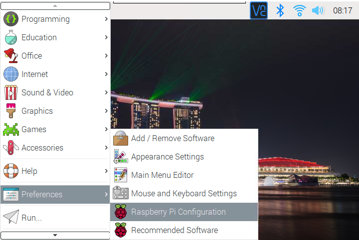
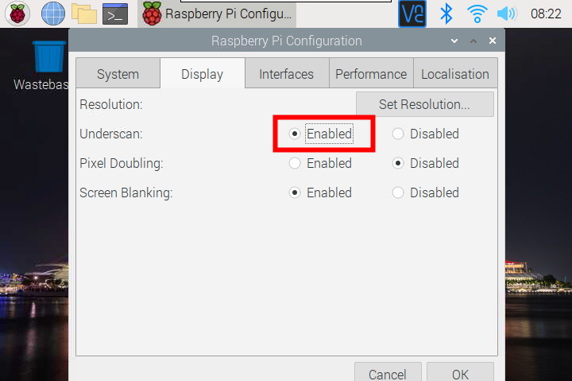

常见问题
===============

修复树莓派启动问题
---------------------------------------

1. 检查电源指示灯是否亮，如果不亮，则需要给RasPad充电或尝试不同的电源。 最好使用 SunFounder 提供的电源。
2. 您可能正在启动但没有获得视频输出。 首先，检查您的电缆是否正确连接。 将它们全部取出并重新连接。 如果您有 HDMI 电缆，请尝试使用不同的 HDMI 电缆。
3. 取出 microSD 卡并使用Raspberry Pi Imager 将新安装的树莓派OS 刷入其中（详见 :ref:`安装树莓派镜像`）。
4. 尝试不同的 microSD 卡。

无法检测到 Micro SD 卡？
-----------------------------

1、Micro SD卡板上的FFC是否连接正确，参考 :ref:`组装说明`。
2、检查SD卡或Micro SD卡板上的金手指（传输信号）是否变黑。 如果是，说明金手指已经氧化，需要用橡皮擦擦掉氧化层。
3、检查SD卡是否损坏。 如果在读取SD卡时拔掉SD卡的插头，导致卡的供电中断，可能会损坏卡。

屏幕不能旋转？
---------------------------------

原因是内置的加速度模块没有经过校准。

请参考 :ref:`安装旋转屏幕服务`.

关于睡眠问题
-----------------------------

* 如果您的 RasPad 屏幕亮起但黑屏，这是树莓派进入睡眠模式。 您可以通过点击触摸屏或按外部键盘或鼠标来唤醒。

* 如果RasPad 屏幕不亮或您短按电源按钮，这是RasPad 进入睡眠模式。 您可以通过短按电源按钮唤醒。
  
关于关机问题
----------------------------------

* 当你在树莓派桌面点击关机按钮或在命令行关闭树莓派时，树莓派会关机，但RasPad没有关机，过一段时间会自动进入睡眠状态，因为它不会 检测不到HDMI信号。 您需要长按RasPad的电源按钮才能关机。

* 如果直接长按RasPad的电源键，树莓派和RasPad会同时关机。 但需要注意的是，这是直接关闭树莓派的电源，可能会损坏Micro SD卡。 建议先关闭树莓派，再关闭RasPad。

桌面不是全屏
---------------------------------------

如果树莓派启动后桌面没有全屏显示，则需要开启 **Underscan**。

单击左上角的菜单图标，然后选择 **Preferences** -> **树莓派Configuration**。

在 **Display** 页面，开启Underscan，然后重启树莓派。

关于触摸问题
-----------------------------------

**A. 触摸不起作用**

首先，请检查内部电缆连接是否稳定。

对于老版本的RasPad 3，因为外接显示器后触摸会变得很奇怪，所以关闭触摸功能。

**B. 触摸不准确**

由于树莓派系统是基于PC鼠标控制的，人手不能像鼠标那样精准，如果触控精度问题造成不便，建议您增大图标大小，或者使用 :ref:`RasPad LAUNCHER` 来安装 RasPad 主题。

关于音频问题
-------------------------

**A. 没有声音。**

如果 RasPad 和树莓派的音量设置为 0，将导致没有声音。

**B. 耳机插孔不能正常工作**

由于 3.5mm 耳机插孔位于 RasPad 3 外壳内部，请检查耳机是否完全插入。

风扇太吵？
-------------------------

这是因为风扇转速太高，本来是为了增强RasPad 3的散热能力。可以通过将主板左上角的风扇开关设置为 \'s\'来降低噪音，但是这个 将降低风扇速度以及冷却能力。

耗电太快？
--------------------------------

RasPad 的电池容量为 3x3.7Vx3Ah = 33Wh，比 iPad pro 2020 的 28.65Wh 大一点。 但是因为树莓派本身功耗比较大，待机3W左右，而且树莓派系统和平板甚至iOS的省电机制都不一样。 相比上一代，我们将原来的7w屏驱动功耗降低到了3W以下，使用时间也得到了提升。

我们将继续优化这种时间的使用。

触摸功能有时会失效？
------------------------------------

打开树莓派的一些软件，会发现有些地方不能触摸，这是树莓派操作系统没有对触摸屏做适配造成的。 我们解决不了，需要等待树莓派OS 优化解决方案。

