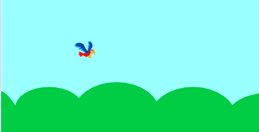
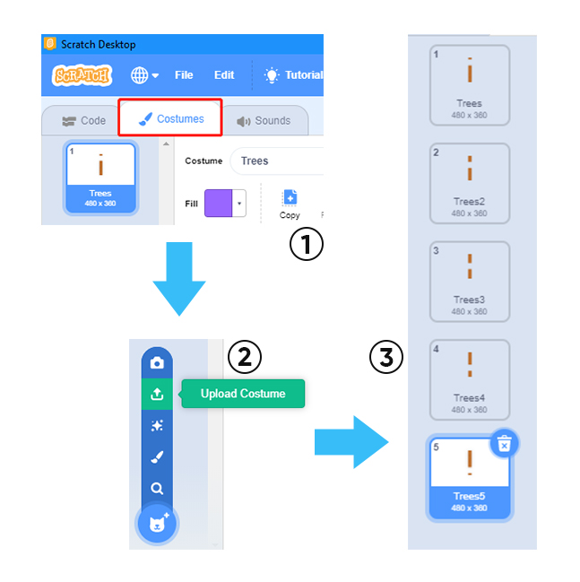
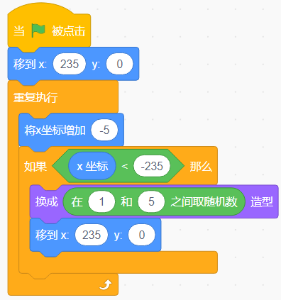
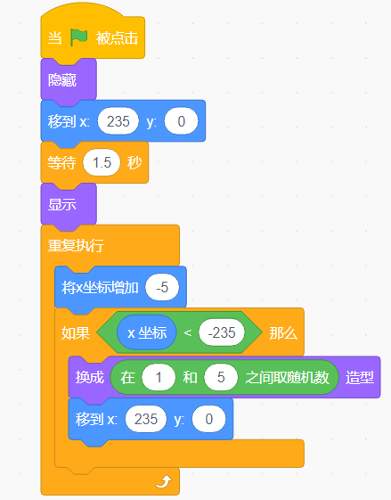
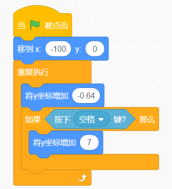
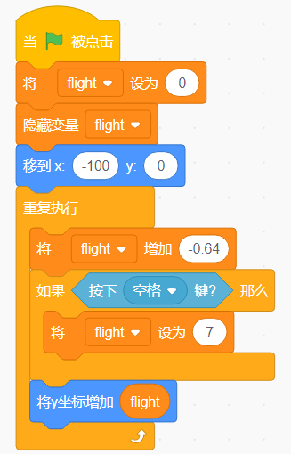
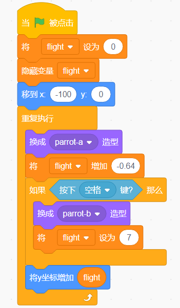
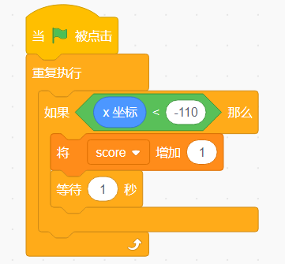
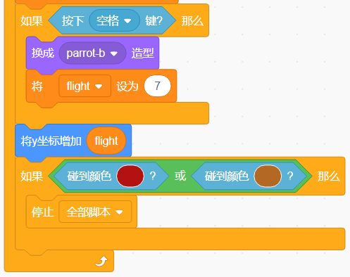

.. note::

    Hello, welcome to the SunFounder Raspberry Pi & Arduino & ESP32 Enthusiasts Community on Facebook! Dive deeper into Raspberry Pi, Arduino, and ESP32 with fellow enthusiasts.

    **Why Join?**

    - **Expert Support**: Solve post-sale issues and technical challenges with help from our community and team.
    - **Learn & Share**: Exchange tips and tutorials to enhance your skills.
    - **Exclusive Previews**: Get early access to new product announcements and sneak peeks.
    - **Special Discounts**: Enjoy exclusive discounts on our newest products.
    - **Festive Promotions and Giveaways**: Take part in giveaways and holiday promotions.

    👉 Ready to explore and create with us? Click [|link_sf_facebook|] and join today!

Flappy Parrot
===============

Description
-------------

Today we made the parrot Devin avoid the trees for food.

Click on the green flag to start.

.. raw:: html

    <iframe src="https://scratch.mit.edu/projects/526929606/embed" allowtransparency="true" width="695" height="576" frameborder="0" scrolling="no" allowfullscreen></iframe>

Or click `Flappy Parrot <https://scratch.mit.edu/projects/526929606/editor/>`_, and then learn online tutorial on the Scratch official website.

Required Components
-------------------------------

- A RasPad 3
- Scratch 3 (either online or offline)

You Will Learn
---------------------

- Add more costumes to sprites and let them change their appearance
- Logical Operation
- Determine if the sprites are touching each other

Lesson Guide
--------------

Arrange the parrot and background image
^^^^^^^^^^^^^^^^^^^^^^^^^^^^^^^^^^^^^^^^^^^^

First, we delete the default sprites and add Parrot sprites and Blue Sky backdrop. Change the size of the Parrot sprite to 20.

Upload the Trees sprite, select the Upload Sprite option, find the "Trees.png" file, and upload it.

Click Costumes, and then click the "Upload Costume" option to upload Trees2.png, Trees3.png, Trees4.png, and Trees5.png.

Copy out the second Trees.

.. image:: img/flappy3.png
  :width: 600
  :align: center

Let the Parrot sprite fly on the stage
^^^^^^^^^^^^^^^^^^^^^^^^^^^^^^^^^^^^^^^^^

Parrot stayed still, and the Trees and Trees2 sprites kept moving to the left, so it looked like the Parrot sprites were flying on the stage!

Set the initial position and movement of the Trees sprite so that it can reach the far left from the far right of the stage. Then, randomly changing costumes reappear on the far right side of the stage.

The code of the Trees2 sprite is almost the same as the Trees sprite, the only difference is that it hides for 1.5 seconds at the beginning.

Now, click on the green flag to see the effect of this flight... Very good, the Parrot sprite seems to be flying to the right side of the stage.

Let the space button control Parrot to fly
^^^^^^^^^^^^^^^^^^^^^^^^^^^^^^^^^^^^^^^^^^^^^^

When the game starts, Parrot will continue to drop down, that is, the y coordinate will continue to decrease. When we press the space button, the y coordinate of Parrot will increase.

Constantly increase the speed of Parrot falling through variables
^^^^^^^^^^^^^^^^^^^^^^^^^^^^^^^^^^^^^^^^^^^^^^^^^^^^^^^^^^^^^^^^^^^^^^^

Parrot drop is a bit slow, we add flight variables to make Parrot drop more and more!

Change the costume so that Parrot has flight animation
^^^^^^^^^^^^^^^^^^^^^^^^^^^^^^^^^^^^^^^^^^^^^^^^^^^^^^^^^^^

When we press the Space button, Parrot's clothing switches to Parrot-b.

Calculate the score!
^^^^^^^^^^^^^^^^^^^^^^^^^

Create a new score variable. When the Trees and Trees2 sprites move to the right side of the Parrot sprite, it means that Parrot has crossed the Trees and Trees2. At this time, we will add score+1. In order to avoid always adding points, we need to add it after score+1 Wait 1 second for the code. (This code is required in both Trees and Trees2 sprites!)

Game failure mechanism
^^^^^^^^^^^^^^^^^^^^^^^^^^^

When the Parrot sprite encounters a tree or falls to the ground during the flight, we judge the game is over, and then we stop all scripts.

Challenge
-----------

I believe that you will be smart enough to program and implement this game soon. Next, we will add some challenges to enrich our game content.

- When the game fails, it switches to a cursing background screen.
- Add a countdown screen to the game start screen, let us prepare for the game.

