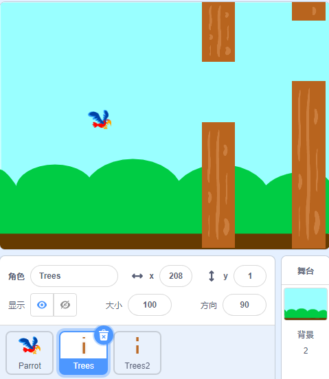

会飞的鹦鹉
===============

描述
-------------

今天我们让鹦鹉 **德文** 避开树木觅食。

点击绿旗开始。

.. raw:: html

    <iframe src="https://scratch.mit.edu/projects/526929606/embed" allowtransparency="true" width="695" height="576" frameborder="0" scrolling="no" allowfullscreen></iframe>

或者点击 `Flappy Parrot <https://scratch.mit.edu/projects/526929606/editor/>`_, 然后在Scratch官网学习在线教程。

所需组件
-------------------------------

- A RasPad 3
- Scratch 3 (either online or offline)

你会学到
---------------------

- 为角色添加更多服装，让它们改变外观
- 逻辑运算
- 确定角色是否相互接触

课程指南
--------------

安排鹦鹉和背景图片
^^^^^^^^^^^^^^^^^^^^^^^^^^^^^^^^^^^^^^^^^^^^

首先，我们删除默认角色并添加鹦鹉角色和蓝天背景。 将鹦鹉的大小更改为20。

上传Trees角色，选择Upload Sprite选项，找到“Trees.png”文件，上传。

单击“Costumes”，然后单击“Upload Costume”选项以上传 Trees2.png、Trees3.png、Trees4.png 和 Trees5.png。

.. image:: img/flappy2.jpg
  :width: 750
  :align: center

复制第二棵树。

让鹦鹉在舞台上飞翔
^^^^^^^^^^^^^^^^^^^^^^^^^^^^^^^^^^^^^^^^^

鹦鹉一动不动，Trees 和Trees2 角色一直向左移动，所以看起来鹦鹉在舞台上飞翔！

设置 Trees 的初始位置和移动方向，使其可以从舞台的最右侧到达最左侧。 然后，随机变化的服装重新出现在舞台的最右侧。

.. image:: img/flappy4.png
  :width: 550
  :align: center

角色Trees2的代码与Trees几乎相同，唯一不同的是它在开始时隐藏了1.5秒。

.. image:: img/flappy5.png
  :width: 550
  :align: center

现在，点击绿旗，看看这次飞行的效果…… 很好，鹦鹉好像飞到了舞台的右侧。

按空格键控制鹦鹉飞
^^^^^^^^^^^^^^^^^^^^^^^^^^^^^^^^^^^^^^^^^^^^^^

游戏开始时，鹦鹉会继续往下掉，也就是y轴坐标会继续往下递减。 当我们按下空格键时，鹦鹉的y轴坐标会增加。

通过变量不断提高鹦鹉下落的速度
^^^^^^^^^^^^^^^^^^^^^^^^^^^^^^^^^^^^^^^^^^^^^^^^^^^^^^^^^^^^^^^^^^^^^^^

鹦鹉掉落有点慢，我们添加飞行变量让鹦鹉掉落越来越快！

改变服装让鹦鹉有飞行动画
^^^^^^^^^^^^^^^^^^^^^^^^^^^^^^^^^^^^^^^^^^^^^^^^^^^^^^^^^^^

当我们按下空格时，鹦鹉的衣服会切换。

计算分数！
^^^^^^^^^^^^^^^^^^^^^^^^^

创建一个新的分数变量，当Trees和Trees2移动到鹦鹉的右侧时，表示鹦鹉已经穿过 Trees 和 Trees2。 这时候给得分加一。 为了避免总是加分，我们需要在加完分数后面加上一秒的延时。 （此代码在 Trees 和 Trees2 角色中都需要添加！）

.. image:: img/flappy9.png
  :width: 550
  :align: center

游戏失败机制
^^^^^^^^^^^^^^^^^^^^^^^^^^^

当鹦鹉在飞行过程中遇到一棵树或掉到地上时，我们判断游戏结束，然后我们停止所有脚本。

.. image:: img/flappy10.png
  :width: 750
  :align: center

挑战
-----------

我相信你很快就能掌握并实现这个游戏。 下面可以添加额外的内容来使你的游戏更丰富。

- 当游戏失败时，它会切换到诅咒背景屏幕。
- 游戏开始画面新增倒计时画面，让我们为比赛做好准备。

