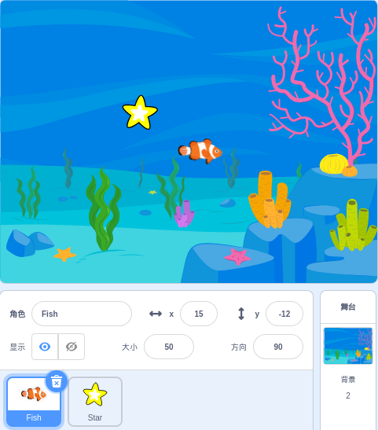
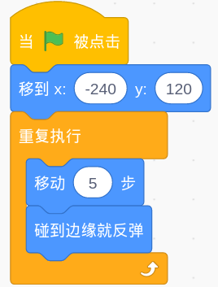
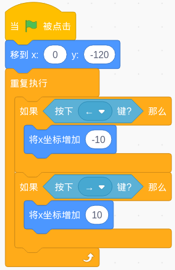
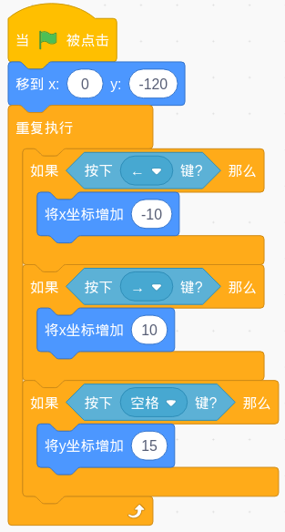
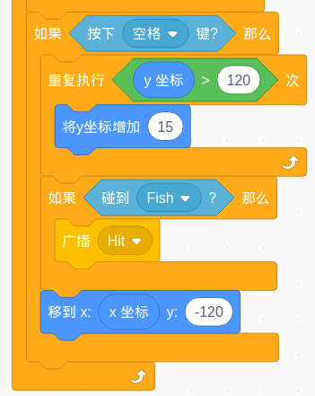
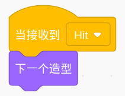
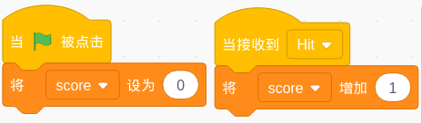

.. note::

    Hello, welcome to the SunFounder Raspberry Pi & Arduino & ESP32 Enthusiasts Community on Facebook! Dive deeper into Raspberry Pi, Arduino, and ESP32 with fellow enthusiasts.

    **Why Join?**

    - **Expert Support**: Solve post-sale issues and technical challenges with help from our community and team.
    - **Learn & Share**: Exchange tips and tutorials to enhance your skills.
    - **Exclusive Previews**: Get early access to new product announcements and sneak peeks.
    - **Special Discounts**: Enjoy exclusive discounts on our newest products.
    - **Festive Promotions and Giveaways**: Take part in giveaways and holiday promotions.

    👉 Ready to explore and create with us? Click [|link_sf_facebook|] and join today!

Hit the Magic Fish
=========================

Description
-------------

Before the project Starts, I will tell you the story of a magic fish. In the vast underwater world, there is a magical magic fish. When you hit it with a Starfish, it will become another fish.

Today we use the scratch stage to simulate an underwater world, and then add the Star sprite and fish sprite to make a "hit the magic fish" mini game.

Click on the green flag to Start. Press the space bar to launch the Starfish.

.. raw:: html

    <iframe src="https://scratch.mit.edu/projects/526928309/embed" allowtransparency="true" width="695" height="576" frameborder="0" scrolling="no" allowfullscreen></iframe>

Or click `Hit the magic fish <https://scratch.mit.edu/projects/526928309/editor/>`_, and then learn online tutorial on the Scratch official website.

Required Components
-------------------------------

- A RasPad 3
- Scratch 3 (either online or offline)

You Will Learn
---------------------

- Let the sprite bounce when it hits the edge of the stage.
- Change the coordinates to make the sprite move.
- Make a timer.
- Use the broadcast to tell the sprite what happened.

Lesson Guide
--------------

This fish is swimming.
^^^^^^^^^^^^^^^^^^^^^^^^^^^^^^^

Added **Fish** sprite, **Star** sprite and **Underwater1** backdrop image.

Let the Fish appear at the coordinates (-240,120), and then let it swim left and right.

Use the 「**if on edge, bounce**」 block to make the Fish sprite fold back from the edge. When it hits the wall, it will fold back in the opposite direction to the original.

This Star is rising.
^^^^^^^^^^^^^^^^^^^^^^^^^

Let the Star appear at (0,-120). If we press the ``←`` or ``→`` key on the keyboard, it will go left and right.

We use the 「**key ... pressed**」block to determine the keyboard, and use 「**change x by ...**」 to move the sprite.

Next, launch the Star. If the space bar is pressed, the y coordinate value of the Star sprite will increase, and the Star sprite will rise.

Something is wrong. The Star sprite should continue to rise until it reaches the height of the Fish sprite (remember? The y coordinate we set for Fish is 120) and then return.

.. image:: img/fish5.png
  :width: 550
  :align: center

Now，It looks better.

Fish hit by a Star.
^^^^^^^^^^^^^^^^^^^^^^^^^^^^^

After the Star rises, before returning to the bottom, you need to use a 「**touch...**」block to determine whether it hits the Fish.

When the Star sprite hits the Fish sprite, we need to tell the Fish sprite about this and let it do the corresponding behavior-change its shape.

We set up a "Hit" broadcast. This broadcast will tell the entire program that something called "Hit" has happened. All sprite and even the backdrop can hear this broadcast and respond accordingly.

Back to the programming interface of the Fish sprite, use a 「**when I receive...**」 block to receive the "Hit" broadcast, and then use 「**Next costume**」to change your form.

Calculate the score!
^^^^^^^^^^^^^^^^^^^^^^^^^^^

To make the game more interesting! Add a scoring mechanism. When you click the green flag, the score will be reset to zero. When a "hit" event occurs, the score will increase by 1.

.. note::
  This does not involve the calculation of sprites and backdrops. We tend to put such codes in backdrops.

Countdown!
^^^^^^^^^^^^^^^^^^^

Add a time mechanism. When the green flag is clicked, the timer is set to 30s, and then decreases by 1 every second until the event is reset to zero to end the game.

But if you hear the "Hit" broadcast, let the timer increase by one to increase the game time.

.. image:: img/fish9.png
  :width: 600
  :align: center

Challenge
------------

I believe that you will be smart enough to program and implement this game soon. Next, we will add some challenges to enrich our game content.

- Added several different magic fish.
- One will get double points
- One will reduce game time
- One will change the background

