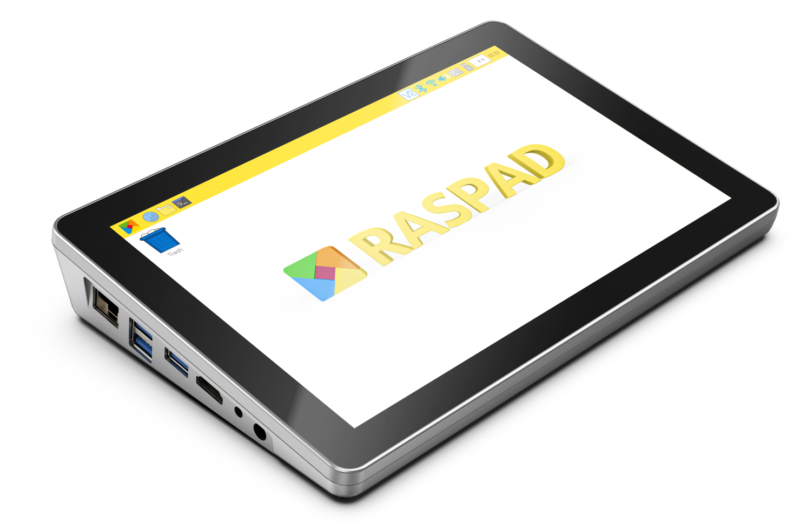

.. note::

    Hello, welcome to the SunFounder Raspberry Pi & Arduino & ESP32 Enthusiasts Community on Facebook! Dive deeper into Raspberry Pi, Arduino, and ESP32 with fellow enthusiasts.

    **Why Join?**

    - **Expert Support**: Solve post-sale issues and technical challenges with help from our community and team.
    - **Learn & Share**: Exchange tips and tutorials to enhance your skills.
    - **Exclusive Previews**: Get early access to new product announcements and sneak peeks.
    - **Special Discounts**: Enjoy exclusive discounts on our newest products.
    - **Festive Promotions and Giveaways**: Take part in giveaways and holiday promotions.

    👉 Ready to explore and create with us? Click [|link_sf_facebook|] and join today!

RasPad 3-A Portable Raspberry Pi Pad
=================================================

    
An ideal programming Raspberry Pi tablet perfectly compatible with Raspberry Pi 4B. RasPad 3 with internal 10.1 inch IPS Pi touchscreen LCD monitor, high resolution of 1280×800 pixels, 10-finger touch, 5 hours long battery life. Easily assembled with 2 steps to get started anytime anywhere.

By leveraging the HDMI, you can easily extend RasPad with other monitors for better multitasking or mirror your display. In addition, due to triangular structure design and six-axis acceleration sensor, it can be placed flat or upright on the table, or rotate it 90°/180°/270° to give amazing presentations!

With all the Raspberry Pi ports, including Ethernet, HDMI, Audio, USB, and Power. All the RPi I/O interface, a customized OS, stereo speakers and many more features for developers to have a convenient hardware-hacking experience, specially designed GPIO Extension and camera holes making users build projects or install cameras for RasPad. You can start programming from anywhere and fun daily work.

Compatible with Arduino, Raspbian, Ubuntu Desktop, Chromium OS, Android and more... Realize A Tablet to Program & A Remote Controller & A Spare Display. Ideal for applications like retro gaming, industrial control, as a secondary monitor, in home automation, for 3D printing control, and as a |link_pc_monitor|.

**About the display language**

In addition to English, we are working on other languages for this course. Please contact service@sunfounder.com if you are interested in helping, and we will give you a free product in return. 
In the meantime, we recommend using Google Translate to convert English to the language you want to see.

The steps are as follows.

* In this course page, right-click and select **Translate to xx**. If the current language is not what you want, you can change it later.

.. image:: img/translate1.png
    :align: center

* There will be a language popup in the upper right corner. Click on the menu button to **choose another language**.

.. image:: img/translate2.png
    :align: center

* Select the language from the inverted triangle box, and then click **Done**.

.. image:: img/translate3.png
    :align: center

.. toctree::
    :maxdepth: 3
    
    safety_notices
    components_list
    assembling
    quick_user_guide
    raspad_launcher
    interfaces_introduction
    raspad_projects_and_activities
    appendix/appendix
    faq

Copyright Notice
---------------------

All contents including but not limited to texts, images, and code in this manual are owned 
by the SunFounder Company. You should only use it for personal study, investigation, enjoyment, 
or other non-commercial or nonprofit purposes, under therelated regulations and copyrights laws, 
without infringing the legal rights of the author and relevant right holders. For any individual 
or organization that uses these for commercial profit without permission, the Company reserves the 
right to take legal action.
