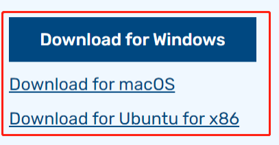
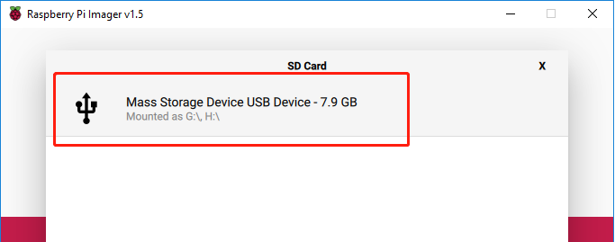
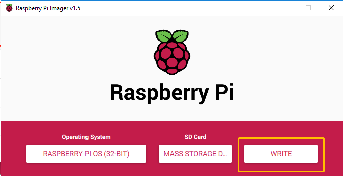

Install OS to Your Micro SD Card
======================================

Before you insert the microSD card into the Raspberry Pi, you need to install the corresponding operating system for it.

.. note::
  If your Raspberry Pi is already set up, you can skip this chapter.

Raspberry Pi Imager is the quick and easy way to install Raspberry Pi OS and other operating systems to a microSD card, ready to use with your Raspberry Pi.

Visit the download page: `Raspberry Pi Imager <https://www.raspberrypi.org/software/>`_. 
Click on the link for the Raspberry Pi Imager that matches your operating system, when the download finishes, click it to launch the installer.

When you launch the installer, your operating system may try to block you from running it. For example, on Windows I receive the following message:
If this pops up, click on More info and then Run anyway, then follow the instructions to install the Raspberry Pi Imager.

.. image:: img/3d2.png
  :width: 550
  :align: center

Insert your SD card into the computer or laptop SD card slot.

In the Raspberry Pi Imager, select the OS that you want to install and the SD card you would like to install it on.

.. image:: img/3d3.png
  :width: 550
  :align: center

.. note::
    - You will need to be connected to the internet the first time.
    - That OS will then be stored for future offline use (lastdownload.cache, C:/Users/yourname/AppData/Local/Raspberry Pi/Imager/cache). So the next time you open the software, it will have the display "Released: date, cached on your computer".

Select the SD card you are using.

Press Ctrl+Shift+X to open the Advanced options page to enable SSH and configure wifi, these 2 items must be set, the others depend on your choice. You can choose to always use this image customization options.

.. image:: img/3d5.png
  :width: 550
  :align: center

Then scroll down to complete the wifi configuration and click **SAVE**.

.. note::
    WiFi country should be set the two-letter ISO/IEC alpha2 code for the country in which you are using your Raspberry Pi, please refer to the following link: `https://en.wikipedia.org/wiki/ISO_3166-1_alpha-2#Officially_assigned_code_elements <https://en.wikipedia.org/wiki/ISO_3166-1_alpha-2#Officially_assigned_code_elements>`_.

.. image:: img/3d6.png
  :width: 550
  :align: center

Click the **WRITE** button.

If your SD card currently has any files on it, you may wish to back up these files first to prevent you from permanently losing them. If there is no file to be backed up, click **Yes**.

.. image:: img/3d8.png
  :width: 550
  :align: center

After waiting for a period of time, the following window will appear to represent the completion of writing.

.. image:: img/3d9.png
  :width: 550
  :align: center
  
Insert the SD card and press the power button to start.

.. image:: img/install_sd_card.jpg
  :width: 550
  :align: center

.. warning::
  
  The card slot is set on the back cover and it’s in snap style. Therefore before opening or closing the back cover, you need to take out the microSD card to avoid damaging your microSD card and the internal button board.

