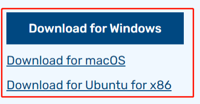
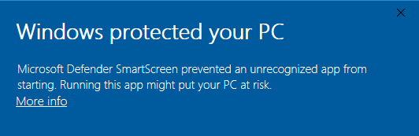
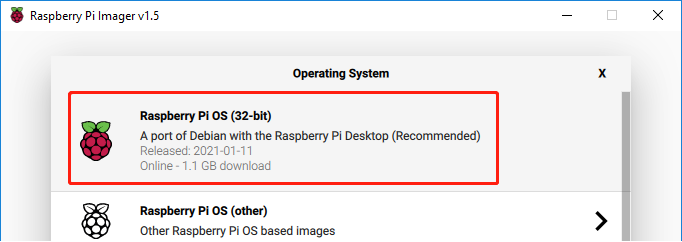
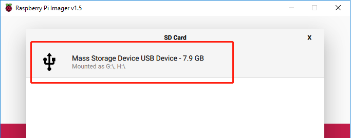
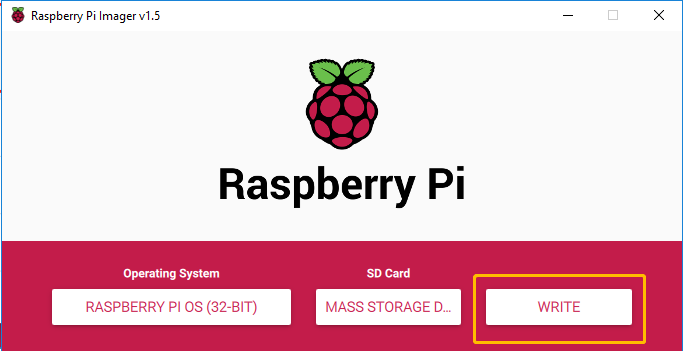
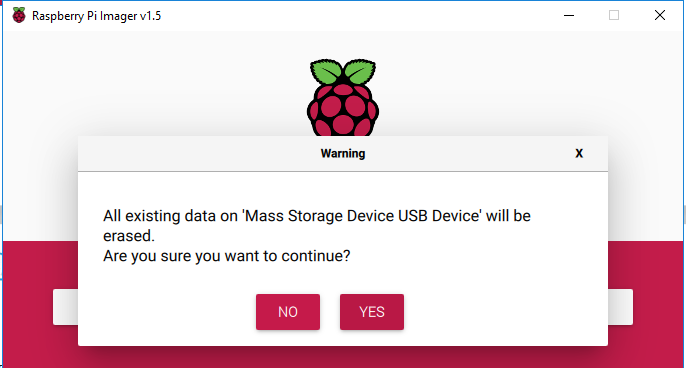
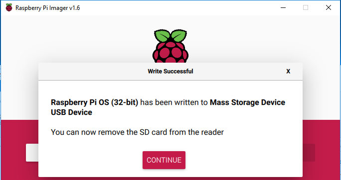
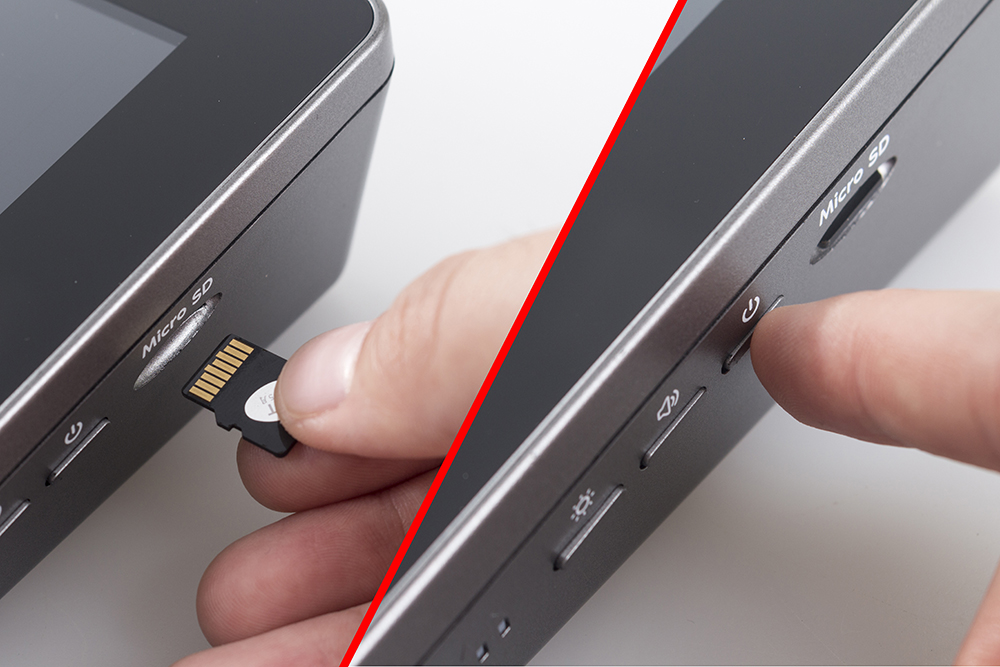

Install the Raspberry Pi OS
======================================

An operating system needs to be installed onto the Micro SD card before inserting it into the RasPad button-board.

.. note::

  Skip this chapter if the Raspberry Pi already has an operating system installed.

Raspberry Pi Imager is a quick and easy way to install the Raspberry Pi operating system to a Micro SD card from a computer or laptop.

Browse to the Raspberry Pi Imager site and download the version that matches the computer or laptop\'s  operating system (www.raspberrypi.org/software). When the download is complete, launch the installer program and follow the prompts to install the Raspberry Pi Imager.

If the Windows operating system prevents the application from launching, click on **More info** and then click on **Run anyway** to install the Raspberry Pi Imager.

Insert the Micro SD card into the computer or laptop's SD card slot. If the computer or laptop only has a full-size port for SD cards, use a Micro SD card adapter.

In the Raspberry Pi Imager, select the Operating System to install, and then select the SD card to install the image on.

.. note::
    * The computer or laptop will need to be connected to the internet during the first time the Operating System is installed.

    * After the first installation, a copy of the Operating System installed from the Imager will be stored on the computer or laptop, and will be available for future use, even while offline (Location of lastdownload.cache will be here: ``C:/Users/<username>/AppData/Local/Raspberry Pi/Imager/cache``). The next time the Imager software launches, it will display “Released: <date>, Cached on your computer”.
    
Select the SD card you are using.

Press ``Ctrl+Shift+X`` to open the Advanced options page to enable SSH and configure wifi, these 2 items must be set, the others depend on your choice. You can choose to always use this image customization options.

.. image:: img/3d5.png
  :width: 550
  :align: center

Scroll down to configure the WiFi settings, and then click **SAVE**.

.. note::

  The entry for the **WiFi country** should be set to a designated two-letter ISO/IEC alpha2 code designated to the country. Please reference the following link: `https://en.wikipedia.org/wiki/ISO_3166-1_alpha-2#Officially_assigned_code_elements <https://en.wikipedia.org/wiki/ISO_3166-1_alpha-2#Officially_assigned_code_elements>`_.

.. image:: img/3d6.png
  :width: 550
  :align: center

Click the **WRITE** button.

The Imager will overwrite any files already on the SD card. If the SD card has any files, back up these files before clicking Yes.

After the Imager completes installing the Operating System on the SD card, click Continue to complete the installation.

  
Insert the Micro SD card into the Micro SD port of the RasPad, then press the power button for over three seconds, RasPad will turn on.

The power button is on the right side. Press and hold for over three seconds to power the RasPad on or off. A short press will turn the screen on or off.

.. note::
  Before use, it is recommended to fully :ref:`Charge the RasPad`.

.. warning::
  
  The SD card slot is a snap-in style attached to the back cover. Before removing or replacing the back cover, remove the Micro SD card to avoid damaging the Micro SD card and the RasPad's internal button board.

