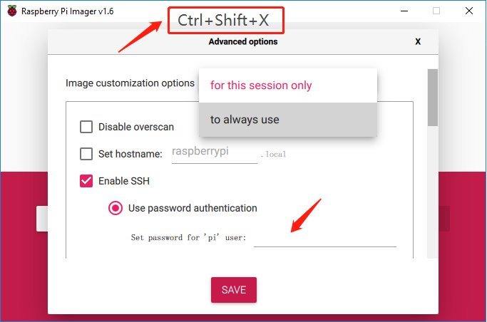

安装树莓派镜像
======================================

在将 Micro SD 卡插入 RasPad 按键板之前，需要在 Micro SD 卡上安装操作系统。

.. note::

  如果树莓派已经安装了操作系统，请跳过本章。

Raspberry Pi Imager 是一种将树莓派操作系统从计算机或笔记本电脑安装到 Micro SD 卡的快捷方式。

浏览到Raspberry Pi Imager 站点并下载与计算机或笔记本电脑的操作系统相匹配的版本 (https://www.raspberrypi.com/software/)。下载完成后，启动安装程序并按照提示安装Raspberry Pi Imager。

.. image:: img/3d1.png
  :width: 400
  :align: center

如果 Windows 操作系统阻止应用程序启动，请单击更多信息，然后单击仍然运行以安装Raspberry Pi Imager。

将 Micro SD 卡插入电脑或笔记本电脑的 SD 卡槽中。如果计算机或笔记本电脑只有 SD 卡的全尺寸端口，请使用 Micro SD 卡适配器。

.. In theRaspberry Pi Imager, select the Operating System to install, and then select the SD card to install the image on.

.. .. image:: img/3d3.png
..   :width: 550
..   :align: center

.. .. note::
..     * The computer or laptop will need to be connected to the internet during the first time the Operating System is installed.

..     * After the first installation, a copy of the Operating System installed from the Imager will be stored on the computer or laptop, and will be available for future use, even while offline (Location of lastdownload.cache will be here: ``C:/Users/<username>/AppData/Local/树莓派/Imager/cache``). The next time the Imager software launches, it will display “Released: <date>, Cached on your computer”.
    
.. .. image:: img/otherOS.png
    :align: center

.. mark

.. warning::

   树莓派OS升级到 **Debian Bullseye** 后，会导致有些功能不能使用，建议还是继续使用 **Debian Buster** 版本。

在Raspberry Pi Imager中，点击 **CHOOSE OS** -》 **树莓派OS(other)**。

将新打开的页下拉到最后面，你会看到 **树莓派OS(Legacy)** 和 **树莓派OS Lite(Legacy)**，这2个是对Debian Buster安全更新，它们之间的区别是带不带桌面。
建议安装 **树莓派OS(Legacy)**，这个带桌面的系统。

选择您正在使用的 SD 卡。

.. image:: img/3d4.png
  :width: 550
  :align: center

按 ``Ctrl+Shift+X`` 打开高级选项页面，启用 SSH 和配置 wifi，这 2 项必须设置，其他取决于您的选择。您可以选择始终使用此图像自定义选项。

向下滚动以配置 WiFi 设置，然后单击 **SAVE**。

.. note::

  **WiFi country** 的条目应设置为指定给该国家/地区的指定的两个字母的 ISO/IEC alpha2 代码。请参考以下链接： `https://en.wikipedia.org/wiki/ISO_3166-1_alpha-2#Officially_assigned_code_elements <https://en.wikipedia.org/wiki/ISO_3166-1_alpha-2#Officially_assigned_code_elements>`_.

.. image:: img/3d6.png
  :width: 550
  :align: center

单击 **WRITE** 按钮。

.. image:: img/3d7.png
  :width: 550
  :align: center

Imager 将覆盖 SD 卡上已有的所有文件。如果 SD 卡上有任何文件，请在单击是之前备份这些文件。

Imager 完成在 SD 卡上安装操作系统后，单击继续以完成安装。

  
将 Micro SD 卡插入 RasPad 的 Micro SD 端口，然后按住电源按钮三秒以上，RasPad 将开启。

电源按钮在右侧。按住 3 秒以上可打开或关闭 RasPad。短按将打开或关闭屏幕。

.. note::

  使用前建议给 :ref:`为RasPad充电`.

.. image:: img/install_sd_card.jpg
  :width: 550
  :align: center

.. warning::
  
  SD卡插槽采用卡扣式连接到后盖。在拆卸或更换后盖之前，请先取出 Micro SD 卡，以免损坏 Micro SD 卡和 RasPad 的内部按键板。

