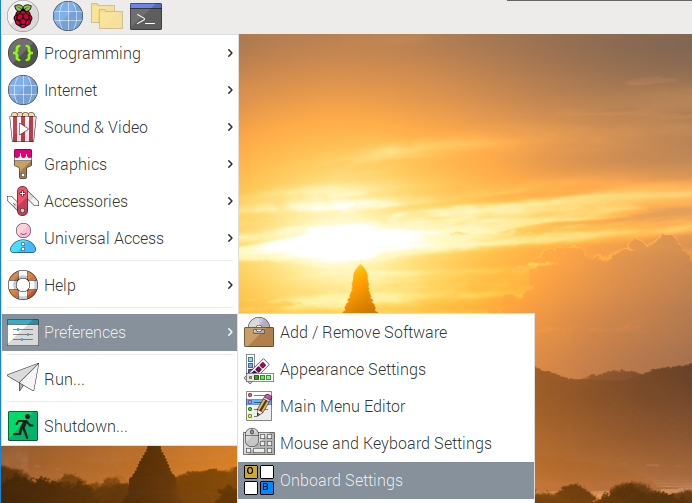
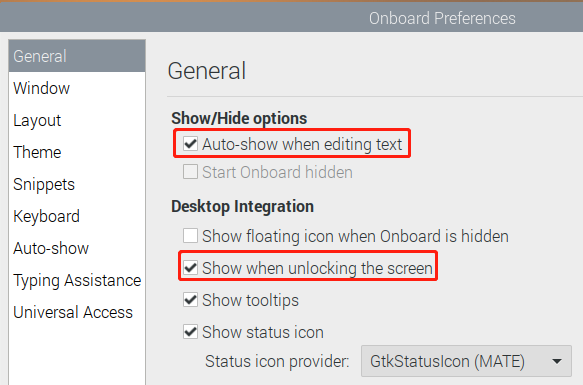
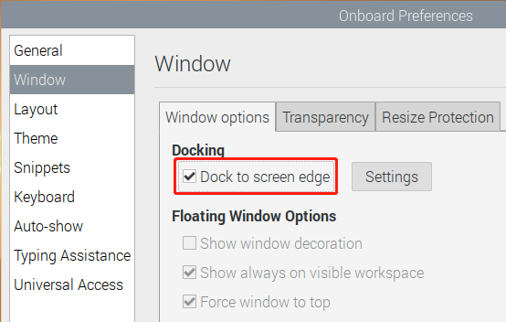
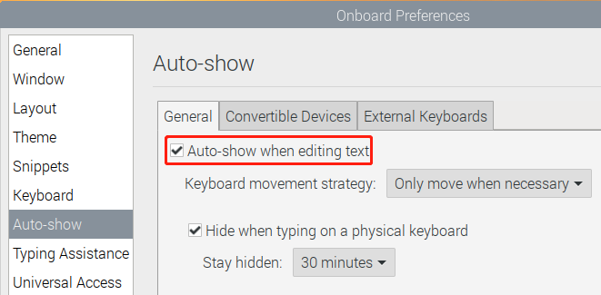
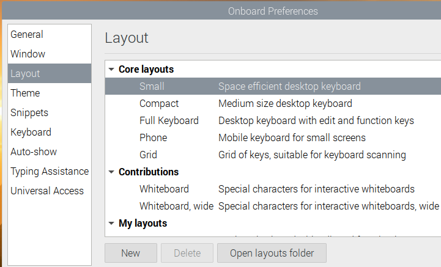
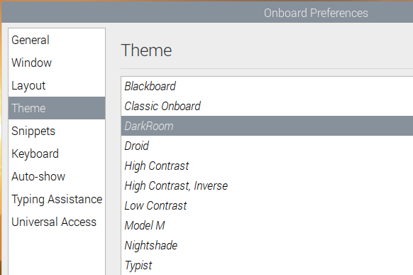
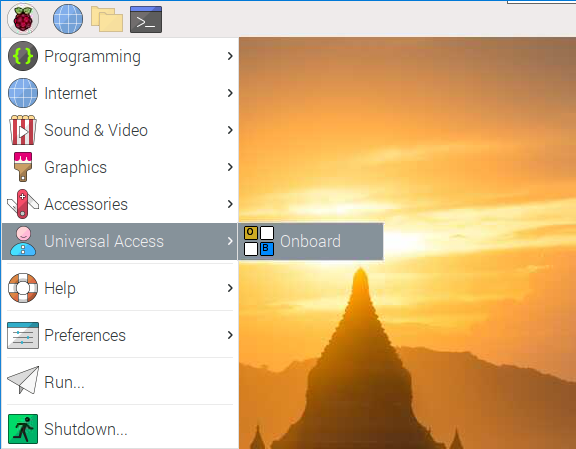
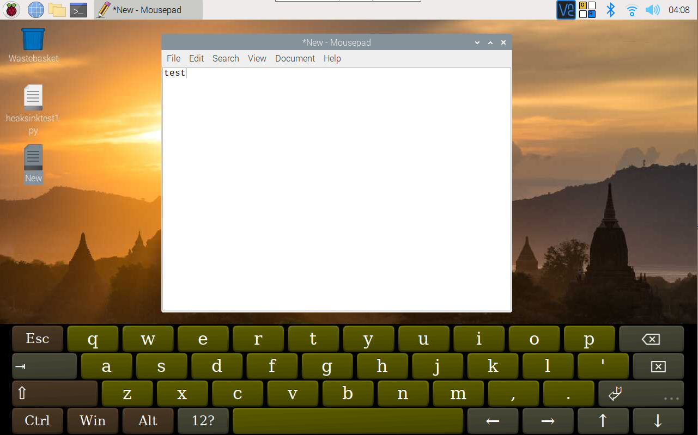

.. note::

    Hello, welcome to the SunFounder Raspberry Pi & Arduino & ESP32 Enthusiasts Community on Facebook! Dive deeper into Raspberry Pi, Arduino, and ESP32 with fellow enthusiasts.

    **Why Join?**

    - **Expert Support**: Solve post-sale issues and technical challenges with help from our community and team.
    - **Learn & Share**: Exchange tips and tutorials to enhance your skills.
    - **Exclusive Previews**: Get early access to new product announcements and sneak peeks.
    - **Special Discounts**: Enjoy exclusive discounts on our newest products.
    - **Festive Promotions and Giveaways**: Take part in giveaways and holiday promotions.

    👉 Ready to explore and create with us? Click [|link_sf_facebook|] and join today!

Install Virtual Keyboard on RasPad
========================================

When you use a touch panel such as RasPad, you can connect an external keyboard to help you do a text input operation, but it is best to install a virtual keyboard.

Install the required software with the following command.

.. raw:: html

    <run></run>

.. code-block:: shell

  sudo apt install onboard -y
  sudo apt install at-spi2-core

In order to make the virtual keyboard have a better effect, you need to do further settings.

Click the Raspberry Pi icon in the upper left corner and select **Preferences** -> **Onboard Settings**.

In the **General** option, check the following 2 items. When you check **Automatically display when editing text**, you will be prompted to reboot, you can reboot after all settings are complete.

In the **Window** option, check **Dock to screen edge**.

And in **Auto-show** option, check **Auto-show when editing text** again.

The next 2 items are optional, the ones checked in the picture are recommended by us, you can also check other ones.

In **Layout** option, **Small** is recommanded.

In **Theme** option, **DarkRoom** is recommanded.

After the setting is complete, restart RasPad. Every time you restart RasPad, you need to click **General Access** -> **Onboard** to enable the virtual keyboard.

Now you can use this keyboard to edit your files or codes.

