.. note::

    Hello, welcome to the SunFounder Raspberry Pi & Arduino & ESP32 Enthusiasts Community on Facebook! Dive deeper into Raspberry Pi, Arduino, and ESP32 with fellow enthusiasts.

    **Why Join?**

    - **Expert Support**: Solve post-sale issues and technical challenges with help from our community and team.
    - **Learn & Share**: Exchange tips and tutorials to enhance your skills.
    - **Exclusive Previews**: Get early access to new product announcements and sneak peeks.
    - **Special Discounts**: Enjoy exclusive discounts on our newest products.
    - **Festive Promotions and Giveaways**: Take part in giveaways and holiday promotions.

    👉 Ready to explore and create with us? Click [|link_sf_facebook|] and join today!

INTERFACES INTRODCTION
==============================

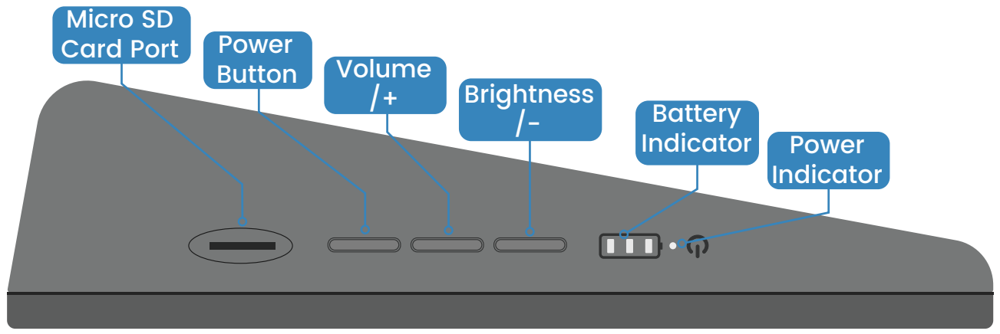

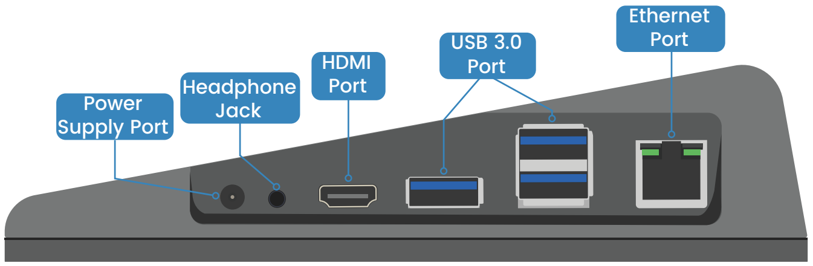

* **Micro SD Card Port**: The SD card slot is a snap-in style attached to the back cover. Before removing or replacing the back cover, remove the micro-SD card to avoid damaging the micro-SD card and the RasPad's internal button board.
* **Power Button**: Press and hold for over three seconds to power the RasPad on or off. A short press will turn the screen on or off.
* **Volume/+**: Press to enter the volume adjustment state；If **Brightness/-** is pressed first, it can be used to increase the brightness when pressed this button.
* **Brightness/-**: Press to enter the brightness adjustment state; If **Volume/+** is pressed first, it can be used to decrease the volume when pressed this button.
* **Battery Indicator**: Lights up in green. When charging, the corresponding LED flashes; when fully charged, all 3 LEDs are on.
* **Power Indicator**: When RasPad is turned on, it lights up as red.

* **Ethernet Port**: Standard Ethernet port.
* **USB 3.0 Port**: Standard USB 3.0 port.
* **HDMI Port**: It can be used as an expansion screen through this port. 
* **Headphone Jack**: Standard headphone jack.
* **Power Supply Port**: 15V/2A DC port.

Charge the RasPad
---------------------

.. image:: img/assembling/power_charge.gif

The number of green LEDs indicates battery percentage. When the low battery warning icon appears, it indicates that RasPad needs to be charged.

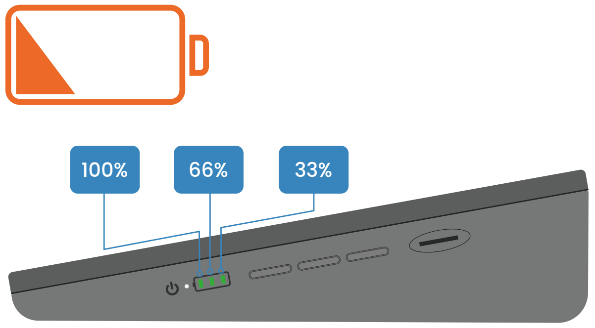

Take out the power adapter and power cable.

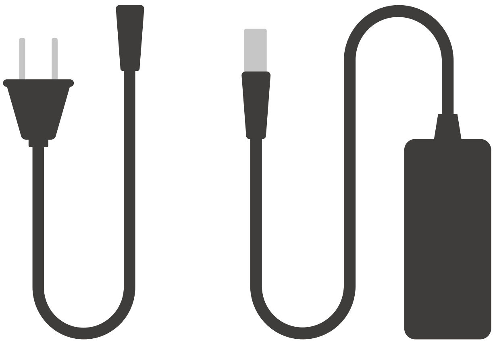

Insert one side of the power cable into the power adapter, and the other side to an outlet.

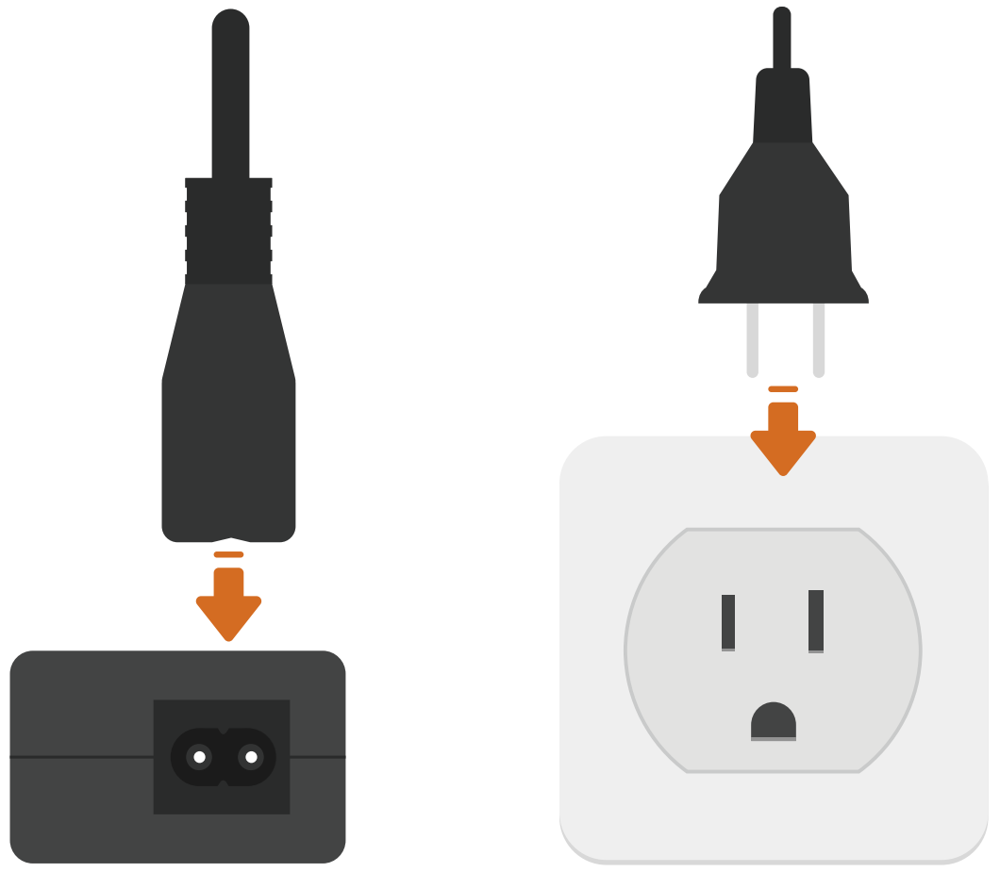

Plug the power adapter into the RasPad power port.

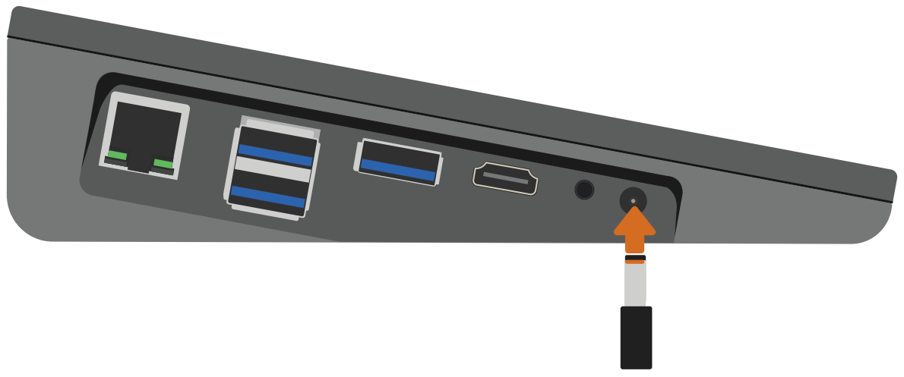

At this time, one of the green LED might be blinking and the charging icon will appear, indicating that the RasPad is charging.

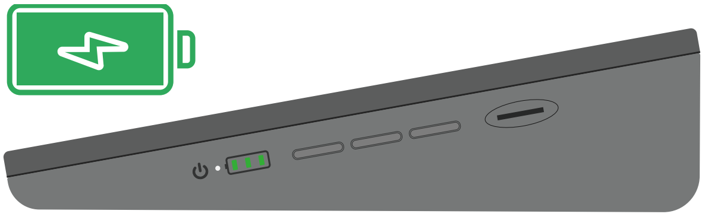

Volume and Brightness Settings
--------------------------------------

Next to the power button, the red LED should now be lit, indicating that the RasPad is powered on.

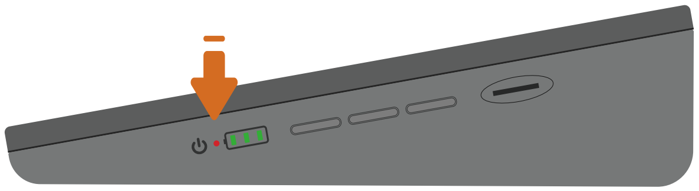

At this point, the RasPad should be booted up.

If the screen is too bright, give the brightness button a short press to enter the screen-brightness adjustment page.

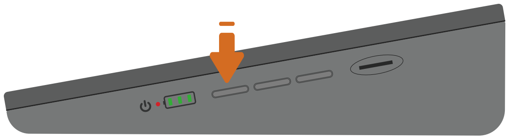

A brightness adjustment bar will appear on the screen.

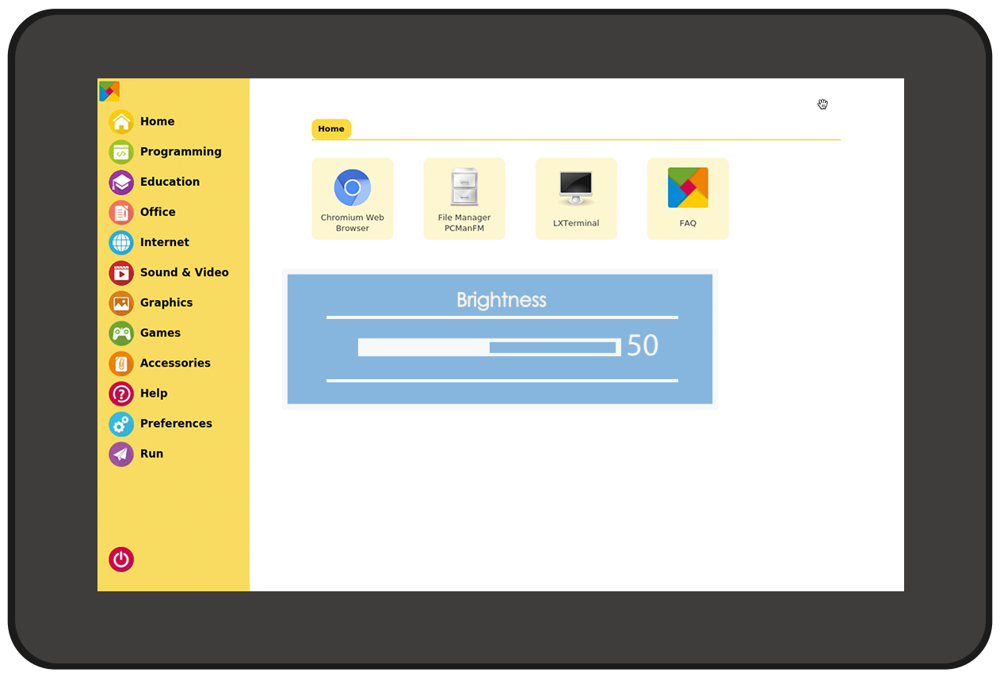

The brightness can be adjusted via these two buttons.

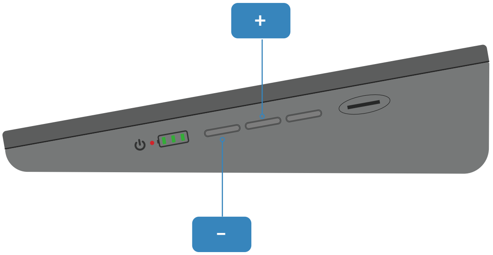

After three seconds without operation, the brightness bar on the screen automatically disappears. The brightness should not be too high or too low, 
otherwise it will be harmful to the eyes.

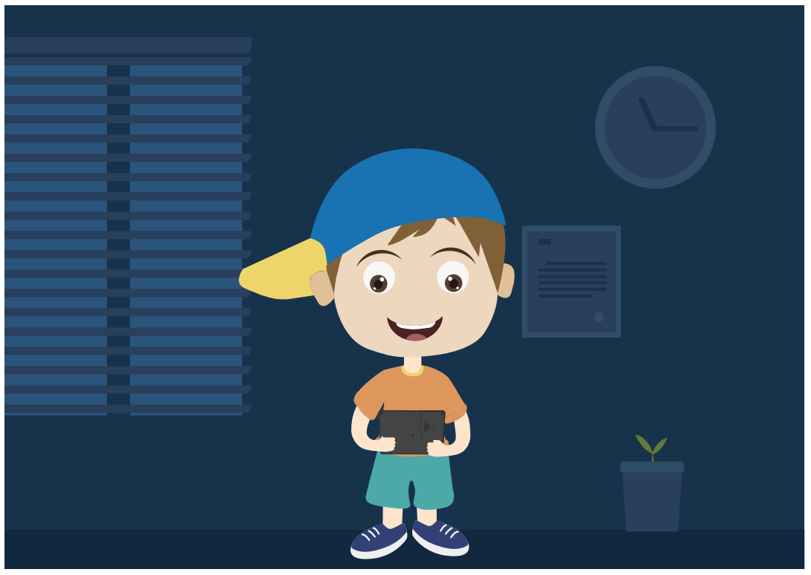

To adjust the volume, press the volume button once to enter the volume adjustment page.

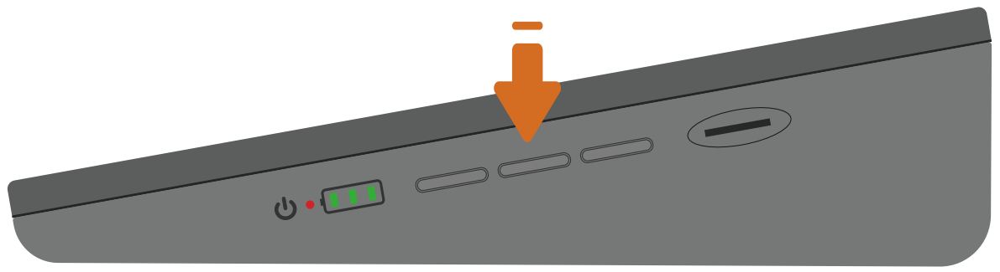

Then press these two buttons to adjust the volume.

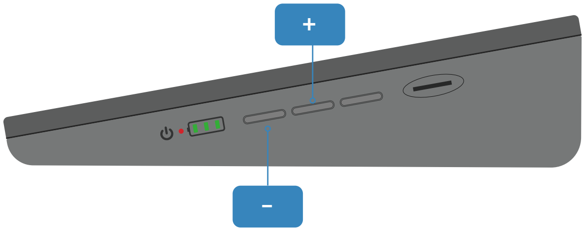

Connect Headphones or Other Screens
-----------------------------------------

Plug in the headphone if you need.

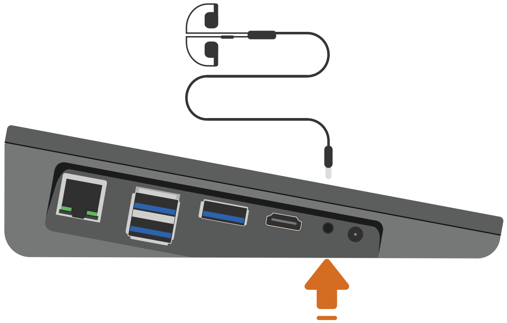

The headphone volume can only be adjusted on the desktop screen. Enter the Raspberry Pi desktop by tapping the top left menu icon of the RasPad Launcher.

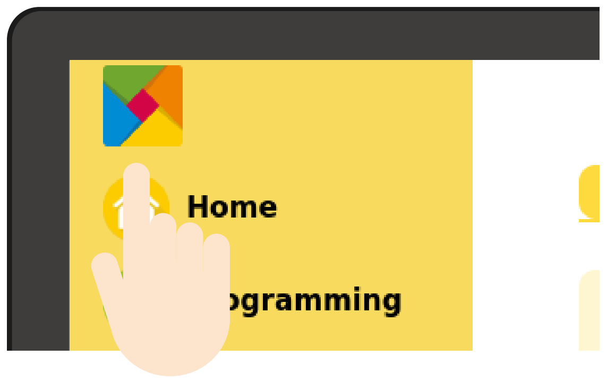

Tap the speaker icon and the volume control box will appear. Slide the volume cursor up or down tto adjust the headphone's volume.

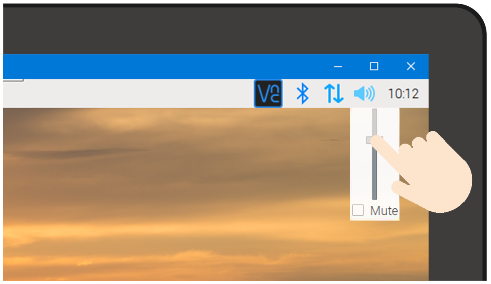

.. warning:: 

  When wearing headphones, do not adjust the volume too high.

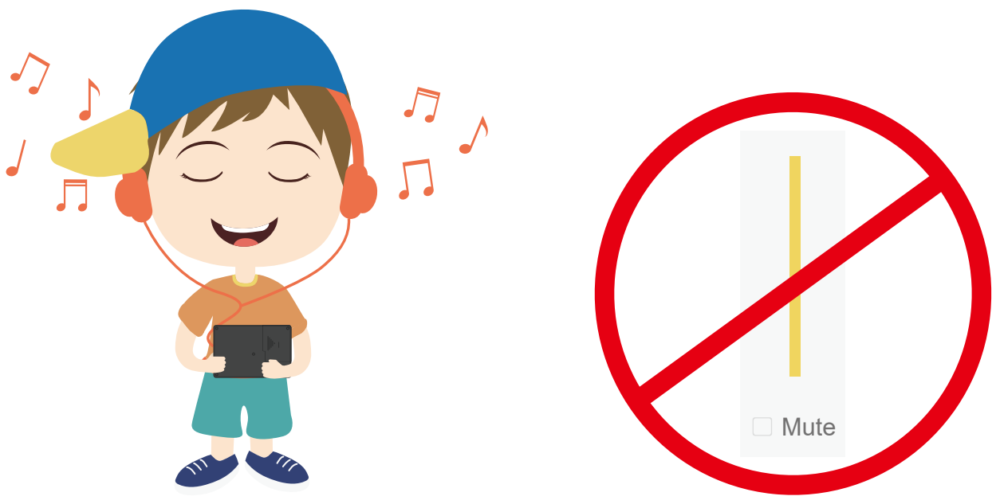

Use the HDMI port to add a second monitor, and the USB ports for a mouse and a keyboard.

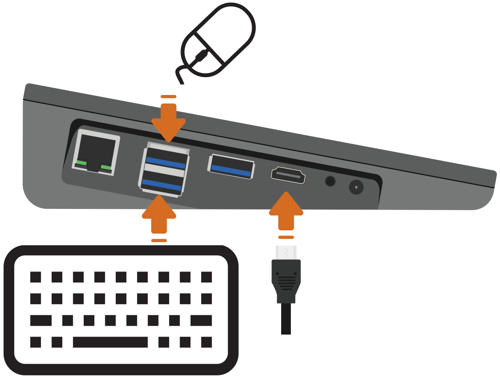

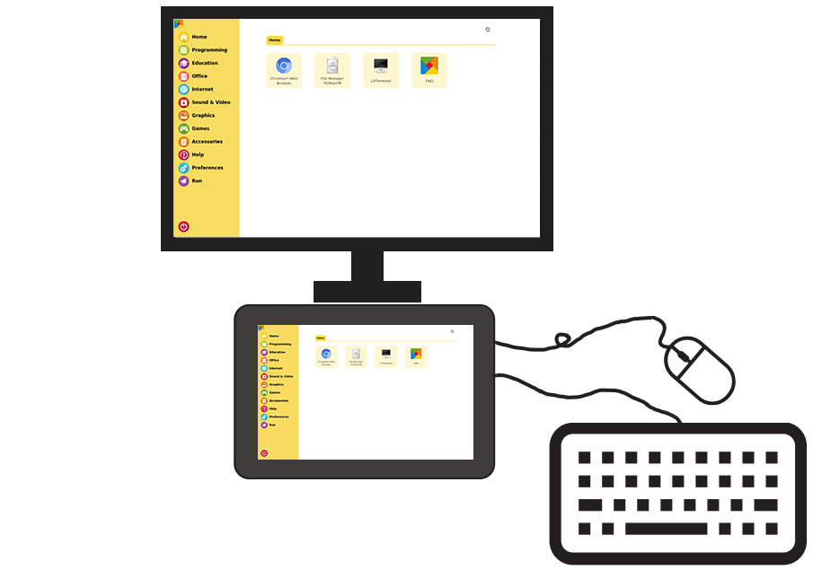

