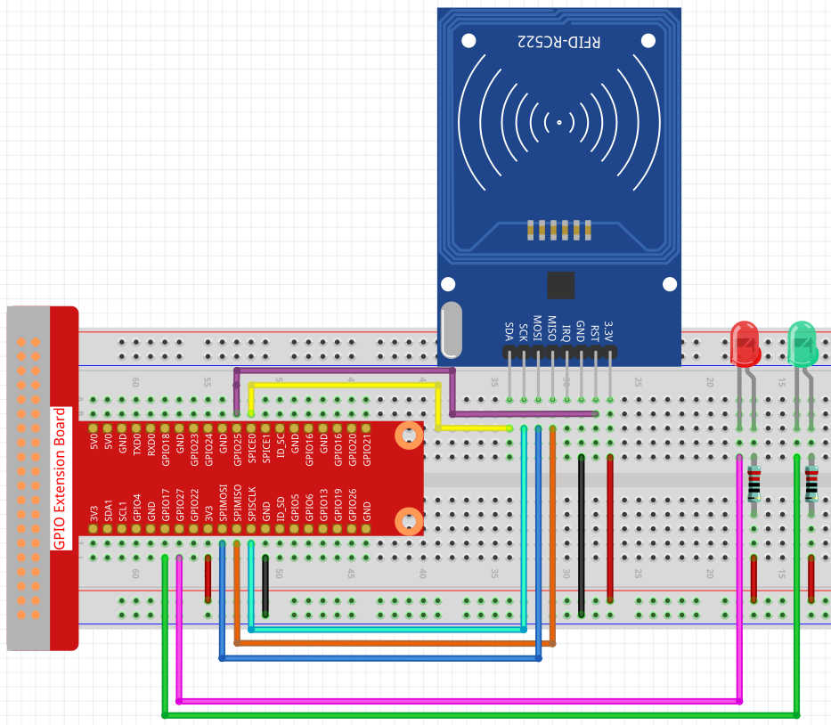

考勤系统
=====================

在这个项目中，我们使用MFRC522 RFID Module和Cloud4RPi做一个系统，可以在Cloud4RPi上查看考勤信息，或者打开本地.csv文件查看考勤记录。

由于网络数据传输延迟，本项目只允许绿灯亮时打卡，红灯亮时上传数据。

实验步骤
-------------------------

搭建电路。

打开代码。

.. raw:: html

    <run></run>

.. code-block:: shell

    cd /home/pi/cloud4rpi-raspberrypi-python
    sudo nano attendance_system.py

找到下面的部分并填写正确的设备令牌。

.. code-block:: python

    DEVICE_TOKEN = '__YOUR_DEVICE_TOKEN__'

运行代码。

.. raw:: html

    <run></run>

.. code-block:: shell

    sudo python3 attendance_system.py

转到 Cloud4RPi 页面, 添加一个名为 **project5** 的新控制面板，并通过点击 **Add widget** 按钮添加 2个小部件（ **Text** 和 **Chart** 部件）。

.. image:: img/rfid2.png
	:align: center

添加完后，您可以在 **Chart** 部件上查看不同时间段的打卡记录（当LED ON的值为True时，表示有人打卡），然后在 **Text** 部件上查看打卡人数。

你也可以在 ``/home/pi/cloud4rpi-raspberrypi-python`` 路径下找到带有日期的 ``.csv`` 文件。

.. image:: img/rfid3.png
	:align: center

使用以下命令打开文件。

.. raw:: html

    <run></run>

.. code-block:: shell

    sudo nano attendance_sheet.2021.06.28.csv

这样就可以读取不同时间段的打卡记录。左边是不同MFRC522 RFID模块的ID，右边是打卡时间。

.. image:: img/rfid4.png
	:align: center

.. note::
	
    如果事先将人名写入MFRC522 RFID Module，然后将id替换为code中的文字（后面在code解释中会提到），这样考勤表就记录了每个人的名字，而不是卡的ID。

代码说明
----------------------

.. code-block:: python

    RedPin = 13
    GreenPin = 11

    GPIO.setmode(GPIO.BOARD)
    GPIO.setup(RedPin, GPIO.OUT, initial=GPIO.HIGH)
    GPIO.setup(GreenPin, GPIO.OUT, initial=GPIO.HIGH)

设置 2 个 LED 作为输出并将初始电平设置为高电平。

.. code-block:: python

    def get_time():
		time.time()
		year = str(time.strftime('%Y',time.localtime(time.time())))
		month = str(time.strftime('%m',time.localtime(time.time())))
		day = str(time.strftime('%d',time.localtime(time.time())))
		hour = str(time.strftime('%H',time.localtime(time.time())))
		minute = str(time.strftime('%M',time.localtime(time.time())))
		second = str(time.strftime('%S',time.localtime(time.time())))
		present_time = year + '.' + month + '.' + day + '.' + hour + '.' + minute + '.' + second
		present_date = year + '.' + month + '.' + day
		return present_date, present_time

使用 ``get_time()`` 函数获取当前时间戳并返回两个值，一个是 ``present_date`` 精确到天，一个是 ``present_time`` 精确到秒。

.. code-block:: python

    attendance = False
	GPIO.output(GreenPin, GPIO.LOW)
	GPIO.output(RedPin, GPIO.HIGH)
	print("Reading...Please place the card...")
	id, text = reader.read()
	print("ID: %s\nText: %s" % (id,text))
	GPIO.output(RedPin, GPIO.LOW)
	GPIO.output(GreenPin, GPIO.HIGH)

首先，我们设置 ``attendance`` 为 False，表示没有人打卡。

然后将 ``GreenPin`` 置低电平点亮绿灯， ``RedPin`` 置高电平保持红灯熄灭，表示当前考勤系统工作正常。

当有人打卡时，会打印卡片的id和文本信息。如果红灯亮绿灯灭，表示签到成功，结果会发送到Cloud4RPi。

在此期间，考勤系统处于休眠状态，直到绿灯亮进入下一个周期。

.. code-block:: python

    if not id in attendance_list:
		attendance = True
		attendance_list.append(id)
		present_date, present_time = get_time()
		attendance_statistics[id] = present_time
		with open('attendance_sheet.' + present_date + '.csv', 'w') as f:
			[f.write('{0}  {1}\n'.format(key, value)) for key, value in attendance_statistics.items()]

首先通过if语句判断 ``attendance_list`` 中的id是否重复, 如果没有, 则表示打卡有效，将信息传入 ``attendance_list``。然后我们得到当前时间戳，并使用id作为 **attendance_statistics** 字典的键和其对应的值 **present_time**。这样字典 **attendance_statistics** 就存储了当前id的打卡时间。

最后我们将字典 **attendance_statistics** 写入一个.csv文件，并将文件命名为 ``'attendance_sheet.' + present_date + '.csv'``，以便我们按时间顺序存储考勤表。

.. note::

    如果之前在 MFRC522 RFID 中写入了一个人的名字，则替换 id 和 text 内容，那么考勤表将会记录下这个人的名字。

.. code-block:: python

    def get_num():
		return len(attendance_list)

返回 ``attendance_list`` 的长度, 即打卡的人数
