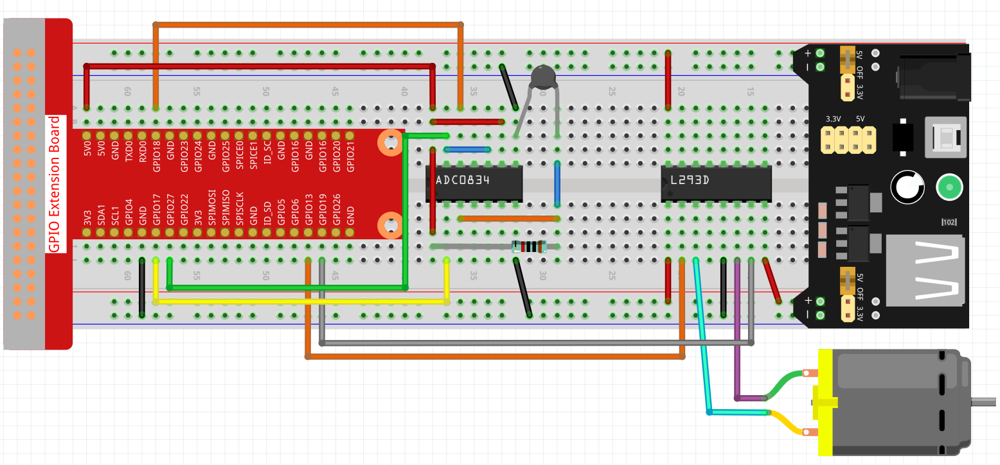

.. note::

    Hello, welcome to the SunFounder Raspberry Pi & Arduino & ESP32 Enthusiasts Community on Facebook! Dive deeper into Raspberry Pi, Arduino, and ESP32 with fellow enthusiasts.

    **Why Join?**

    - **Expert Support**: Solve post-sale issues and technical challenges with help from our community and team.
    - **Learn & Share**: Exchange tips and tutorials to enhance your skills.
    - **Exclusive Previews**: Get early access to new product announcements and sneak peeks.
    - **Special Discounts**: Enjoy exclusive discounts on our newest products.
    - **Festive Promotions and Giveaways**: Take part in giveaways and holiday promotions.

    👉 Ready to explore and create with us? Click [|link_sf_facebook|] and join today!

Smart Fan
===========

In this project, you can see the temperature from Blynk and turn on the fan remotely.

.. note:: Before starting this project, we recommend that you complete :ref:`bk_start`. The following will give you a clear understanding of Blynk.

**1. Wiring**

**2. Create Widget and Datastream**

1. Click on the menu icon in the upper right corner and select edit dashboard.

    .. image:: img/sp220913_180231.png

2. Add a Switch widget and a Label widget to the Dashboard.

    .. image:: img/sp220914_175437.png

3. Create a Datastream (I used V3) for the Switch widget. It will be used to turn on the Motor.

    .. image:: img/sp220914_155911.png

4. Create a Datastream for the Label widget(I used V0). It will be used to display the temperature. Set **DATA TYPE** to String.

    .. image:: img/sp220914_175616.png

#. When finished, click Save And Apply at the top right.

    .. image:: img/sp220913_182300.png

**3. Run the Code**

1. Edit the code

.. raw:: html

   <run></run>

.. code-block:: 

    cd /home/pi/blynk-raspberrypi-python
    sudo nano blynk_motor.py

2. Find the line below and past your ``BLYNK_AUTH_TOKEN``.

.. code-block:: python

    BLYNK_AUTH = 'YourAuthToken'

3. Run the code.

.. raw:: html

   <run></run>

.. code-block:: 

    sudo python3 blynk_motor.py

4. Go to Blynk, on the Dashboard you can check the temperature via Label widget; you can turn on/off the fan via Switch widget.

.. #. If you want to use Blynk on mobile devices, please refer to :ref:`blynk_mobile`.