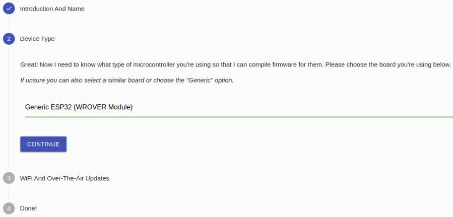
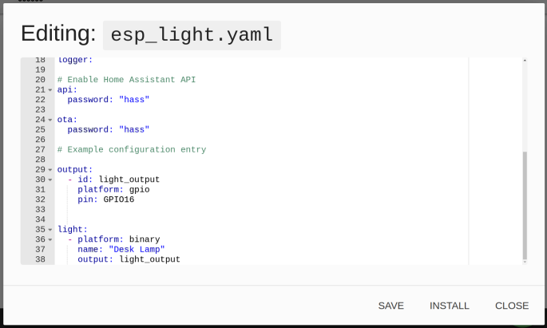

Configure DIY Device
===========================

Install ESPhome
-----------------

**1. Installation dependencies**

.. code-block::

   sudo pip3 install cryptography==2.8 

**2. Install**

.. code-block::

   sudo pip3 install esphome

**3. Open web tool**

.. code-block::

   esphome dashboard config/

**4. Open webpage**

http://localhost:6052 or http://X.X.X.X:8123 (replace X.X.X.X with your machines’ IP address).

Tutorial
------------

**1. First time adding a device**

* Click on the \"+\" sign to start adding configurations

.. image:: media/image44.png    
   :align: center
   :width: 800

* Enter name

.. image:: media/image48.png    
   :align: center
   :width: 800

* Select the device type (ESP32 for example)

* Enter WIFI name and password

* Click submit

.. note::

   When it is not the first time to add a device, click \"+\" on the main page, 
   follow the prompts to enter the device name, WIFI and password, select the device type.

   .. image:: media/image53.png    
      :align: center

**2. EDIT**

* Enter configuration file editing (yaml format)

You can refer to the example on the `ESPHome official website <https://esphome.io/>`_.

.. image:: media/image52.png    
   :align: center

* After editing, click \"INSTALL\" in the lower right corner to compile and install. 
  
The first compilation process needs to download dependencies, which takes about 10 minutes.

**3. Choose installation method**

The first download needs to be connected to the Raspberry Pi via USB, after that you can download via WIFI.

.. image:: media/image51.png    
   :align: center

.. note::

   If there is no response when clicking download, please clear the browser cache and download again.
   
   .. code-block::

      sudo rm -rf ~/.cache/chromium

You can add the device in homeassistant after the compilation and upload is finished.