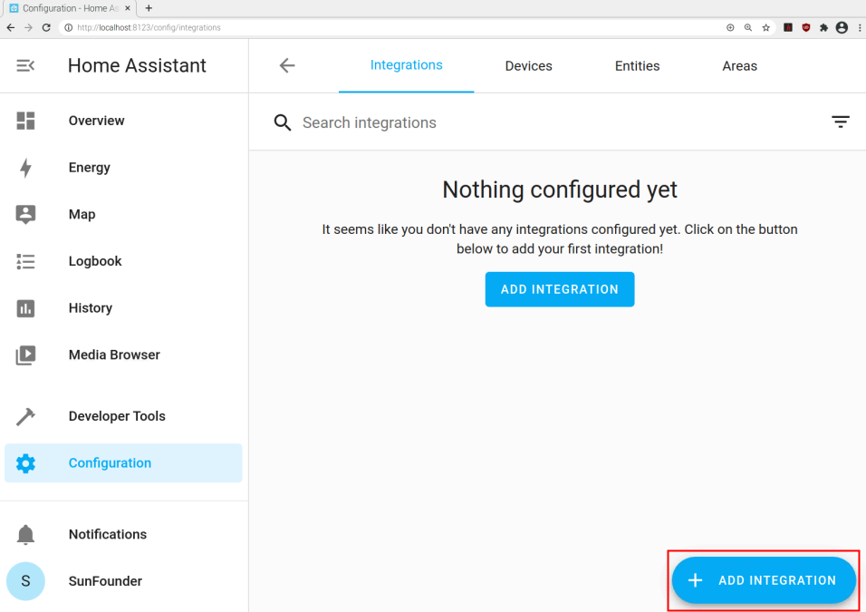
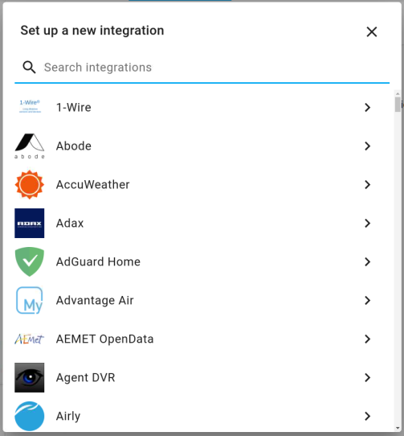
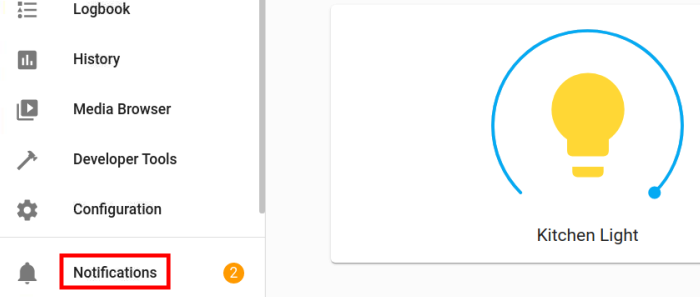
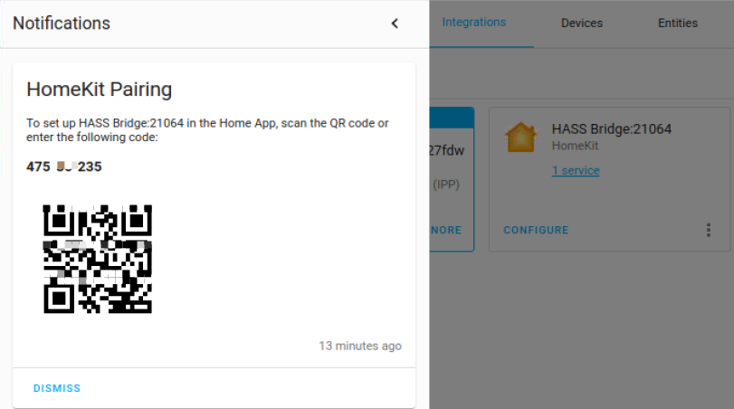

Add Integration
=======================

**1. Integrations**
   
.. image:: media/image12.png
   :align: center

**2. Add Integration**
   

**3. Search Integration**

Homkit
^^^^^^^

Homkit integration can use Home-assistant as a bridge, allowing users to control devices connected 
to Home Assistant through the Home App on the ios system. After installation, 
a QR code of Homekit link will be generated, and the device on Home-assistant can be connected 
to Homekit by scanning the connection through Apple Home App.

**1. Add Homkit**

.. image:: media/image19.png
   :align: center

**2. View notifications**

**3. HomeKit Pairing**
   

