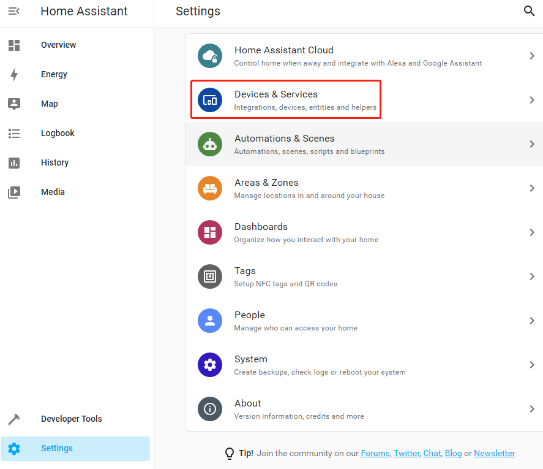
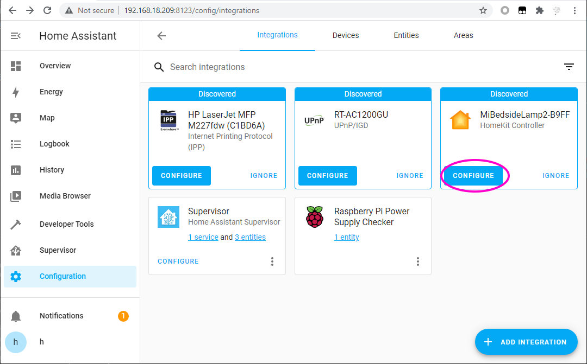
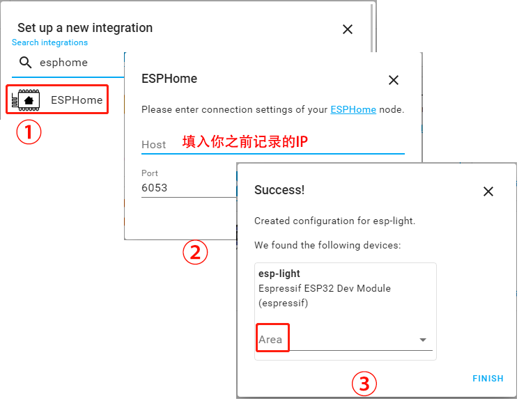
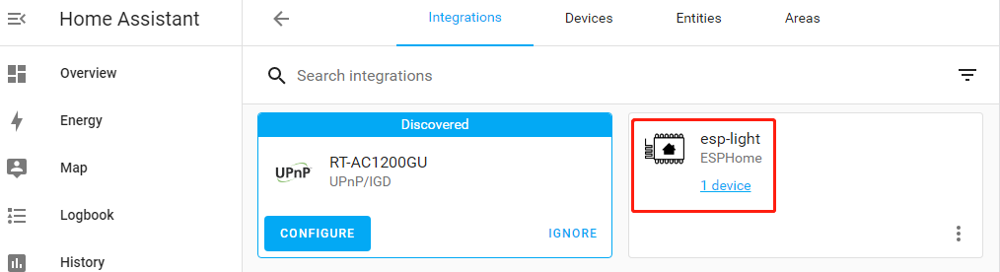
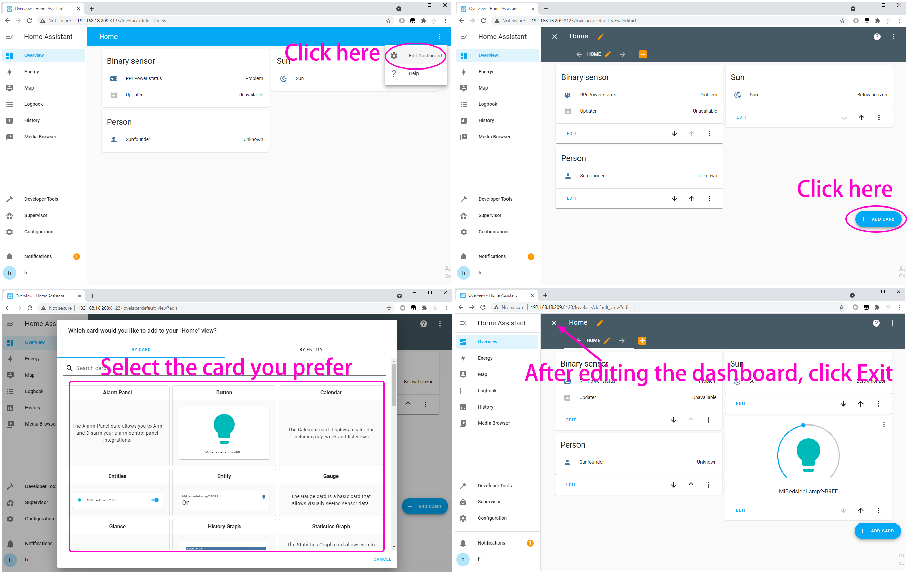
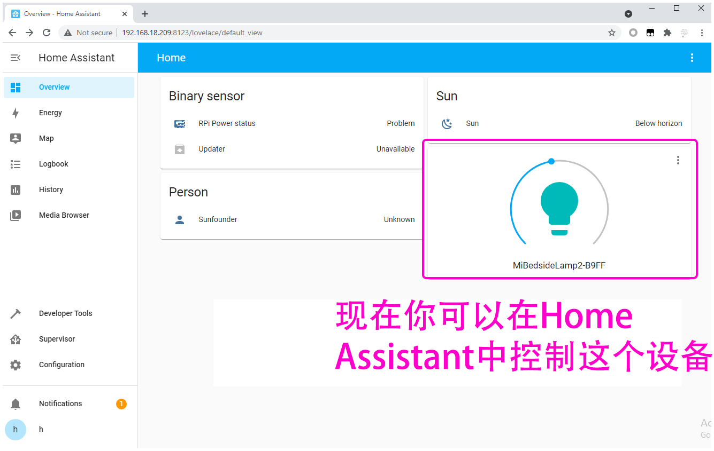

Add DIY Device with ESP32
==================================

You can add your purchased smart devices to Home Assistant, such as smart sound, smart desk lamp, etc. You can also make your DIY device with ESP32 and add it in.

In this section, you will learn how to add your DIY device.

Before you start the following operations, you need to complete :ref:`Install and configure ESPHome`.

**Add Integration**

1. Now, visit http://ip:8123 to access your Home Assistant, then click **Configuration** in the left column and select **Intergrations**.
   

2. If Home Assistant finds a device on your network, it will display the corresponding integration, which can be easily added with just a few clicks. 
If your smart device is not yet discovered, don't worry, you can add it via the **+ ADD INTERGATION** button at the bottom right.
   

3. Search for ESPHome in the pop-up window and fill in the Host (the IP recorded after the INSTALL step in chapter:ref:`Install and configure ESPHome`), with the option to place your esp-light in the bedroom, kitchen or other area of your choice.

4. After clicking Finish, you will see it in the list.

**Edit Dashboard**

Now a CARD needs to be added to control this esp-light.

Click **Overview** --> **Edit Dashboard** --> **ADD CARD**, you can select the corresponding CARD according to your needs, for example, select **Button** here, and then select the corresponding Entity.

After clicking SAVE, you will be able to use this Button to control the esp-light (if you connect an LED to GPIO16 in ESP32 board, click on the Button to make the LED light up or turn off).

For more styles, you can refer to `Official Demo <https://demo.home-assistant.io/#/lovelace/0>`_.
