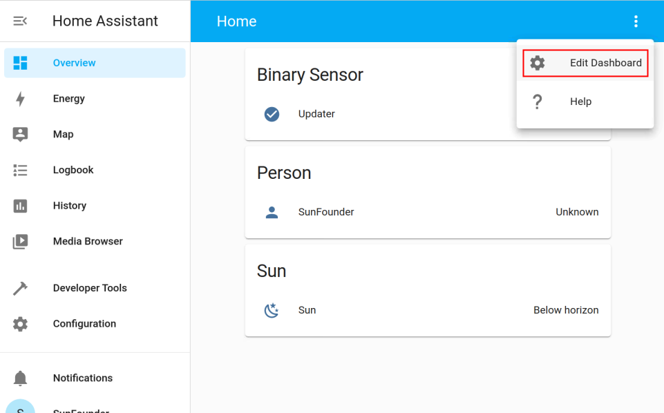
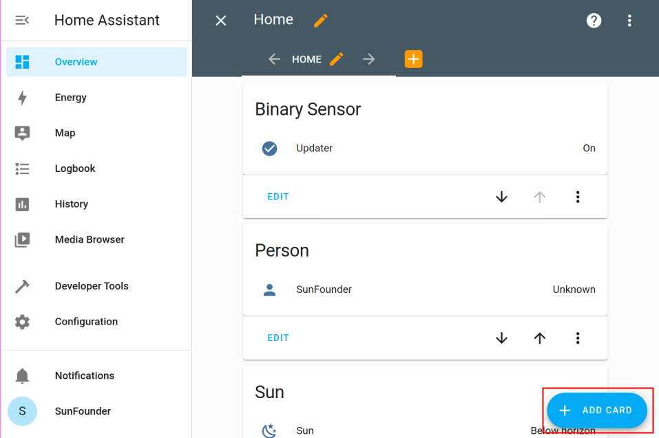
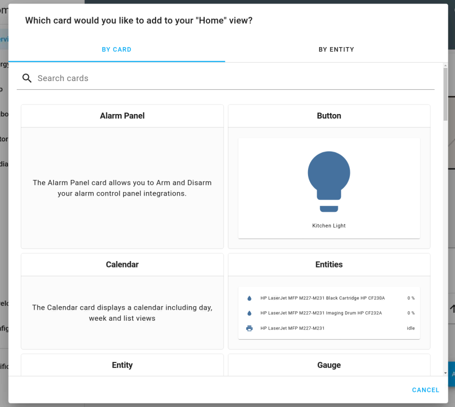
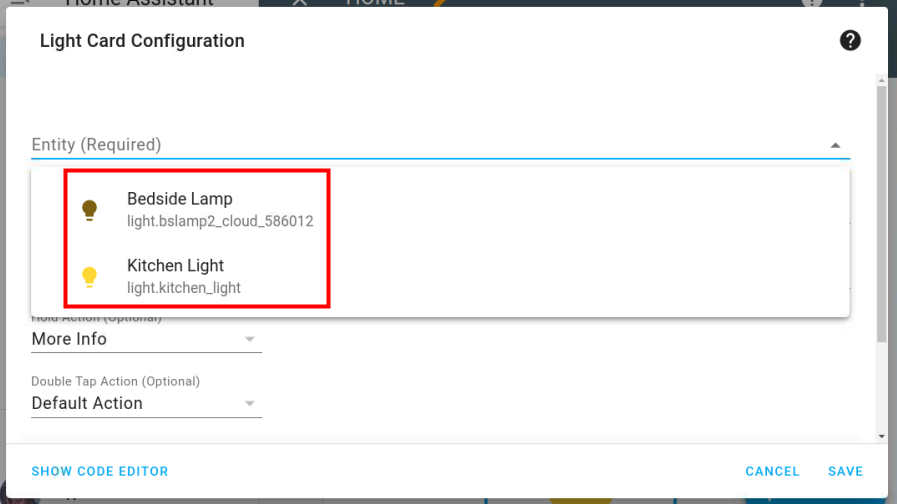
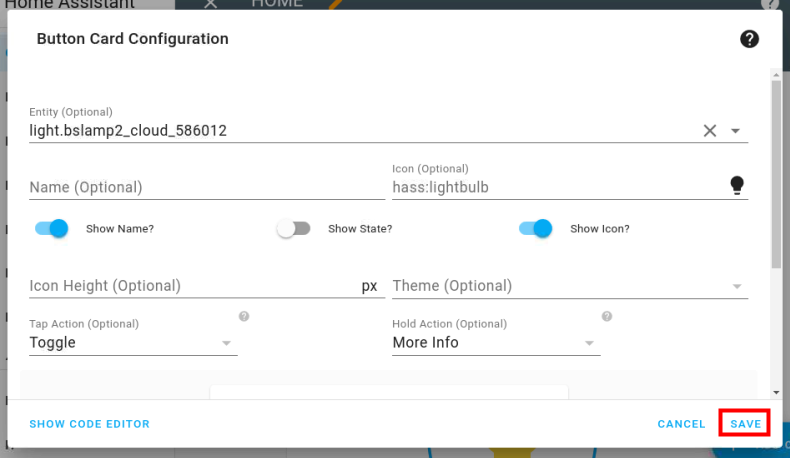
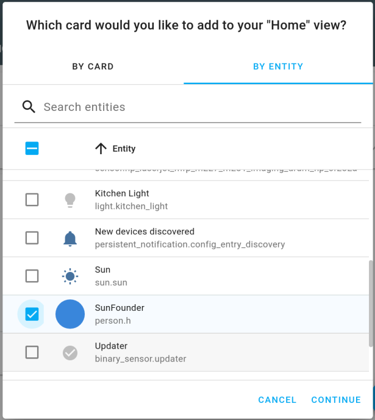
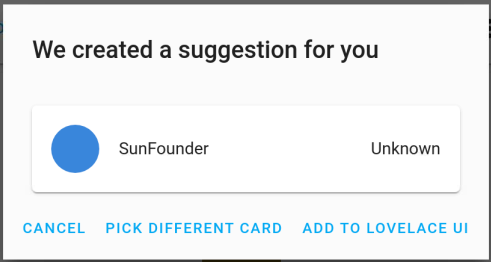

Edit Dashboard
===============

**Overview** --> **Edit Dashboard** --> **ADD CARD**, 
you can add the card to control the device, and then control the smart device by manipulating the card.

**1. Edit Dashboard**

**2. ADD CARD**

You can search cards by Card or by Entity.

**By Card:** 

Select the card style you want.
   

Select the entity in the drop-down list.

Click \"SAVE\" to save the settings.

**By Entity:** 

Select the entity you want to add.

For more styles, you can refer to `Official Demo <https://demo.home-assistant.io/#/lovelace/0>`_. Now to set up your smart device.
