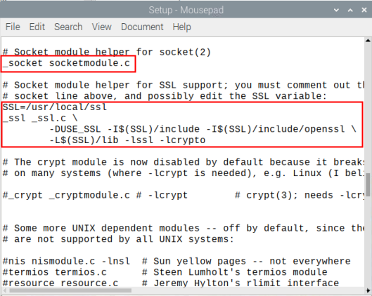

FAQ
=========

Python3.8 No module named \'_ssl\' Solution
----------------------------------------------

1. Install dependent libraries

.. code-block::
    
    sudo apt install zlib-devel bzip2-devel openssl-devel libssl-dev ncurses-devel sqlite-devel readline-devel tk-devel gdbm-devel db4-devel libpcap-devel xz-devel

2. Download and unzip Python 3.8.6

.. code-block::

    cd /usr/local
    
    sudo wget https://www.python.org/ftp/python/3.8.6/Python-3.8.6.tgz

    sudo tar zxvf Python-3.8.6.tgz

3. Find the Python-3.8.6/Modules/Setup file in the unzipped file

.. code-block::
    
    vim Setup

Remove the 5 lines of comments, as follows:

Save and exit

4. Delete the original Python3.8 installation file and recreate it.

.. code-block::

    sudo rm -rf /usr/local/python3.8/
    sudo mkdir /usr/local/python3.8/

5. Recompile and install Python3.8

.. code-block::

    cd /usr/local
    sudo ./configure --prefix=/usr/local/python3.8/
    sudo make
    sudo make install
