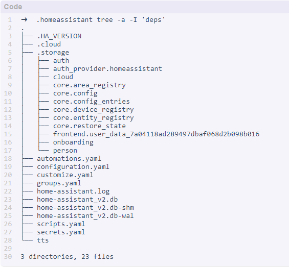

Home Assistant File Structure
====================================

Homeassistant creates a configuration file by default under the path of the executing user 
(created homeassistant) at the ``~/.homeassistant`` path.

The file directory structure is as follows:

* ``.storage`` directory contains a lot of user-related information, including user login information (username/password, encrypted in auth_provider.homeassistant file).
* ``configuration.yaml``: User-edited configuration files.
* ``home-assistant.log``: Run log (cleared with each reboot).
* ``home-assistant_v2.db``: Database..
* ``.storage``: Various elements of front-end configuration.

