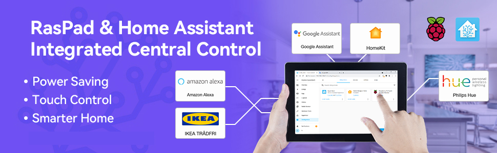

.. note::

    Hello, welcome to the SunFounder Raspberry Pi & Arduino & ESP32 Enthusiasts Community on Facebook! Dive deeper into Raspberry Pi, Arduino, and ESP32 with fellow enthusiasts.

    **Why Join?**

    - **Expert Support**: Solve post-sale issues and technical challenges with help from our community and team.
    - **Learn & Share**: Exchange tips and tutorials to enhance your skills.
    - **Exclusive Previews**: Get early access to new product announcements and sneak peeks.
    - **Special Discounts**: Enjoy exclusive discounts on our newest products.
    - **Festive Promotions and Giveaways**: Take part in giveaways and holiday promotions.

    👉 Ready to explore and create with us? Click [|link_sf_facebook|] and join today!

Home Assistant
====================================

Home Assistant is a Python-based open source smart home system that supports smart home devices 
of many brands and can easily implement voice control and automation of the devices. 
You can run Home-assistant on the Raspberry Pi, without having to send your data out onto 
the internet. This means that you have total control over your data, 
limit the amount of internet traffic from your smart devices, and tighten up security.

And RasPad 3 is powered by Raspberry Pi 4 with 10.1" HD touch screen and 5 hours battery life. 
We also wrote scripts for it to boot up and full screen self-start, so you can use Home Assistant on RasPad more easily and quickly.

**Expand Viewing**

Here are some projects made by others that combine Raspberry Pi and Home Assistant.

* `My cheap smart home system | HomeAssistant Wall Panel - AGT Designs <https://www.youtube.com/watch?v=UiRsiVFwFOU>`_
* `Getting started with Home Assistant - JuanMTech <https://www.youtube.com/watch?v=F57zx3qQXuY>`_
* `DIY Home Automation Intruder Alarm System! || Home Assistant + Raspberry Pi + ESP8266 - GreatScott! <https://www.youtube.com/watch?v=IvI1RqYPO24>`_

**Quick Guide**

.. toctree::
    :maxdepth: 2

    install_home_assistant
    install_and_configure_esphome
    log_in
    smart_device
    diy_device
    set_boot_up_automatically
    set_full-screen_boo_up
    file_structure