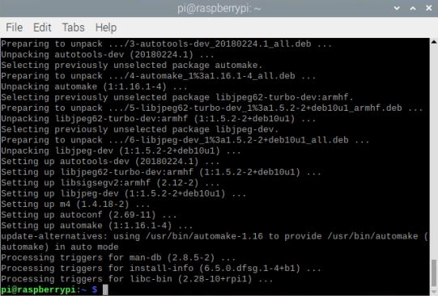
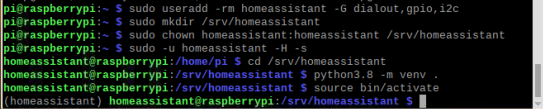
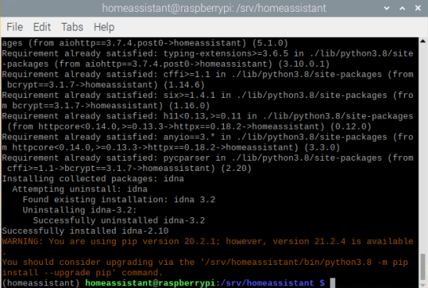

Home Assistant 
============================

Install Dependencies
^^^^^^^^^^^^^^^^^^^^^^^^^^

Before you start make sure your system is fully updated, all packages in this guide are installed 
with apt, if your OS does not have that, look for alternatives.

.. code-block::

    sudo apt-get update
    sudo apt-get upgrade -y

Install the dependencies:

.. code-block::

    sudo apt-get install -y python3 python3-dev python3-venv python3-pip libffi-dev libssl-dev libjpeg-dev zlib1g-dev autoconf build-essential libopenjp2-7 libtiff5 tzdata

Create an account
^^^^^^^^^^^^^^^^^^^^^^

Add an account for Home Assistant Core called **homeassistant**. 
The account name is used when :ref:`Set Boot Up Automatically`.

Since this account is only for running Home Assistant Core the extra arguments 
of ``-rm`` is added to create a system account and create a home directory. 

The arguments ``-G dialout,gpio,i2c`` adds the user to the ``dialout``, 
``gpio`` and the ``i2c`` group. 

The first is required for using Z-Wave and Zigbee controllers, 
while the second is required to communicate with GPIO.

.. code-block::

    sudo useradd -rm homeassistant -G dialout,gpio,i2c

Create the Virtual Environment
^^^^^^^^^^^^^^^^^^^^^^^^^^^^^^^^^^

First we will create a directory for the installation of Home Assistant Core and change 
the owner to the ``homeassistant`` account.

.. code-block::

    sudo mkdir /srv/homeassistant
    sudo chown homeassistant:homeassistant /srv/homeassistant

Next up is to create and change to a virtual environment for Home Assistant Core. 
This will be done as the ``homeassistant`` account.

.. code-block::

    sudo -u homeassistant -H -s
    cd /srv/homeassistant
    python3.8 -m venv .
    source bin/activate

Once you have activated the virtual environment (notice the prompt change to ``(homeassistant) 
homeassistant\@raspberrypi:/srv/homeassistant $``) you will need to run the following command to 
install a required Python package.

.. code-block::

    python3 -m pip install wheel

.. image:: media/image42.png
    :align: center

.. note::

    If the ssl module is not available in Python, please reinstall Python3 refer to :ref:`Install Python3.8.6`

    .. image:: media/image55.png    
        :align: center

Once you have installed the required Python package it is now time to install Home Assistant Core.

.. code-block::

    pip3 install homeassistant

Start Home Assistant
^^^^^^^^^^^^^^^^^^^^^^^^^

This will complete the installation for you, automatically creating the 
``.homeassistant`` configuration directory in the ``/home/homeassistant`` 
directory, and installing any basic dependencies.

.. code-block::

    hass

After the hass command is started, no log will be displayed. 
You can now reach your installation via the web interface on http://homeassistant.local:8123.

If this address doesn’t work you may also try http://localhost:8123 or http://X.X.X.X:8123 (replace X.X.X.X with your machines’ IP address).

.. image:: media/image56.png
    :align: center

.. note::
    1. When you run the ``hass`` command for the first time, it will download, 
    install and cache the necessary libraries/dependencies. This procedure may take anywhere 
    between 5 to 10 minutes. During that time, you may get \"site cannot be reached\" 
    error when accessing the web interface. This will only happen for the first time, 
    and subsequent restarts will be much faster.
    
    2. If an error is reported after the ``hass`` command due to network problems, 
    after deleting the three files (.db, db-shm, db-wal) under the configuration directory
    ``/home/homeassistant/.homeassistant``, run ``hass`` again.
    
    3. If you need to configure boot-up, please refer to: :ref:`Set Boot Up Automatically`
    
    4. If you need to configure a full screen boot, please refer to: :ref:`Set Full-Screen Boot Up`

    5. If you have not set up a self-start, the way to open Home Assistant again is as follows:

    .. code-block::

        sudo -u homeassistant -H -s
        cd /srv/homeassistant
        python3.8 -m venv .
        source bin/activate

        hass
   
