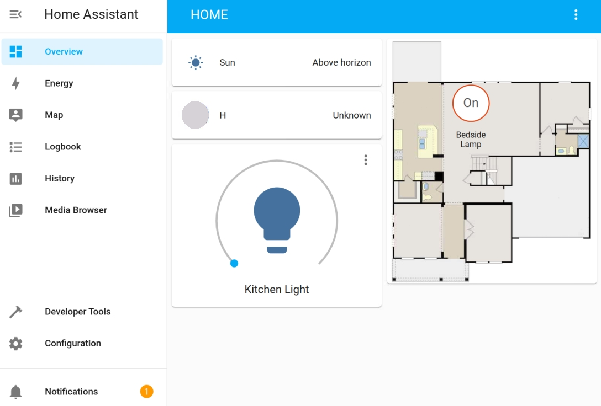

Home Assistant
====================================

Home Assistant is a Python-based open source smart home system that supports smart home devices 
of many brands and can easily implement voice control and automation of the devices. 
You can run Home-assistant on the Raspberry Pi, without having to send your data out onto 
the internet. This means that you have total control over your data, 
limit the amount of internet traffic from your smart devices, and tighten up security.
Let the Raspberry Pi become the smart central control in the home.

.. toctree::
    :maxdepth: 2

    install_required_libraries
    log_in
    consumer_device
    diy_device
    set_boot_up_automatically
    set_full-screen_boo_up
    file_structure