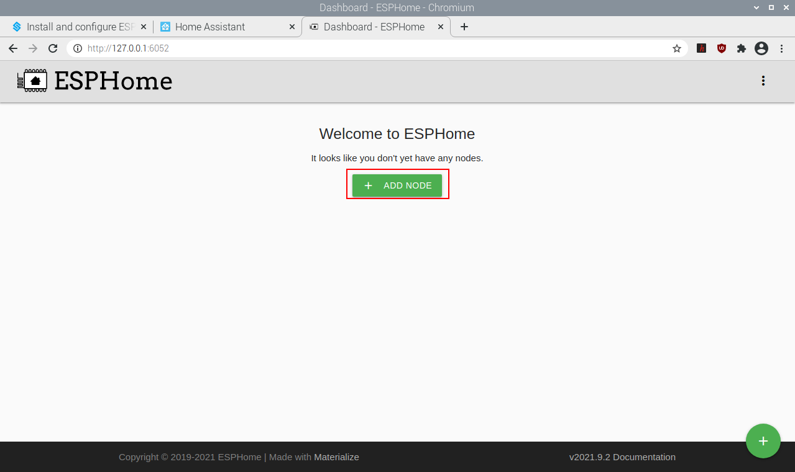
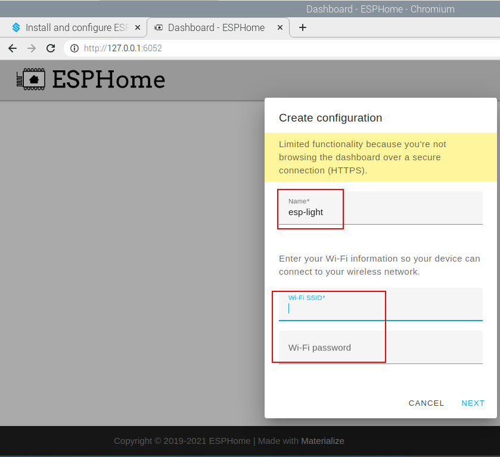
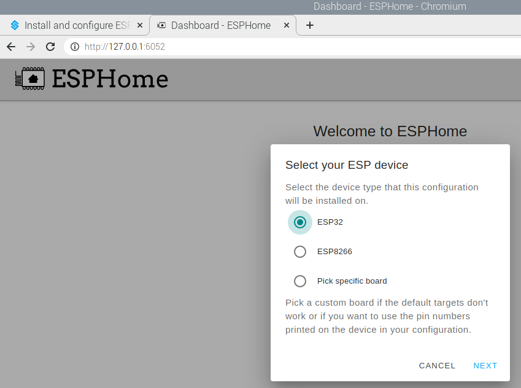

.. note::

    Hello, welcome to the SunFounder Raspberry Pi & Arduino & ESP32 Enthusiasts Community on Facebook! Dive deeper into Raspberry Pi, Arduino, and ESP32 with fellow enthusiasts.

    **Why Join?**

    - **Expert Support**: Solve post-sale issues and technical challenges with help from our community and team.
    - **Learn & Share**: Exchange tips and tutorials to enhance your skills.
    - **Exclusive Previews**: Get early access to new product announcements and sneak peeks.
    - **Special Discounts**: Enjoy exclusive discounts on our newest products.
    - **Festive Promotions and Giveaways**: Take part in giveaways and holiday promotions.

    👉 Ready to explore and create with us? Click [|link_sf_facebook|] and join today!

Install and configure ESPHome
==============================

.. note::

    If you want to add ESPHome in Home Assistant, then you need to go through this section to install and configure it.

    If you don't use it, you can skip this section and go directly to the next one: :ref:`Log In`.

`ESPHome <https://esphome.io/>`_ is the perfect solution for creating custom firmware for your ESP8266/ESP32 boards. 

.. image:: media/esphome_logo.png    
   :align: center

Here’s a very quick introduction to how ESPHome works: ESPHome is a tool which aims to make managing your ESP boards as simple as possible. It reads in a YAML configuration file (just like Home Assistant) and creates custom firmware which it installs on your ESP device. Devices or sensors added in ESPHome’s configuration will automatically show up in Home Assistant’s UI.

**Installation**

1. Installation dependencies.

.. raw:: html

    <run></run>

.. code-block::

    sudo pip3 install cryptography==2.8

2. Install ESPHome, you need to install Python and install the console script through pip3.

.. note::
    
    Python 3.7 or above is required to install ESPHome 1.18.0 or above.

.. raw:: html

    <run></run>

.. code-block::

    sudo pip3 install esphome

Alternatively, there’s also a Docker image available for easy installation (the Docker hub image is available for AMD64, ARM and ARM64(AARCH64) right now; if you have another architecture, please install ESPHome through pip or use the Home Assistant add-on:

.. raw:: html

    <run></run>

.. code-block::

    docker pull esphome/esphome

3. Open the ESPHome Dashboard.

.. note::
    You need to keep this command running while you are operating in the ESPHome dashboard.

.. raw:: html

    <run></run>

.. code-block::

    esphome dashboard config/

**Configure ESPHome**

1. Open a browser and enter ESPHome Dashboard through http://localhost:6052 or http://X.X.X.X:6052 (replace X.X.X.X with your Raspberry Pi's IP address).

2. Create configuration.

Click on the \"+\" to start adding configurations.

Enter a name and the WiFi and password that you need to have your device connect to and then click **NEXT**.

Select the device type (ESP32 for example).

Enter 

Once added, you will see them in the Dashboard of ESPHome.

.. note::

   When it is not the first time to add a device, click \"+\" on the main page, 
   follow the prompts to enter the device name, WIFI and password, select the device type.

   .. image:: media/image53.png    
      :align: center

3. Edit the ``.yaml`` file.

Click **EDIT** in the bottom right corner to go inside the ``.yaml`` file, you will see the following default components.

.. image:: media/desphome_yaml0.png
    :align: center

* ``esphome``: Contains the name, platform, and board type that you set up.
* `logger <https://esphome.io/components/logger.html?highlight=logger>`_: The logger component automatically logs all log messages through the serial port and through MQTT topics.
* `api <https://esphome.io/components/api.html?highlight=api>`_: The ESPHome native API is used to communicate with clients directly, with a highly-optimized network protocol. Currently, only the ESPHome tool and Home Assistant use this native API.
* `ota <https://esphome.io/components/ota.html?highlight=ota>`_: With the OTA (Over The Air) update component you can upload your firmware binaries to your node without having to use a USB cable for uploads. 
* `wifi <https://esphome.io/components/wifi.html?highlight=wifi>`_: This core ESPHome component sets up WiFi connections to access points for you. It needs to be in your configuration or otherwise ESPHome will fail in the config validation stage.
* `captive_portal <https://esphome.io/components/captive_portal.html?highlight=captive_portal>`_: The captive portal component in ESPHome is a fallback mechanism for when connecting to the configured WiFi fails. After 1 minute of unsuccessful WiFi connection attempts, the ESP will start a WiFi hotspot (with the credentials from your configuration).

Now start to add other components. There are a lot of components in the `ESPHome official website <https://esphome.io/>`_, including **Sensor Components**, **Output Components**, **Light Components**, etc., Here we take **Binary Light** in **Light Components** as an example.

.. image:: media/image52.png    
   :align: center

Add the following code to the end of the ``.yaml`` file.

.. code-block::

    # Example configuration entry
    light:
      - platform: binary
        name: "Desk Lamp"
        output: light_output

    output:
      - id: light_output
        platform: gpio
        pin: GPIO16

.. image:: media/desphome_yaml.png
    :align: center

4. Install the ``.yaml`` file to ESP32 board.

After editing, click **INSTALL** in the lower right corner to compile and install. There are 2 methods for you to choose: Wirelessly and USB Port. But for the first installation you need to connect the ESP32 board to the Raspberry Pi using USB and then choose the second installation method.
At a later time you can install and compile via Wirelessly.

It takes about 10 minutes to download the dependencies during the first compilation, so please be patient.

.. image:: media/install_esp32.png
    :width: 600

After successful installation, if you connect an LED to GPIO16 in ESP32 board, you will see the LED is lit. Also please record this IP, you will need to fill in this IP when you add ESPHome to Home Assistant.

    .. image:: media/install_suc.png 

.. note::

    If there is no response when clicking INSTALL, please clear the browser cache and INSTALL again.

    .. raw:: html

        <run></run>

    .. code-block::

        sudo rm -rf ~/.cache/chromium

ESPHome configuration is complete and you can now add it to Home Assistant.