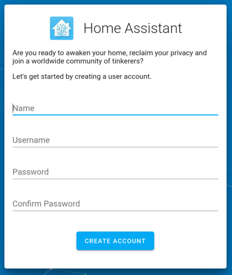
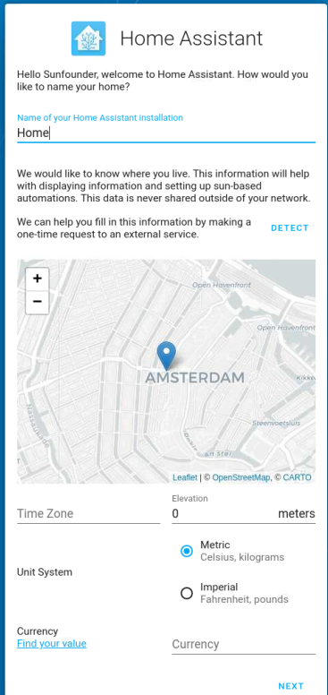
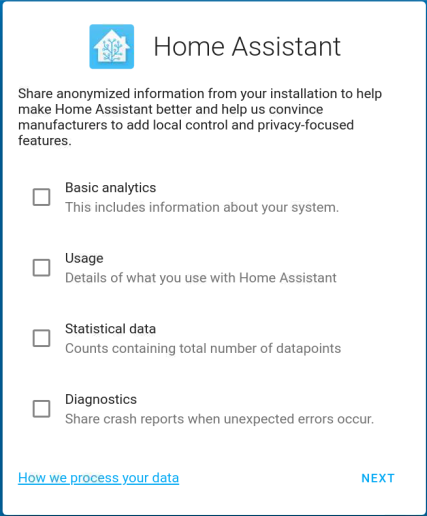
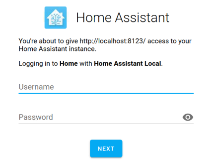
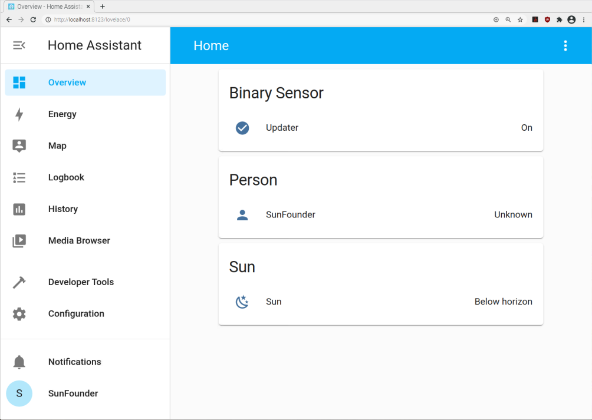

.. note::

    Hello, welcome to the SunFounder Raspberry Pi & Arduino & ESP32 Enthusiasts Community on Facebook! Dive deeper into Raspberry Pi, Arduino, and ESP32 with fellow enthusiasts.

    **Why Join?**

    - **Expert Support**: Solve post-sale issues and technical challenges with help from our community and team.
    - **Learn & Share**: Exchange tips and tutorials to enhance your skills.
    - **Exclusive Previews**: Get early access to new product announcements and sneak peeks.
    - **Special Discounts**: Enjoy exclusive discounts on our newest products.
    - **Festive Promotions and Giveaways**: Take part in giveaways and holiday promotions.

    👉 Ready to explore and create with us? Click [|link_sf_facebook|] and join today!

Log In
=========

1. Now you can enter http://<ip>:8123 in the browser to enter the Home Assistant operation interface. Then set up a username and password for your Home Assistant.

2. Create a name for your home and select your region.

3. Select the content you want to share to Home Assistant.

4. You can choose to configure the device now, or later. It is recommended that beginners configure the device later, as the configuration is described in detail later in the tutorial.
    
.. image:: media/image70.png
    :align: center

5. After setting up, enter your login username and password in the login screen.
   

.. note::
   If the login screen does not jump automatically, please open Home Assistant again via http://localhost:8123.

After logging in successfully, you will enter your Home. 

    
