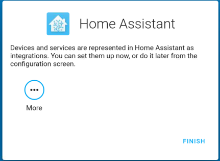

登录
=========

1. 现在，访问 http://ip:8123 以进入您的 Home Assistant，然后为您的Home Assistant设置用户名和密码。

.. image:: media/image56.png
    :align: center

2. 为您家庭创建一个名称并选择所在的地区。

.. image:: media/image68.png
    :align: center

3. 选择您想要分享给Home Assistant的内容。

.. image:: media/image69.png
    :align: center

4. 您可以选择现在或稍后配置设备。建议初学者稍后配置设备，配置将在后面的教程中详细介绍。
    

5. 设置完成后，在登录屏幕中输入您的登录用户名和密码。
   
.. image:: media/image72.png
    :align: center

.. note::
   如果登录界面没有自动跳转，请通过 http://localhost:8123 再次打开Home Assistant。 

登录成功之后，将会自动进入您的主页。

.. image:: media/image57.png
    :align: center

    
