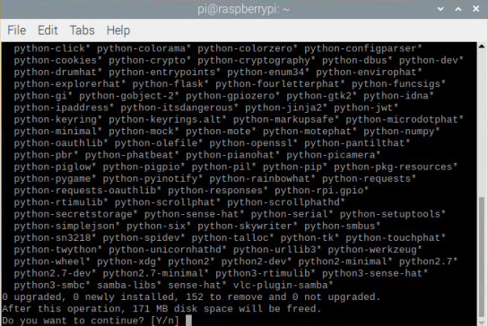
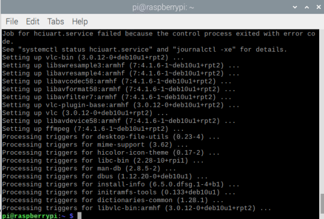
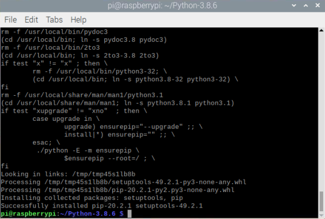

Python3.8
==========================                            

The minimum supported version of Python for Home Assistant is 3.8, 
but the latest version of Python for Raspberry Pi is still 3.7.2, 
so the first step is to manually install Python 3.8.

.. note::
    
    If your version is 3.8, please skip this installation step.

Uninstall python3.7 (optional)
^^^^^^^^^^^^^^^^^^^^^^^^^^^^^^^^^^^^^

.. code-block::

    # Uninstall python3.7 and clear the configuration file  

    sudo apt-get purge --auto-remove python3.7 

Enter \"Y\".

Install related dependencies
^^^^^^^^^^^^^^^^^^^^^^^^^^^^^^^^^^^^^^

If direct mounting may result in part dependent deletions, some inexplicable is introduced 
third cladding being given, such as: ``Python3: ImportError: No module named '_ctypes' when 
using Value from module multiprocessing;``

.. code-block::

    sudo apt-get update

    sudo apt-get upgrade

    sudo apt-get dist-upgrade

    sudo apt-get install build-essential python-dev python-setuptools python-pip python-smbus
    
    sudo apt-get install libncursesw5-dev libgdbm-dev libc6-dev
    
    sudo apt-get install zlib1g-dev libsqlite3-dev tk-dev
    
    sudo apt-get install libssl-dev openssl
    
    sudo apt-get install libffi-dev

Install Python3.8.6
^^^^^^^^^^^^^^^^^^^^^^^^^^^^^

.. code-block::

    sudo apt update                                                      
                                                                        
    sudo apt upgrade                                                     
                                                                        
    
    sudo apt-get install build-essential libsqlite3-dev sqlite3 bzip2 libbz2-dev                                                           
                                                                        
    
    wget https://www.python.org/ftp/python/3.8.6/Python-3.8.6.tgz        
                                                                        
    tar zxvf Python-3.8.6.tgz                                            
                                                                        

    cd Python-3.8.6                                                      
                                                                        
    sudo ./configure                                                     
                                                                        
    sudo make                                                            
                                                                        
    sudo make install                                                    

Establish a soft link 
^^^^^^^^^^^^^^^^^^^^^^^^^^^^

Use Python3 to link to Python3.8

.. code-block::

    sudo ln -s /usr/local/lib/python3.8 /usr/lib/python3                  
                                                                        
    sudo ln -s /usr/local/lib/python3.8/site-packages/usr/lib/python3/dist-packages                                        

Now Python3.8 has been installed successfully.

