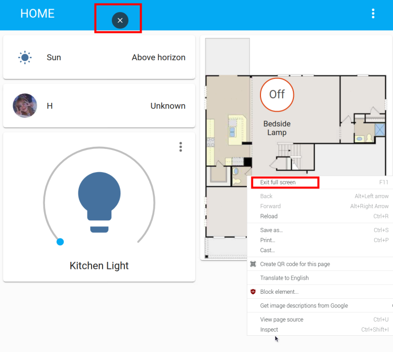

Enter the Home Assisant Page at Boot
================================================

Experience the full-screen self-boot interface first. 
Please close the already open Home Assistant URL and run 
``chromium-browser --start-fullscreen "http://localhost:8123"``.

If you want to automatically display the Home Assistant interface in full screen after 
booting, then do the following.

1. Go to the ``autostart`` folder.

.. raw:: html

    <run></run>

.. code-block::

    cd /home/pi/.config/autostart/

.. note::

    If the ``autostart`` folder does not exist, you need to create a new one.
    
    .. raw:: html

        <run></run>

    .. code-block::

        sudo mkdir -p /home/pi/.config/autostart/

        
2. Create ``chrome_start_fullscreen.desktop`` file.

.. raw:: html

    <run></run>

.. code-block::

    sudo nano chrome_start_fullscreen.desktop

3. Edit the ``chrome_start_fullscreen.desktop`` file as follows.

.. code-block::

    [Desktop Entry]
    Type = Application
    Exec = chromium-browser --start-fullscreen "http://localhost:8123"

Save and exit: ``Ctrl + X``, ``Y``, ``Enter``.

.. note::
   
    If you want to cancel the full-screen self-start, comment out the contents of the ``.desktop`` file (by **\"#\"** )and restart the Raspberry Pi.

    .. raw:: html

        <run></run>

    .. code-block::

        cd /home/pi/.config/autostart/
        sudo nano chrome_start_fullscreen.desktop

4. Exit full screen.

**computer:**

Method 1: Press F11.

Method 2: Move the mouse to the upper column of the screen and click the exit button that appears.

Method 3: Right-click the pop-up menu, select \"Exit full screen\".

**Touch screen:** 

Long press the blank space to pop up the menu, 
click the exit button at the top of the screen or select \"Exit full screen\".

