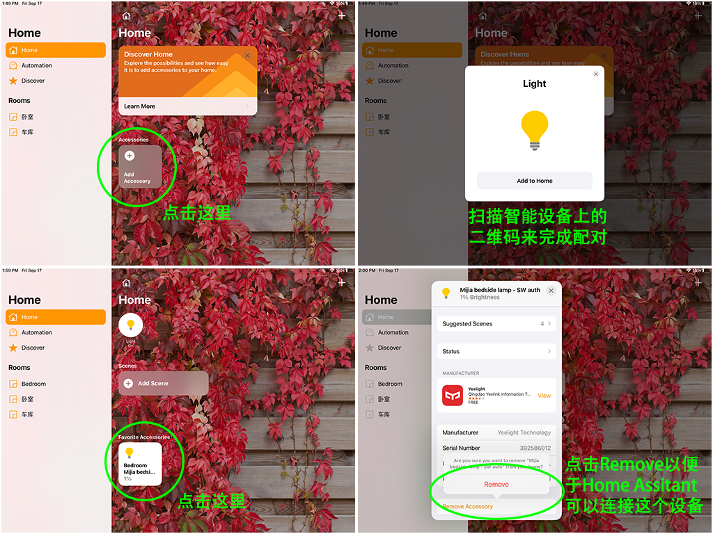
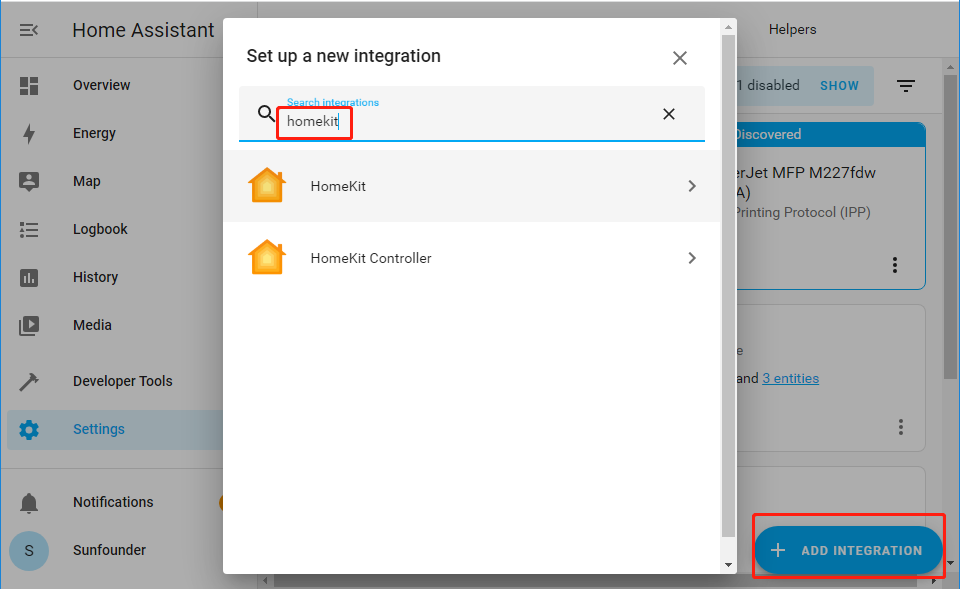

Add Smart Devices
=================================

You can add your purchased smart devices to Home Assistant, such as smart sound, smart desk lamp, etc. You can also make your DIY device with ESP32 and add it in.

In this section, you will learn how to add your smart devices.

You need to make sure that your smart device has been assigned an IP. 
You can complete this step through the corresponding APP of the smart device. 
For example, the picture below shows a bedside lamp configured with **HomeKit**.

Now back to home assistant(refer to :ref:`Log In`), click **Configuration** in the left column, select **Intergrations**.

.. image:: media/image12.png
   :align: center

If Home Assistant finds a device on your network, it will display the corresponding integration, which can be easily added with just a few clicks. 
If your smart device has not been discovered yet, don’t worry, click the **+ ADD INTEGRATION** button at the bottom right and search for your integration in the list.

.. image:: media/sp210917_111709.png
   :align: center

Each integration may be different in use, you can visit `Home Assistant Integration <https://www.home-assistant.io/integrations/>`_ for details.

Return to the Overview page. If the device you just added does not appear, you need to **Edit Dashboard**.

.. image:: media/edit_dashboard.png
   :align: center
   :width: 800

.. image:: media/sp210917_115819.png
   :align: center
