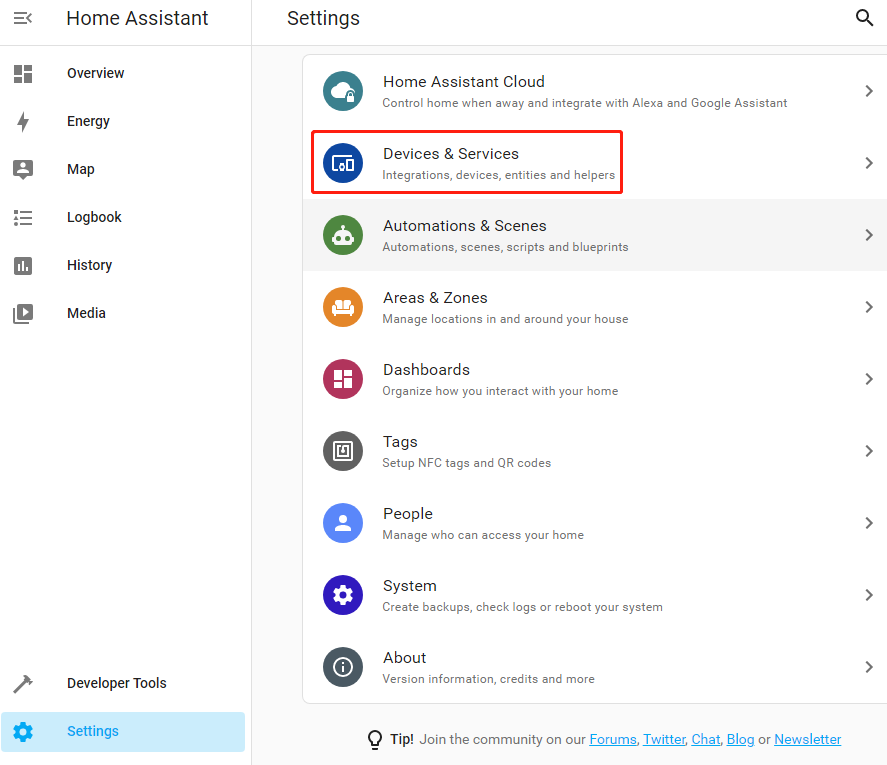
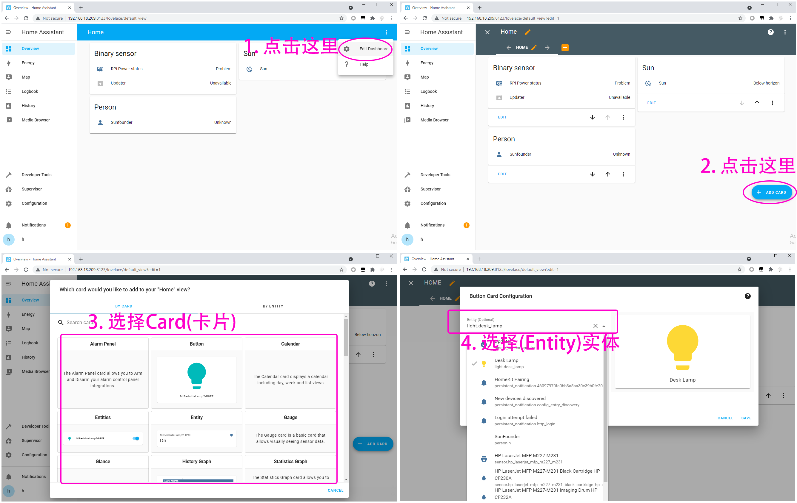

添加智能设备
=================================

您可以将您购买的智能设备添加到Home Assistant中，例如智能音响、智能台灯等。您也可以使用ESP32制作并添加自己的DIY设备。

在本节中，您将学习如何添加您的智能设备。

**配置智能设备**

您需要确保您的智能设备已分配 IP。
您可以通过智能设备对应的APP完成此步骤。 
例如，下图显示了一个配置了 **HomeKit** 的床头灯。 

**添加集成**

现在，访问 http://ip:8123 以进入您的 Home Assistant，然后单击左栏中的 **Settings** 并选择 **Devices/Services**。

如果 Home Assistant 在您的网络上找到一个设备，它会显示这个设备相关的集成，只需点击几下即可轻松添加。

.. image:: media/sp210917_111709.png
   :align: center

如果您的智能设备没有被找到，请不要担心，单击右下角的+ 添加集成按钮并在列表中搜索您的集成。

.. image:: media/image19.png
    :align: center

每种集成在使用方法上可能有所不同, 您可以访问 `Home Assistant Integration <https://www.home-assistant.io/integrations/>`_ 了解详情。

**编辑仪表板**

现在需要添加一个 CARD 来控制这个智能设备。

返回概览页面。如果您刚刚添加的设备没有出现，您需要 **编辑仪表板**.

点击 **Overview** --> **Edit Dashboard** --> **ADD CARD**, 可以根据需要选择对应的CARD，比如这里选择 **Button**，然后选择对应的Entity。

添加完卡片后，点击Done来退出编辑，这样你就能开始控制你的智能设备。

.. image:: media/sp210917_115819.png
   :align: center
