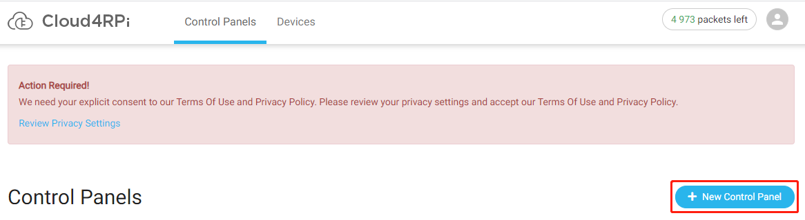

Cloud4RPi的快速使用指南
================================

在您的树莓派中安装 Cloud4RPi
------------------------------------------------

建议在安装前更新您的系统。

.. raw:: html

    <run></run>

.. code-block:: shell

    sudo apt update && sudo apt upgrade -y

安装/更新所需的软件包。

.. raw:: html

    <run></run>

.. code-block:: shell

    sudo apt install git python3 python3-pip -y

使用以下命令安装 Cloud4RPi：

.. raw:: html

    <run></run>

.. code-block:: shell

    sudo pip3 install cloud4rpi

.. note::

  本教程提供Python 3.0及以上版本的安装方法。对于较低版本的 Python，可能需要修改命令。

在计算机上登录 Cloud4RPi
-------------------------------------

打开 Chromium Web 浏览器并输入链接： https://cloud4rpi.io.

.. image:: img/cloud1.png
  :align: center

在使用之前，您需要注册并登录您的 Cloud4RPi 帐户。

.. image:: img/cloud2.png
  :align: center

登录完成后可以看见如下图所示的选项， **Devices** 用于显示设备的连接， **Control Panels** 用于显示来自网页或者树莓派的信息。

.. image:: img/cloud3.png
  :align: center

将您的树莓派连接到 Cloud4RPi
----------------------------------------

登录后, 单击 **Devices** 选项, 然后单击 **New Device**。

.. image:: img/cloud4.png
  :align: center

为新设备命名, 并复制当前的 **Device token**。 

.. image:: img/cloud5.png
  :align: center

打开树莓派终端，下载 Cloud4RPi 提供的测试示例。

.. raw:: html

    <run></run>

.. code-block:: shell

  cd /home/pi
  git clone https://github.com/cloud4rpi/cloud4rpi-raspberrypi-python.git

使用文本编辑器（如 Nano）修改 ``control.py`` 文件内容。

.. raw:: html

    <run></run>

.. code-block:: shell

  cd cloud4rpi-raspberrypi-python
  sudo nano control.py

找到以下代码行。

.. code-block:: python

  DEVICE_TOKEN = '__YOUR_DEVICE_TOKEN__'

将 ``__YOUR_DEVICE_TOKEN__`` 替换成从 Cloud4RPi 上复制的 **Device token** 按 ``Ctrl + X`` 保存修改的内容。

.. code-block:: python

  DEVICE_TOKEN = '556UfPaRw6r6rDKYfzx5Nd1jd'

运行示例文件 ``control.py``.

.. raw:: html

    <run></run>

.. code-block:: shell

  sudo python3 control.py

返回 Cloud4RPi 的服务页面。 如果您的树莓派连接到 Cloud4RPi, 设备信息将变成绿色。

.. image:: img/cloud6.png
  :align: center

使用 Cloud4RPi 控制面板
-----------------------------------

Cloud4RPi 服务器上的控制面板为 IoT 应用程序提供了许多有用的小部件。这些小部件可以用来控制组件或显示传感器数据。

进入 **Control Panels** 之后, 单击 **New Control Panel** 按钮。

.. note::

  在使用控制面板之前要保持运行 ``control.py`` 文件。

输入控制面板名称，然后单击 **Add Widget** 按钮。

.. image:: img/cloud8.png
  :align: center

再次点击 **Add Widget** 按钮之前, 需要选择合适的小部件和要显示的变量。

.. image:: img/cloud9.png
  :align: center

例如，选择 **Text** 之后再选择 **Hot Water °C**, 这样我们就能再新创建的控制面板上看到它了。

.. note::
  
  我们会在 :ref:`详细了解 control.py` 章节详细介绍这些显示的数据。