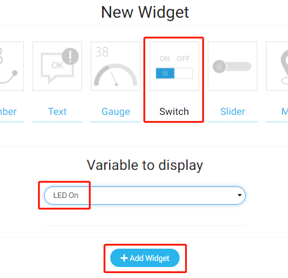

遥控开关
=================

在这个项目中，我们将学习使用 Cloud4RPi 的开关来控制继电器，从而控制继电器的负载 LED。您也可以将继电器的负载更改为家用电器，但要注意安全。

实验步骤
-------------------------

搭建电路。

.. image:: img/relay1.png
    :align: center

打开代码。

.. raw:: html

    <run></run>

.. code-block:: shell

    cd /home/pi/cloud4rpi-raspberrypi-python
    sudo nano remote_switch.py

找到下面的部分并填写正确的设备令牌。

.. code-block:: python

    DEVICE_TOKEN = '__YOUR_DEVICE_TOKEN__'

运行代码。

.. raw:: html

    <run></run>

.. code-block:: shell

    sudo python3 remote_switch.py

转到 Cloud4RPi 页面，添加一个名为 project2 的新控制面板，然后单击 **Add Widget** 添加一个 **Switch** 小部件。

添加后，您可以使用 “Switch” 小部件来控制继电器。

.. image:: img/relay3.png
    :align: center

代码说明
----------------------

.. code-block:: python

    RELAY_PIN = 18

继电器连接到 T 型扩展板的 GPIO18 引脚。

.. code-block:: python

    GPIO.setmode(GPIO.BCM)
    GPIO.setup(RELAY_PIN, GPIO.OUT)

选择 BCM 命名模式并设置 ``RELAY_PIN`` 为输出模式。

.. code-block:: python

    def relay_control(value=None):
        GPIO.output(RELAY_PIN, value)
        return GPIO.input(RELAY_PIN)

该函数通过 ``value`` 控制继电器，并返回继电器当前的电平。

.. note::

    由于继电器工作在高电平，当开关状态为Ture时继电器闭合，当开关状态为False时继电器打开

.. code-block:: python

    variables = {
        'LED On': {
            'type': 'bool',
            'value': False,
            'bind': relay_control
        },
    }

通过设置 ``'value'`` 键的值, 我们可以设置Switch部件的初始值, 然后循环读取 ``'value'`` 键的值，并将继电器当前电平 ``RELAY_PIN`` (函数 ``relay_control()`` 的返回值) 发送到Cloud4RPi。

